# 💚 Introduction Pwm MCAL AUTOSAR MODULE 💛

## 👉 Introduction and Summary

### 1️⃣ Introduction

+ Ở repo này mình sẽ nói overview về kiến thức module Pwm. Version Autosar trong repo này là 4.3.1 nhé.

### 2️⃣ Summary

Nội dung của bài viết gồm có những phần sau nhé 📢📢📢:
- [I. Introduction and Summary](#👉-introduction-and-summary)
    - [1. Introduction](#1️⃣-introduction)
    - [2. Summary](#2️⃣-summary)
- [II. Contents](#👉-contents)
- [III. Reference](#📌-reference)

## 👉 Contents

### Introduction
+ This document details AUTOSAR BSW Pwm module implementation
  - Supported AUTOSAR Release : 4.3.1
  - Supported Configuration Variants : Pre-Compile & Post-Build

### Overview
+ The figure below depicts the AUTOSAR layered architecture as 3 distinct layers, Application, Runtime Environment (RTE) and Basic Software (BSW). The BSW is further divided into 4 layers, Services, Electronic Control Unit Abstraction, MicroController Abstraction (MCAL) and Complex Drivers.

​<p align="center">
     
</p>

+ MCAL is the lowest abstraction layer of the Basic Software. It contains software modules that interact with the Microcontroller and its internal peripherals directly. The PWM driver is a part of the microcontroller (peripheral) Driver module which is a part of the Basic Software. The figure below shows the position of the PWM driver in the AUTOSAR Architecture.

​<p align="center">
  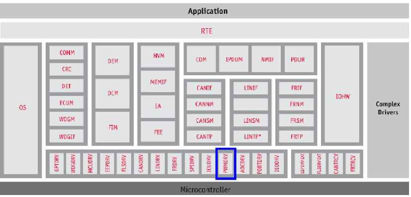   
</p>

### Pwm Overview
+ The PWM module implements an interface in C programming language for handling the PWM functionality of the device.This PWM driver takes care of initializing and de-initializing the PWM unit and offers services to:
  - Generate pulses with variable pulse width(Duty Cycle - can range from 0% to 100%)
  - Set parameters of a PWM channels waveform(Duty Cycle and Period)
  - Enable/Disable notifications

​<p align="center">
  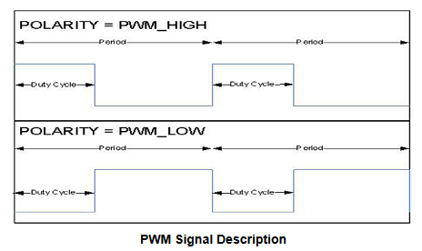   
</p>

### Hardware Overview
+ In this design, the PWM Functionality can be achieved by using either of two available IPs, the DM Timers, or EPWM module.
+ DM Timer
+ DM Timer available on the device are used. TDA4x class of devices includes multiple timers, some of the key features provided are listed below:
  - Free running 32 bit up counter
  - Auto reload mode (can be used for continuous counter operation)
  - Support dynamic Start / Stop counter operation
  - Programmable clock dividers (2n, where n = [0-8])
  - 2 timers modules could be operated in cascaded mode to provide 64bit counter
  - Programmable interrupt generation on overflow, compare and capture
  - Programmable clock source
+ There is Support for 3 basic functional modes Timer mode, Capture mode & Compare mode. Refer RM in 2 for more details on timer operation.
+ Timer pins can be configured to be used as PWM output pins. However, not all timer pins can be configured to be PWM output, please refer TRM for specific pins (RM)
+ The following image shows the block diagram of Timer which can generate a PWM output:

​<p align="center">
  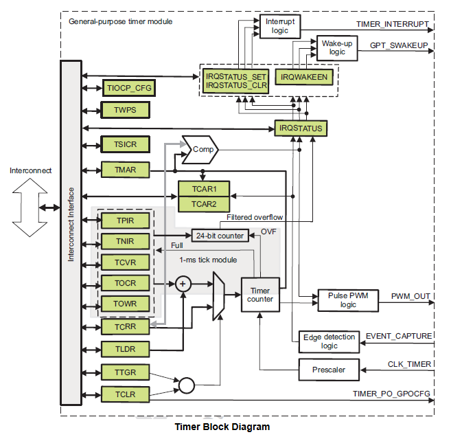   
</p>

### EPWM Module
+ The ePWM(enhanced) unit described here addresses these requirements by allocating all needed timing and control resources on a per PWM channel basis. Cross coupling or sharing of resources has been avoided; instead, the ePWM is built up from smaller single channel modules with separate resources and that can operate together as required to form a system. This modular approach results in easy understand of its operation quickly.
+ J7 family device include six instances of ePWM. The EPWM module represents one complete PWM channel composed of two PWM outputs: EPWMxA and EPWMxB. A given EPWM module functionality can be extended with the so called High-Resolution Pulse Width modulator.
+ In the further description the letter x within a signal or module name is used to indicate a generic EPWM instance on a device. For example, output signals EPWMxA and EPWMxB refer to the output signals from the EPWMx instance.
+ There are 6 instances of the EPWM integrated in the device. Each of the Enhanced Pulse Width Modulator (EPWM) includes an Enhanced High Resolution Modulator (HRPWM). The high-resolution functionality is implemented only on the EPWMxA output. EPWMxB output has conventional PWM capabilities. At system level the EPWM0 through EPWM5 integration features are listed below:
  - A 32-bit slave configuration port on the CBASS0 interconnect.
  - A single functional clock from PLLCTRL.
  - 2 hardware events per EPWM, that is a total of 12 events. From these events each EPWM:
  - generates 2 interrupts to the device COMPUTE_CLUSTER0, PRU_ICSSG0_INTC, PRU_ICSSG1_INTC and MAIN2MCU_INTRTR_PLS
  - A synchronization input/output daisy chain-like connection exists between the EPWM0 trough EPWM5.
+ The high-resolution pulse-width modulator (HRPWM) extends the time resolution capabilities of the conventionally derived digital pulse-width modulator (PWM). HRPWM is typically used when PWM resolution falls below ~9-10 bits. The key features of HRPWM are:
  - Extended time resolution capability with regards to falling edge.
  - Used in Duty cycle control methods.
  - Finer time granularity control or edge positioning using extensions to the Compare A.
  - Implemented using the A signal path of PWM, that is, on the EPWMxA output. EPWMxB output has conventional PWM   capabilities.

### Features Supported
+ Below listed are some of the key features that are expected to be supported
  - Changing of frequency and duty cycle for a PWM channel at runtime besides the default configuration.
  - The PWM signal that can be generated is a square wave with variable duty cycle and period .

### Features Not Supported
+ [NON Compliance] APIs related to setting or getting power state of the device is not supported, as hardware itself doesn’t support this feature.
+ [NON Compliance] PwmMcuClockReferencePoint doesn’t refer to McuClockReferencePoint. 
+ PWM_FIXED_PERIOD_SHIFTED Pwm Channel Class type is not supported
+ Standard AUTOSAR PWM specification 1, categorizes few BSW General Requirements as non-requirements
+ Supports additional configuration parameters, refer section (Pwm_RegisterReadback)
+ Specifically to EPWM IP, DeadBand, Trip Zone and PWM Chopper sub-modules are bypassed.

### Fundamental Operation
***Timer***
+ The timer can be configured to provide a programmable PWM output. The timer PWM (POTIMERPWM) output pin can be configured to toggle on an event. The TCLR[11-10] TRG bit field determines on which register value the PWM pin toggles. Either overflow or both overflow and match can be selected to toggle the timer PWM pin when a compare condition occurs. TMAR, TLDR The internal overflow pulse is set each time the (0xFFFF FFFF – TLDR[31-0] LOAD_VALUE + 1) value is reached, and the internal match pulse is set when the counter reaches the value of TMAR. Depending on the value of the TCLR[12] PT bit and TCLR[11-10] TRG bit field, the timer provides pulse or PWM event on the output pin (POTIMERPWM). The TLDR and TMAR must keep values below the overflow value (0xFFFF FFFF) by at least two units. If the PWM trigger events are both overflow and match, the difference between the values kept in the TMAR and the value in the TLDR must be at least two units. When match event is used, the compare mode TCLR[6] CE bit must be set.
+ The following sequence of steps needs to be performed, before the timer can be started
  - Timer is programmed as configured (in continuous mode or Autoreload mode)
  - The initial count of the counter TCLR needs to be loaded
  - The reload register (TLDR) needs to be loaded
  - The timer is started and the counter (register TCRR), starts counting on every pulse
    + As depicted in above figure, TCRR has moved w.r.t to TLDR

​<p align="center">
  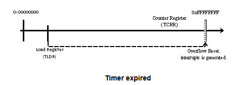   
</p>

  - When the timer expires, the TCRR is loaded with value present in TLDR as show above
  - An interrupt can be triggered at this point

+ For generating a PWM signal from the timer interrupts, the following cases w.r.t. duty cycle are considered:
  - Case 1: Duty cycle of 0%
    + The output will be the inverse of the configured polarity parameter. For example, if the polarity is configured as LOW, the PWM signal will always be HIGH.
  - CASE 2: Duty cycle of 100%
    + The output will be equal to the configured polarity parameter. For example, if the polarity is configured as LOW, the PWM signal will always be LOW.
  - Case 3: Duty cycle of 50%
    + When the When a duty cycle of 50% for a PWM signal is required, both the time that the pulse remains HIGH and LOW is equal. In this case, the timer is operated in overflow mode alone (without compare). In one cycle of the PWM signal, the timer should generate an interrupt twice. Hence, the overflow rate for the timer (OVF_Rate) is half the period of the PWM signal required. The load value for TLDR register can be calculated using the following formula: OVF_Rate = (0xFFFF FFFF – TLDR + 1) × (timer-functional clock period) × PS
    + where
      - OVF_Rate = (PWM Period /2 )
      - Timer-functional clock period is the period of the input clock to the timer
      - PS is the Prescaler Clock Ratio Value used to divide the timer counter input clock frequency
  - Case 4: 0%< Duty cycle < 100%
    + When PWM signal with 0%< duty cycle < 100% for a is required, the timer is operated in overflow and match mode (with compare). In one cycle of the PWM signal, the timer generates an interrupt twice, one when the match condition is met and one when overflow is triggered as shown in the figure below.Hence, in this scenario, the overflow rate for the timer (OVF_Rate) is same as the period of the PWM signal required.

​<p align="center">
  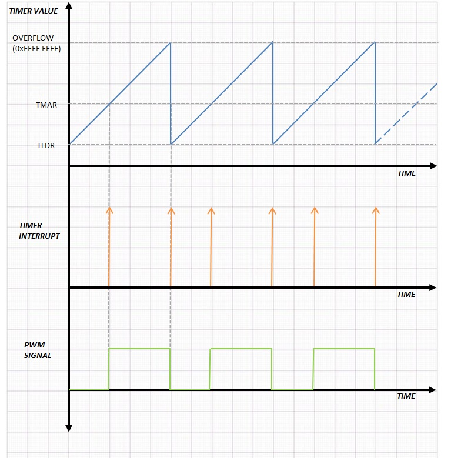   
</p>

+ The load value for TLDR and TMAR registers can be calculated using the following formula:

```bash
OVF_Rate = (0xFFFF FFFF – TLDR + 1) × (timer-functional clock period) × PS
OVF_Rate * (1- (Dutycyle/100)) = (0xFFFF FFFF – TMAR + 1) × (timer-functional clock period) × PS
```
+ where
  - OVF_Rate = (PWM Period )
  - Timer-functional clock period is the period of the input clock to the timer
  - PS is the Prescaler Clock Ratio Value.

+ Two example cases are shown in the following figure. The TCLR[7] SCPWM bit is set to 0 in one case and to 1 in the other case. To obtain the desired wave form, start the counter at 0xFFFF FFFE value (to ensure an overflow first) or adjust the line polarity (TCLR[7] SCPWM bit).

​<p align="center">
  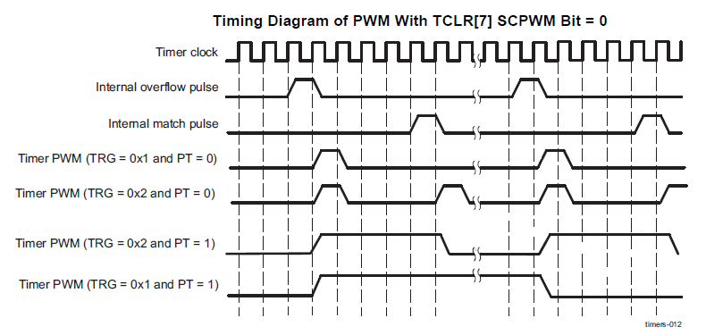   
</p>

​<p align="center">
  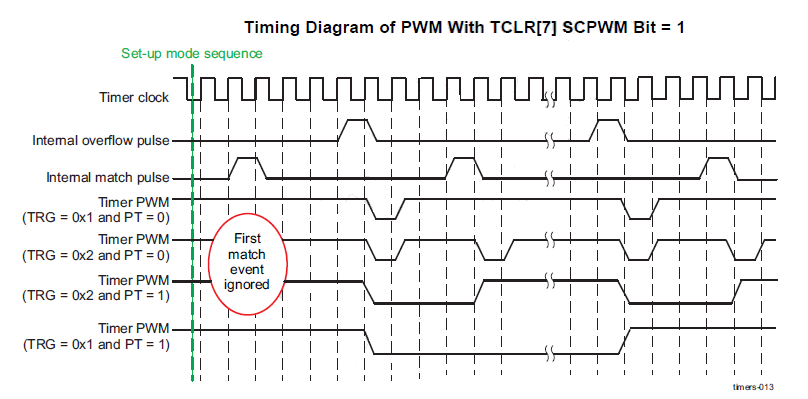   
</p>

### Time-base (TB)
+ Scale the time-base clock (TBCLK) relative to the system clock (FICLK).
+ Configure the PWM time-base counter (TBCNT) frequency or period.
+ Time-base counter mode selection:
  - count-up mode: used for asymmetric PWM
  - count-down mode: used for asymmetric PWM
  - count-up-and-down mode: used for symmetric PWM
+ Configure the time-base phase relative to another EPWM module.
+ Synchronize the time-base counter between modules through hardware or software.
+ Configure the direction (up or down) of the time-base counter after a synchronization event.
+ Configure how the time-base counter will behave when the device is halted by an emulator.
+ Specify the source for the synchronization output of the EPWM module:
  - Synchronization input signal
  - Time-base counter equal to zero
  - Time-base counter equal to counter-compare B (CMPB)
  - No output synchronization signal generated.

### Counter-compare (CC)
+ Specify the PWM duty cycle for output EPWMxA and/or output EPWMxB
+ Specify the time at which switching events occur on the EPWMxA or EPWMxB output

### Action-qualifier (AQ)
+ Controls how the two outputs EPWMxA and EPWMxB behave when a particular event occurs.
+ Possible actions are: Set High, Clear Low, Toggle and Do nothing.
+ Specify the type of action taken when a time-base or counter-compare submodule event occurs:
  - No action taken
  - Output EPWMxA and/or EPWMxB switched high
  - Output EPWMxA and/or EPWMxB switched low
  - Output EPWMxA and/or EPWMxB toggled
+ Force the PWM output state through software control
+ Configure and control the PWM dead-band through software

### Event-trigger (ET)
+ Enable the EPWM events that will trigger an interrupt.
+ Specify the rate at which events cause triggers (every occurrence or every second or third occurrence)
+ Poll, set, or clear event flags
+ Manages the events generated by the time-base submodule and the counter-compare submodule to generate an aggregated interrupt request.
+ An event can be be of the following:
  - Time-base counter equal to 0.
  - Time-base counter equal to period.
  - Time-base counter equal to the compare A or B register when timer is incr/decr

### High-Resolution PWM (HRPWM)
+ Enable extended time resolution capabilities with regards to falling edge.
+ Configure finer time granularity control or edge positioning.
+ Once the EPWM has been configured to provide conventional PWM of a given frequency and polarity, the HRPWM is configured by programming the control HR control register.
+ Typical low-frequency PWM operations (below 250kHz) may not require the HRPWM capabilities.
+ HRPWM is based on micro edge positioner (MEP) technology. MEP logic is capable of positioning an edge finely by sub-diving one coarse system clock of a conventional PWM generator. This driver assumes a MEP value of 180 ps.

​<p align="center">
  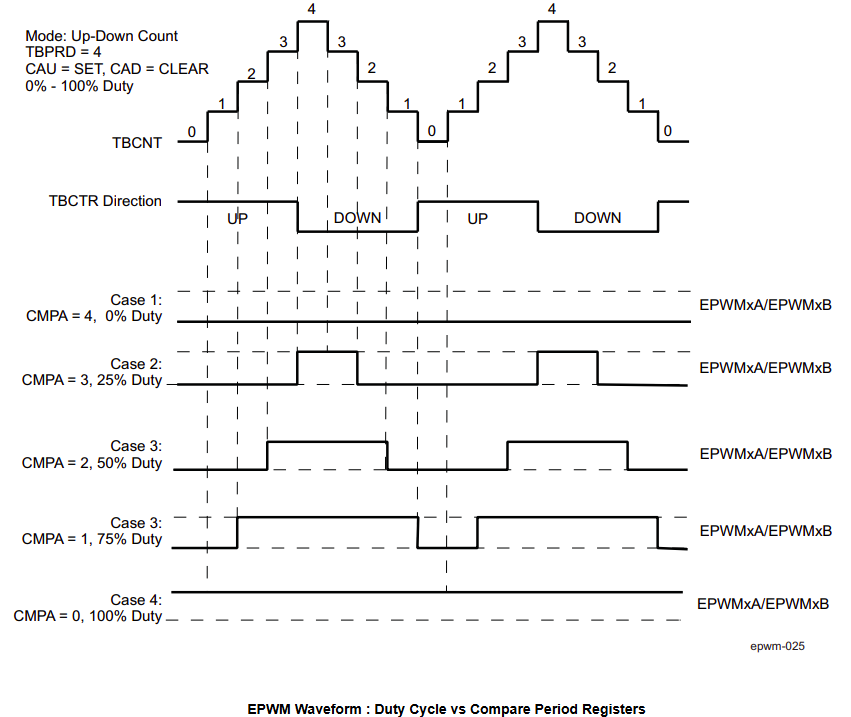   
</p>

​<p align="center">
  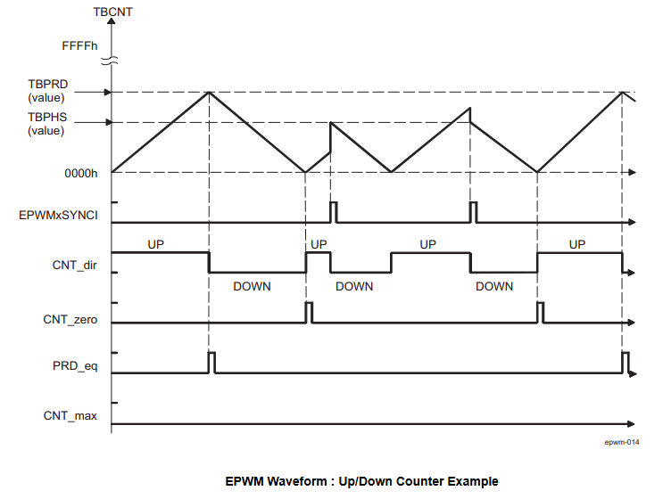   
</p>

### Dynamic Behavior
+ As the PWM module is implemeted using a timer, as detailed in section 7.1 , a timer would be in one of the following states. Initialized, running, stopped, expired. The diagram below shows transitions of states:

​<p align="center">
  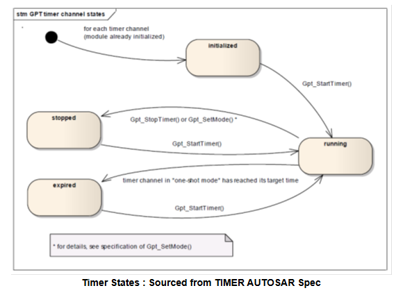   
</p>

+ States for EPWM
  - Before Pwm_Init() - PWM_STATUS_UNINIT
  - After Pwm_Init() - PWM_STATUS_INIT
  - After Pwm_DeInit() - PWM_STATUS_UNINIT

### Directory Structure

​<p align="center">
  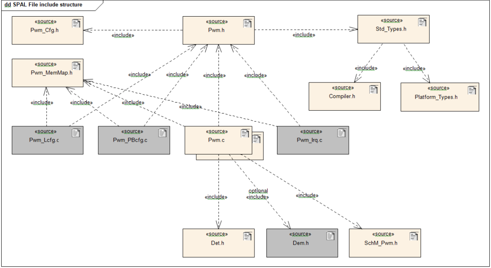   
</p>

### NON Standard configurable parameters

​<p align="center">
  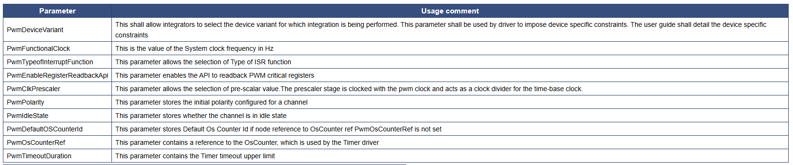   
</p>

### Development Errors

​<p align="center">
  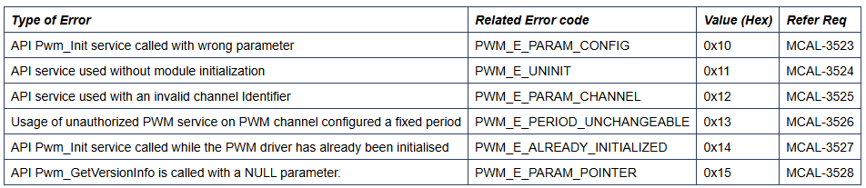   
</p>

### Data Types
+ Maximum number of channels: uint32	PWM_MAX_CHANNELS	Defines the maximum number of channels that are configured. Its required that configurations for all channel specified is valid.
+ Pwm_ChannelType: Used to specify the numeric identifier for a channel
+ Pwm_PeriodType: Used to specify the period of a PWM channel
+ Pwm_OutputStateType: Used to specify the Output state of a PWM channel
+ Pwm_EdgeNotificationType: Enumeration used to specify the type of edge notification of a PWM channel
+ Pwm_ChannelClassType: Enumeration used to specify the class of a PWM channel, whether the period is fixed or not
+ Pwm_ConfigType: Hardware dependent structure used to specify the initial data for the PWM driver

### API
+ Pwm_Init, Pwm_DeInit, Pwm_SetDutyCycle, Pwm_SetPeriodAndDuty, Pwm_SetOutputToIdle, Pwm_DisableNotification, Pwm_EnableNotification, Pwm_GetVersionInfo

### Global Variables

​<p align="center">
  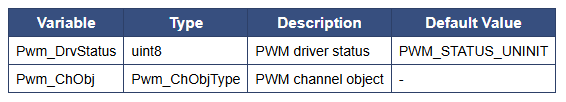   
</p>

### Safety Analysis
***EPWM Module***
+ The following tests can be applied as diagnostics for this module (to provide diagnostic coverage on a specific function):
  1. Software Test of Basic functionality including error tests: Application can use the Pwm_EnableNotification() API to verify correct frequency by counting the number of interrupts received in particular time period. Reference example will be provided in MCAL package. The Unit Test framework will be used to check basic functionality, as well as negative tests by injecting errors.
  2. Information redundancy techniques: Application can implement this using GPIO inputs used as interrupts. The interrupts can be timestamped to provide a check on the pulse widths.
  3. Monitoring by eCAP: Application can use external eCAP module to monitor the PWM outputs.
  4. Periodic software readback of static configuration registers: The driver will internally readback the configured registers to ensure correct value has been set.
  5. Software readback of written configuration: The driver provides a Pwm_RegisterReadback() API that application can use to check configured register value. Reference example will be provided in MCAL package during later release.

***GPTimer Module***
1. 1oo2 Voting Using a Second Timer: Application can use other time based modules on the device to periodically check and perform diagnostic on main counter. Example of other external time based modules include PMU (Performance Monitoring Unit), Timer Manager Module and Global Timebase Counter (GTC).
2. Software Test of Basic Functionality including error tests: Application can use the Pwm_EnableNotification() API to verify correct frequency by counting the number of interrupts received in particular time period. Reference example will be provided in MCAL package. The Unit Test framework will be used to check basic functionality, as well as negative tests by injecting errors.
3. Software readback of written configuration: The driver provides a Pwm_RegisterReadback() API that application can use to check configured register value. Reference example will be provided in MCAL package during later release.
4. Periodic software readback of static configuration registers: The driver will internally readback the configured registers to ensure correct value has been set.
5. Analog-to-Digital Converter Information redundancy techniques: Information redundancy techniques can be applied via software as an additional runtime diagnostic on ADC conversion. This can be done by application to filter and perform plausibility check to ensure converted values are in expected range.

### Timer Mode configuration in Overflow Only Mode for Duty cycle of 50%
+ The PWM signal generation when duty cycle is 50% and 0% < duty cycle < 100% can be done in the following ways:
  - Configure the timer in overflow only mode in the case where the duty cycle is 50%. In this case, the overflow rate of the timer is kept at half the desired PWM period. When 0% < duty cycle < 100%, the timer is configured in overflow and compare mode with overflow rate kept at the desired period of PWM signal and the formulas given in (Fundamental Operation) are used to calculate the compare and reload register values.
  - Configure the timer in overflow and compare mode always irrespective of duty cycle and the overflow rate is kept at the PWM period and in the case of 50% duty cycle, the compare register TMAR can be kept at half the reload register value.
+ Criteria: The PWM signal generation from the timer should be optimized.
+ Use timer in either Overflow Mode or ( Overflow and Compare Mode) configuration depending on duty cycle
  - Advantages: Incase of 50% duty cycle, only the overflow register condition needs to be checked to generate the interrrupts and PWM signal.
  - Disadvantages: Seperate one time Mode configuration depending on the duty cycle needs to be done in software.
+ Use of Timer in compare and overflow Mode configurations irrespective of duty cycle
  - Advantages: No need to have seperate Mode configuration of timer for different duty cycles. Timer can be configured in overflow and compare mode.
  - Disadvantages: In 50% duty cycle, register compare to TMAR register needs to be performed continuously to detect the compare condition
+ Decision: The PWM module is more efficeintly implemented by operating timer in overflow mode alone when duty cycle of 50% is required as this avoids the continuous register compare to TMAR to generate the trigger at compare condition. The configuration to overflow or overflow and compare in different duty cycles needs to be done one time, and is a lesser overhead.

### Test Criteria
+ PWM Wave generation : Polarities
 - Test cases shall check the generation of PWM wave based on different initial polarities configured. This will be verified on the CRO.
+ PWM Wave generation : Duty Cycle, Period and Input clock frequency
  - Test cases shall perform equivalence class test and ensure different duty cycles, periods for a PWM signal can be supported based on input clock frequencies.
  - Test cases should also check for conditions where the PWM parameters are reconfigured while the timer is running.
+ PWM Wave generation :Reset (Period = 0)
  - Test cases should check the behaviour on reset and with Period = 0
+ PWM Multiple Instances
  - Configure multiple PWM instances with duty cycle of 75% and 25%, reset and vary the duty cycles to ensure that the re-entrancy is maintained.

## 📌 Reference

[0] https://www.autosar.org/fileadmin/user_upload/standards/classic/4-3/AUTOSAR_SWS_ICUDriver.pdf

[1] https://youtu.be/G-Y27cojQb8?si=WphEMRTopmP83CDc

[2] https://autosarthonv.github.io/

[3] https://software-dl.ti.com/jacinto7/esd/processor-sdk-rtos-jacinto7/08_01_00_11/exports/docs/mcusw/mcal_drv/docs/drv_docs/index.html

[4] https://www.youtube.com/watch?v=YeAsBK0K0F0&list=PLE9xJNSB3lTFFjw2Or_ayjf-CSX0VypIE

