# 💚 Introduction MCAL AUTOSAR MODULE 💛

## 👉 Introduction and Summary

### 1️⃣ Introduction

+ Ở repo này mình sẽ nói overview về kiến thức các module trong Autosar Mcal nhé. Version Autosar trong repo này là 4.3.1 nhé.

### 2️⃣ Summary

Nội dung của bài viết gồm có những phần sau nhé 📢📢📢:
- [I. Introduction and Summary](#👉-introduction-and-summary)
    - [1. Introduction](#1️⃣-introduction)
    - [2. Summary](#2️⃣-summary)
- [II. Contents](#👉-contents)
    - [1. MCAL Configurator](#1️⃣-MCAL-Configurator)
    - [2. Can Module](#2️⃣-Can-Module)
- [III. Reference](#📌-reference)

## 👉 Contents

### 1️⃣ MCAL Configurator
***MCAL sử dụng Elektrobit Tresos để cấu hình các mô-đun MCAL.***
+ Định nghĩa tham số ECU của mô-đun MCAL được ghi lại ở định dạng Elektrobit xdm.
+ Các mô-đun MCAL được cung cấp dưới dạng plugin EBtresos.
+ Việc cấu hình các mô-đun MCAL có thể được thực hiện bằng Trình chỉnh sửa cấu hình Elektrobit Tresos.
+ Sau khi quá trình cấu hình hoàn tất, mã có thể được tạo ra cho các biến thể trình điều khiển được hỗ trợ.
+ Một mô-đun điển hình sẽ bao gồm các tệp sau:
  + Định nghĩa mô-đun
    - Module.xdm : Mô tả mô-đun có thể được dùng để tạo ra file arxml
    - Module.epd
  + Code generate
    - Module_Cfg.h : Cung cấp mẫu để tạo tệp tiêu đề.
    - Module_Cfg.c : Cung cấp mẫu để tạo cấu hình mô-đun trong quá trình biên dịch.
    - Module_Lcfg.c : Cung cấp mẫu để tạo cấu hình mô-đun Link Time.
    - Module_PBcfg.c : Cung cấp mẫu để tạo cấu hình mô-đun sau khi biên dịch.
  + Module_Bswmd.arxml: Chi tiết mô-đun như cách sử dụng ngăn xếp, tệp, vùng độc quyền, v.v...
  + MANIFEST.MF: Thông tin cấp phép của mô-đun (bắt buộc đối với EB)
  + plugin.xml: Mô tả mô-đun sẽ được sử dụng bởi giao diện người dùng đồ họa (GUI) của EB Tresos Studio.

***Tạo nội dung bằng giao diện dòng lệnh Tresos Studio.***
+ Nội dung config của mô-đun MCAL có thể được tạo bằng lệnh tresos và cấu hình được đề xuất cho một mô-đun nhất định. Các bước sau đây mô tả chi tiết trình tự các thao tác cần thiết. Dựa trên SOC, bạn cần chọn các plugin tương ứng.
+ Lệnh dưới đây có thể được sử dụng
```bash
 C:\EB\tresos\bin\tresos_cmd.bat -Decuid=mcal_example_config_1 -Dtarget=R5F -Dderivate=J721E legacy generate -n Can -g Can_HuLa -oc:\program\Can.xdm
```
+ Các tùy chọn được sử dụng là
  - -Decuid: Specifies the ID of the imported ECU
  - -Dtarget: Defines the target architecture ECU
  - -Dderivate: Defines the targets derivate
  - -n: Specifies the name of the module configurations of the configuration files to load
  - -g: Module Id
  - -o: Sets the directory to which the generated files are written

***Tạo EPD và ARXML***
+ EB Tresos cung cấp commandline để chuyển đổi các tệp XDM thành định nghĩa mô-đun EPD hoặc ARXML

+ **Tạo EPD**
1. Open cmd
2. Giả sử EB được cài đặt trong "C:/EB", hãy chạy lệnh dưới đây để tạo EPD cho mô-đun Can. Dựa trên SOC, bạn cần chọn các plugin tương ứng.
```bash
C:\EB\tresos\bin\tresos_cmd.bat -Duuids=true -DecuParamDef=true -DValidate=true -DrestrictShortName=true -DwriteDefaults=true legacy convert Can.xdm Can.epd@asc:4.4.0
```

+ **Tạo ARXML**
1. Open cmd
2. Giả sử EB được cài đặt trong "C:/EB", hãy chạy lệnh dưới đây để tạo ARXML cho mô-đun Can. Dựa trên SOC, bạn cần chọn các plugin tương ứng.
```bash
C:\EB\tresos\bin\tresos_cmd.bat -DValidate=false -DwriteXPathAttributes=false legacy convert Can.xdm Can_HuLa.arxml@asc:4.4.0
```
3. Nếu có cảnh báo nào đó về việc sử dụng XPATH, hãy chạy lại chương trình với tùy chọn này.
```bash
DwriteXPathAttributes=true
```
4. File arxml được tạo ra đã được kiểm tra tính hợp lệ.

### 2️⃣ Can Module

1. ***Giới thiệu***
+ Repo này mô tả chi tiết việc triển khai mô-đun AUTOSAR BSW CAN.
  - Phiên bản AUTOSAR được hỗ trợ : 4.3.1
  - Các biến thể cấu hình được hỗ trợ : Sau khi biên dịch, Trước khi biên dịch
+ Trình điều khiển CAN cung cấp các dịch vụ truyền và nhận khung CAN cơ bản ở cả chế độ ngắt và chế độ thăm dò. Các thành phần này có thể được sử dụng bởi một ứng dụng.

2. ***CAN Driver Architecture Design***
+ Hình dưới đây mô tả kiến ​​trúc phân lớp của AUTOSAR gồm 3 lớp riêng biệt: Ứng dụng, Môi trường thời gian chạy (RTE) và Phần mềm cơ bản (BSW). BSW được chia nhỏ hơn nữa thành 4 lớp: Dịch vụ, Trừu tượng hóa đơn vị điều khiển điện tử, Trừu tượng hóa vi điều khiển (MCAL) và Trình điều khiển phức tạp.

​<p align="center">
     
</p>

+ MCAL là lớp trừu tượng thấp nhất của phần mềm cơ bản. Nó chứa các mô-đun phần mềm tương tác trực tiếp với vi điều khiển và các thiết bị ngoại vi bên trong của nó. Trình điều khiển CAN là một phần của Trình điều khiển vi điều khiển (khối, được hiển thị ở trên). Hình bên dưới cho thấy vị trí của trình điều khiển CAN trong kiến ​​trúc AUTOSAR.

​<p align="center">
  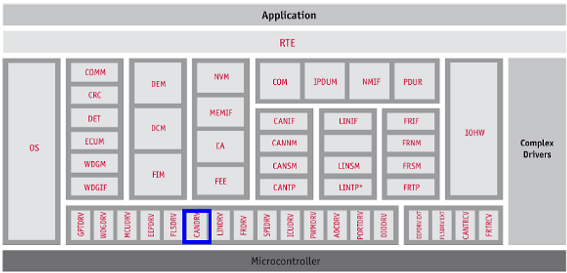   
</p>

+ ***Mô-đun Can cung cấp các dịch vụ sau.***
  - Trong quá trình truyền L-PDU, mô-đun CAN ghi L-PDU vào một bộ đệm thích hợp bên trong phần cứng bộ điều khiển CAN.
  - Khi nhận được L-PDU, mô-đun CAN sẽ gọi hàm gọi lại chỉ báo RX với ID, DLC và con trỏ đến L-SDU làm tham số.
  - Mô-đun Can cung cấp một giao diện đóng vai trò là chức năng xử lý định kỳ, và chức năng này phải được mô-đun Lập lịch phần mềm cơ bản gọi định kỳ.
  - Mô-đun CAN cung cấp các dịch vụ để điều khiển trạng thái của các bộ điều khiển CAN. Các sự kiện tắt bus và đánh thức được thông báo thông qua các hàm gọi lại.
+ Hình dưới đây minh họa sự tương tác giữa trình điều khiển Can với các mô-đun khác của ngăn xếp AUTOSAR.

​<p align="center">
  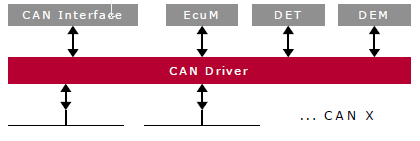   
</p>

+ ***Tổng quan về Can (FD)***
  - Mạng điều khiển khu vực (CAN) là một giao thức truyền thông nối tiếp hỗ trợ hiệu quả việc điều khiển thời gian thực phân tán. CAN có khả năng chống nhiễu điện cao. Trong mạng CAN, nhiều thông điệp ngắn được phát sóng đến toàn bộ mạng, đảm bảo tính nhất quán dữ liệu tại mọi nút trong hệ thống.
  - Mô-đun CAN (còn được gọi là MCAN) hỗ trợ cả hai chuẩn CAN cổ điển và CAN FD (CAN với tốc độ dữ liệu linh hoạt). Tính năng CAN FD cho phép thông lượng cao và tải trọng lớn hơn trên mỗi khung dữ liệu. Các thiết bị CAN cổ điển và CAN FD có thể cùng tồn tại trên cùng một mạng mà không gây xung đột.
  - SoC có thể hỗ trợ nhiều mô-đun CAN, vui lòng tham khảo tài liệu hướng dẫn kỹ thuật của thiết bị để biết số lượng chính xác. Mỗi mô-đun MCAN hỗ trợ tốc độ truyền dữ liệu linh hoạt lớn hơn 1 Mbps và tuân thủ tiêu chuẩn ISO 11898-1:2015.
  - Các đặc điểm chính của CAN là
    + Tuân thủ giao thức CAN 2.0 A, B và tiêu chuẩn ISO 11898-1
    + Hỗ trợ đầy đủ CAN FD (tối đa 64 byte dữ liệu)
    + Hỗ trợ AUTOSAR và SAE J1939
    + Tối đa 32 bộ đệm truyền chuyên dụng
    + FIFO truyền có thể cấu hình, tối đa 32 phần tử
    + Hàng đợi truyền có thể cấu hình, tối đa 32 phần tử
    + FIFO sự kiện truyền có thể cấu hình, tối đa 32 phần tử
    + Tối đa 64 bộ đệm nhận chuyên dụng
    + Hai FIFO nhận có thể cấu hình, tối đa 64 phần tử mỗi FIFO.
    + Hỗ trợ tối đa 128 phần tử lọc tiêu chuẩn.
    + Hỗ trợ tối đa 64 phần tử lọc mở rộng.
    + Chế độ vòng lặp nội bộ để tự kiểm tra
    + Bộ đếm dấu thời gian

+ ***Các tính năng được hỗ trợ***
  - Khởi tạo và hủy khởi tạo tất cả các bộ điều khiển CAN/MCAN trên SoC.
  - Truyền tải khung CAN và xác nhận
  - Tiếp nhận khung CAN
  - Chế độ thăm dò để xác nhận đọc và ghi
  - Hỗ trợ phát hiện và báo cáo lỗi CAN.
  - Các đối tượng hộp thư – CAN đầy đủ cho cả Tx và Rx (32 Tx và 64 Rx)
  - Các mã số yêu cầu được liệt kê bên dưới sẽ được hỗ trợ.

+ ***Các tính năng không được hỗ trợ / Không tuân thủ***
  - [Không tuân thủ] Chức năng đánh thức bằng phần cứng không được hỗ trợ
  - [Không tuân thủ] Không hỗ trợ kết nối mạng giả lập.
  - [Không tuân thủ] Hỗ trợ cho TTCAN
  - [Tùy chọn AUTOSAR] Hỗ trợ API truyền kích hoạt
  - [Tùy chọn AUTOSAR] Chức năng gọi hàm L-PDU không được hỗ trợ
  - Hỗ trợ các tham số cấu hình bổ sung/cụ thể cho thiết bị

+ ***Các giả định***
  - Các giả định được liệt kê bên dưới được cho là hợp lệ đối với thiết kế/triển khai này, các trường hợp ngoại lệ và sai lệch khác được liệt kê rõ ràng cho từng trường hợp. Cần lưu ý đảm bảo rằng các giả định này được xem xét đầy đủ.
    + Cần đảm bảo rằng xung nhịp chức năng của mô-đun CAN được bật trước khi gọi bất kỳ API nào của mô-đun CAN. Trình điều khiển CAN không thực hiện bất kỳ lập trình nào để lấy xung nhịp chức năng.
    + Việc lựa chọn nguồn xung nhịp cho CAN không do trình điều khiển CAN thực hiện, mà các thực thể khác như MCU hoặc MCAL sẽ thực hiện việc này.
    + Việc cấu hình chân cắm dùng cho CAN không do trình điều khiển CAN thực hiện, mà các thực thể khác hoặc mô-đun MCAL PORT sẽ thực hiện việc này.

+ ***Hạn chế***
  - Một số hạn chế quan trọng của thiết kế này được liệt kê dưới đây.
    + Các HTH và HRH sẽ được chia thành 2 nhóm, tức là một nhóm trong đó mỗi HTH/HRH chỉ được mapping tới một hardware mailbox duy nhất (mapping 1:1) và một nhóm khác trong đó mỗi HTH/HRH được mapping tới một nhóm các hardware mailbox (mapping 1:n). Số lượng hardware mailbox được gán cho một HTH/HRH 'n' có thể được cấu hình thông qua biến 'CanHwObjectCount'.
    + Xin lưu ý rằng nếu chúng ta sử dụng FIFO để nhận, chúng ta không thể đảm bảo số lượng tin nhắn nhận được chính xác cho một ID tin nhắn cụ thể vì nó sẽ được đưa vào vùng nhớ FIFO chung. Ví dụ: Nếu bạn cấu hình CanID1 là 0xC1, kích thước FIFO là 3 và CanID2 là 0xD1, kích thước FIFO là 2, tổng kích thước FIFO được phân bổ sẽ là 5. Nếu bạn truyền 0xC1 4 lần và truyền 0xD1 2 lần, cả 4 tin nhắn 0xC1 sẽ được lưu trữ trong FIFO và chỉ có một tin nhắn 0xD1 được lưu trữ trong FIFO. Tin nhắn 0xD1 khác sẽ bị mất vì không có chỗ để lưu trữ.
    + Trong trường hợp RxProcessing Type được chọn là chế độ MIXED, ngắt sẽ được bật cho tất cả các bộ đệm Rx. Nếu bất kỳ hộp thư (Bộ đệm Rx) nào được cấu hình cho chế độ MIXED và HwObjUsesPolling được đặt thành TRUE, thì sẽ xảy ra ngắt giả, điều này không thể tránh khỏi do hạn chế của phần cứng.
    + Trong trường hợp mô-đun MCU không được sử dụng (hỗ trợ) để cấu hình nguồn xung nhịp cho mô-đun CAN ( Giả định 2).

***+ Hoạt động cơ bản***
  - Mô-đun MCAN thực hiện giao tiếp giao thức CAN theo tiêu chuẩn ISO 11898-1:2015. Tốc độ bit có thể được lập trình lên các giá trị lớn hơn 1 Mbps. Cần có phần cứng thu phát bổ sung để kết nối với lớp vật lý (bus CAN).
  - Để giao tiếp trên mạng CAN, các khung thông báo riêng lẻ có thể được cấu hình. Các khung thông báo và mặt nạ định danh được lưu trữ trong bộ nhớ RAM thông báo. Tất cả các chức năng liên quan đến việc xử lý thông báo được thực hiện trong bộ xử lý thông báo. Tập hợp các thanh ghi của mô-đun MCAN có thể được truy cập trực tiếp thông qua giao diện mô-đun. Các thanh ghi này được sử dụng để điều khiển và cấu hình lõi CAN và bộ xử lý thông báo, cũng như để truy cập bộ nhớ RAM thông báo.

​<p align="center">
     
</p>

  - CAN Core: Lõi CAN bao gồm bộ điều khiển giao thức CAN và thanh ghi dịch chuyển Rx/Tx. Nó xử lý tất cả các chức năng của giao thức ISO 11898-1:2015 và hỗ trợ các định danh 11 bit và 29 bit.
  - Message Handler: Bộ xử lý thông báo (Bộ xử lý nhận và Bộ xử lý truyền) là một máy trạng thái điều khiển việc truyền dữ liệu giữa RAM thông báo một cổng và thanh ghi dịch chuyển nhận/truyền của lõi CAN. Nó cũng xử lý việc lọc chấp nhận.
  - Message RAM: Mục đích chính của bộ nhớ RAM thông báo là lưu trữ các thông báo nhận/gửi, các phần tử sự kiện gửi và các phần tử bộ lọc ID thông báo.
  - Message RAM Interface: Cho phép kết nối giữa RAM thông báo và các khối khác trong mô-đun MCAN.
  - Registers and Message Object Access: Tính nhất quán dữ liệu được đảm bảo bằng cách truy cập gián tiếp vào các đối tượng thông báo. Trong hoạt động bình thường, tất cả các truy cập phần mềm và DMA vào RAM thông báo đều được thực hiện thông qua các thanh ghi giao diện. Các thanh ghi giao diện có cùng độ dài từ với RAM thông báo.
  - Module Interface: Các thanh ghi của mô-đun MCAN được phần mềm người dùng truy cập thông qua giao diện bus ngoại vi 32 bit.
  - Clocking: Mô-đun MCAN được cung cấp hai xung nhịp, xung nhịp đồng bộ ngoại vi (xung nhịp giao diện - MCANx_ICLK) và xung nhịp không đồng bộ ngoại vi (xung nhịp chức năng - MCANx_FCLK). Một thực thể bên ngoài trình điều khiển CAN sẽ cung cấp/cấu hình, chẳng hạn như SBL, MCU của mô-đun MCAL sẽ thực hiện việc này.

+ ***Classic Can (Normal Operation)***
  - Sau khi mô-đun MCAN được khởi tạo và bit INIT được đặt lại về 0, mô-đun MCAN sẽ tự đồng bộ hóa với bus CAN và sẵn sàng cho việc giao tiếp. Sau khi vượt qua bộ lọc chấp nhận, các thông điệp nhận được, bao gồm Mã định danh thông điệp (ID) và Mã độ dài dữ liệu (DLC), được lưu trữ vào bộ đệm Rx chuyên dụng hoặc vào Rx FIFO 0/Rx FIFO 1. Đối với các thông điệp cần truyền, các bộ đệm Tx chuyên dụng và/hoặc Tx FIFO hoặc Tx Queue có thể được khởi tạo hoặc cập nhật.
+ ***CAN FD***
  - Chuẩn CAN FD cho phép truyền các khung mở rộng, tối đa 64 byte dữ liệu trong một khung duy nhất và ở tốc độ bit cao hơn cho pha dữ liệu của khung, lên đến 8 Mbps. Chuẩn CAN FD giới thiệu khả năng chuyển đổi từ tốc độ bit này sang tốc độ bit khác. Độ dài dữ liệu mở rộng (EDL), như thể hiện trong Hình, thiết lập độ dài dữ liệu lên đến 8 hoặc lên đến 64 byte dữ liệu. Chuyển đổi tốc độ bit (BRS) cho biết liệu hai tốc độ bit (pha dữ liệu được truyền ở tốc độ bit khác với pha phân bổ) có được bật hay không.

​<p align="center">
  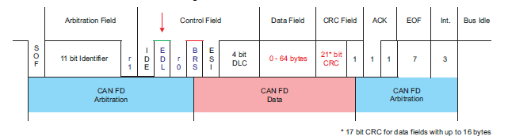   
</p>

+ Có hai biến thể của việc truyền khung CAN FD.
  - CAN FD frame transmission without bit rate switching
  - Truyền khung CAN FD trong đó trường điều khiển, trường dữ liệu và trường CRC được truyền với tốc độ bit cao hơn so với phần đầu và phần cuối của khung.

+ Trong khung CAN, FDF = recessive (logic 1) biểu thị khung CAN FD, FDF = dominant (logic 0) biểu thị khung CAN cổ điển. Trong khung CAN FD, hai bit sau FDF - res và BRS, quyết định xem tốc độ bit bên trong khung CAN FD này có được chuyển đổi hay không. Việc chuyển đổi tốc độ bit CAN FD được biểu thị bằng res = dominant và BRS = recessive. Lưu ý rằng mã hóa res = recessive được dành cho việc mở rộng giao thức trong tương lai.
+ Trong trường hợp mô-đun MCAN nhận được khung dữ liệu với FDF = recessive và res = recessive, nó sẽ báo hiệu Protocol Exception Event. Khi Protocol Exception Handling được bật, điều này sẽ khiến trạng thái hoạt động thay đổi từ Receiver to Integrating at the next sample point. Trong trường hợp Protocol Exception Handling bị tắt, MCAN sẽ coi bit res recessive là lỗi định dạng và sẽ phản hồi bằng một error frame.
+ Chế độ hoạt động CAN FD được kích hoạt bằng cách lập trình bit FDOE. Trong trường hợp FDOE = 1, việc truyền và nhận khung CAN FD được cho phép. Việc truyền và nhận khung CAN cổ điển luôn khả thi. Có thể cấu hình việc truyền khung CAN FD hay khung CAN cổ điển thông qua bit FDF trong phần tử Tx Buffer tương ứng.
+ Việc thay đổi chế độ trong quá trình hoạt động CAN chỉ được khuyến nghị trong các điều kiện sau:
    - Tỷ lệ lỗi trong giai đoạn dữ liệu CAN FD cao hơn đáng kể so với giai đoạn phân xử CAN FD. Trong trường hợp này, hãy tắt tùy chọn chuyển đổi tốc độ bit CAN FD cho các lần truyền.
    - Trong quá trình khởi động hệ thống, tất cả các nút đều truyền các thông điệp CAN cổ điển cho đến khi được xác minh rằng chúng có thể giao tiếp ở định dạng CAN FD. Nếu điều này đúng, tất cả các nút sẽ chuyển sang hoạt động ở chế độ CAN FD.
    - Các thông báo đánh thức trong mạng CAN một phần phải được truyền tải ở định dạng CAN cổ điển.
    - Lập trình cuối dây chuyền trong trường hợp không phải tất cả các nút đều hỗ trợ CAN FD. Các nút không hỗ trợ CAN FD sẽ được giữ ở chế độ im lặng cho đến khi quá trình lập trình hoàn tất. Sau đó, tất cả các nút sẽ chuyển trở lại giao tiếp CAN cổ điển.
***3. Dynamic Behavior***
+ Can sẽ ở 1 trong các state sau: Un Initialized, Initialized, started, stopped, sleep and wakeup. Xin lưu ý rằng "thức dậy" không được hỗ trợ.
+ Mỗi channel cần duy trì một biến để theo dõi và cập nhật trạng thái. Sơ đồ bên dưới minh họa sự chuyển đổi trạng thái và các API liên quan.

​<p align="center">
  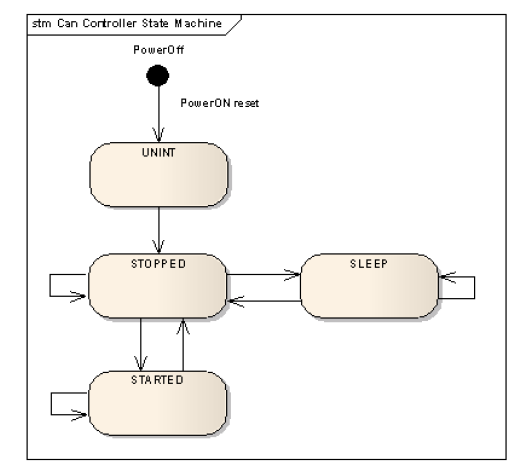   
</p>

+ Các states:
    - STATE_UNINT: Đây là trạng thái khi phần cứng vừa được khởi động.
    - STATE_STOPPED: Đây là trạng thái của phần cứng sau khi quy trình khởi tạo được gọi. Bộ điều khiển CAN đã được khởi tạo hoàn toàn nhưng không tham gia vào các giao dịch trên bus.
    - STATE_START : Đây là trạng thái của phần cứng khi nó hoạt động đầy đủ, tức là nó đang gửi và nhận tin nhắn từ bus trên mạng CAN.
    - STATE_SLEEP: Đây là trạng thái của phần cứng khi bộ điều khiển đang ở chế độ ngủ.
+ API Can_SetControllerMode() có thể được sử dụng để chuyển đổi giữa các trạng thái sau: CAN_T_START, CAN_T_STOP, CAN_T_SLEEP.

+ 1 ví dụ về các file include khi không có cấu trúc nhiều layer

​<p align="center">
  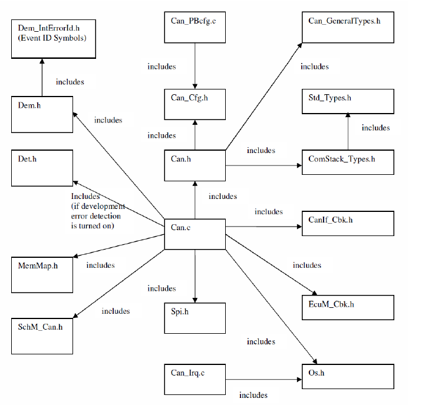   
</p>

***4. NON Standard configurable parameters***
+ Danh sách sau đây liệt kê các thông số cấu hình cụ thể của thiết kế này.
    - CanControllerInstance	Chọn phiên bản bộ điều khiển CAN đã được cấu hình, ví dụ: MCAN0 hoặc MCAN1.
    - CanDefaultOSCounterId	ID bộ đếm hệ điều hành mặc định nếu tham chiếu nút đến tham chiếu OsCounter là CanOsCounterRef không được thiết lập. Trình điều khiển phải triển khai chờ có thời gian cho tất cả các lần chờ (ví dụ: chờ quá trình thiết lập lại hoàn tất). Thời gian chờ này sẽ sử dụng API hệ điều hành GetCounterValue().
    - CanTypeofInterruptFunction	Loại hàm ISR CAT1 : ngắt void func(void) CAT2 : ISR(func)
    - CanRegisterReadbackAPI	Bật/Tắt API TI an toàn để đọc lại cấu hình. Nếu tham số này được đặt thành true, API đọc lại sẽ được hỗ trợ. Nếu không, API sẽ không được hỗ trợ.
    - CanDemEventParameterRefs	Tham chiếu đến DemEventParameter sẽ được phát ra khi xảy ra lỗi hết thời gian chờ trong quá trình gọi API chặn.
    - CanDeviceVariant	Chọn SOC đang được sử dụng. Tham số này sẽ được trình điều khiển sử dụng để áp đặt các ràng buộc cụ thể cho thiết bị. Hướng dẫn sử dụng sẽ nêu chi tiết các ràng buộc cụ thể cho thiết bị (nếu có).
    - CANFDCLK	Tần số xung nhịp được cung cấp cho mô-đun CAN FD tính bằng MHz. Xung nhịp này cần thiết để tính toán giá trị BRP (Baud Rate Prescaler).
    - CanLoopBackTest_Enable	Bật/Tắt API kiểm thử LoopBack. Nếu tham số này được đặt thành true, chế độ LoopBack sẽ được hỗ trợ, chế độ này được sử dụng để kiểm thử nội bộ. Nếu không, API sẽ không được hỗ trợ.
***5. Error Classification***
+ Errors are classified in two categories, development error and runtime / production error.

***Development Errors***

​<p align="center">
  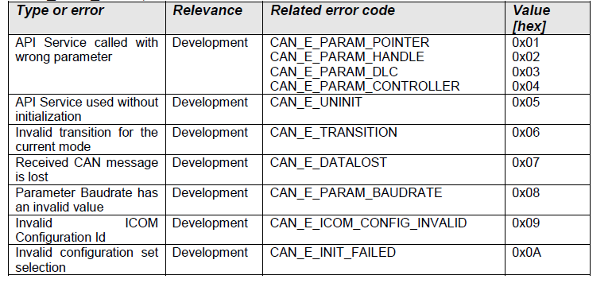   
</p>

***Error Detection***
+ Việc phát hiện lỗi phát triển có thể được cấu hình (BẬT/TẮT) trong quá trình biên dịch trước. Công tắc CanDevErrorDetection sẽ kích hoạt hoặc vô hiệu hóa việc phát hiện tất cả các lỗi phát triển.

***Thông báo lỗi (DET)***
+ Tất cả các lỗi phát triển được phát hiện đều được báo cáo cho dịch vụ Det_ReportError của Hệ thống Theo dõi Lỗi Phát triển (DET).

***Runtime Errors***
​<p align="center">
  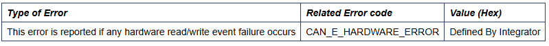   
</p>

***Error notification (DEM)***
+ All detected run time errors shall be reported to Dem_ReportErrorStatus () service of the Diagnostic Event Manager (DEM).

***MACROS, Data Types & Structures***
+ The sections below lists some of key data structures that shall be implemented and used in driver implementation

***Maximum number of controller and mailboxes.***
+ These values depends on the SoC and integrators shall not modify the same.
+ uint32:CAN_MAX_CONTROLLER: Defines the maximum number of controllers that are configured. It’s used internally by the driver object as size parameter to allocate can controller object type structures.
+ uint32: CAN_MAX_MAILBOXES: Defines the maximum number of mailboxes that are configured. It’s used internally by the driver object as a size parameter to allocate can controller mailbox arrays.

***Can_ControllerType***
+ Can_BaudConfigType	*DefaultBaud	Pointer to the default Baud structure
+ Can_BaudConfigType	**BaudRateConfigList	List of available Baud rate structures

***Can Controller Pre-Compile Configuration(Can_ControllerType_PC)***
+ uint8	ControllerId	This parameter provides the controller ID which is unique in a given CAN Driver.
+ boolean	CntrActive	Defines if a CAN controller is used in the configuration
+ uint32	CntrAddr	Specifies the CAN controller base address.(Need to provide Message RAM Base Address, please refer MCAN Message RAM Configuration For details)
+ Can_TxRxProcessingType	RxInterrupt	CAN_TX_RX_PROCESSING_INTERRUPT/CAN_TX_RX_PROCESSING_MIXED/CAN_TX_RX_PROCESSING_POLLING
+ Can_TxRxProcessingType	TxInterrupt	CAN_TX_RX_PROCESSING_INTERRUPT/CAN_TX_RX_PROCESSING_MIXED/CAN_TX_RX_PROCESSING_POLLING
+ boolean	BusOffProcessingInterrupt	TRUE = Interrupt mode enabled FALSE = Polling mode
Can_ControllerInstance	CanControllerInst	Specifies theCan controller Instance selected.
+ boolean	CanFDModeEnabled	Controller is in CAN FD Mode or not.

***Mailbox Configuration(Can_MailboxType)***
+ uint8	CanHandleType	Specifies the type (Full-CAN or Basic-CAN) of a hardware object. .
+ uint32	MBIdType	CanIdType 0=standard 1=Extended 2= Mixed
+ Can_HwHandleType	HwHandle	Actual HW Mailbox object in the controller.
+ uint16	CanHwObjectCount	Number of hardware objects used to implement one HOH
+ Can_MailBoxDirectionType	MBDir	Direction of Mailbox whether TRANSMIT or RECEIVE
+ const Can_ControllerType_PC	*Controller	Reference to CAN Controller to which the HOH is associated to.
+ Can_HwFilterType	**HwFilterList	List of HW Filter structure of this mailbox.
+ uint32	HwFilterCnt	HW filter count
+ uint8	CanFdPaddingValue	If PduInfo->SduLength does not match possible DLC values CanDrv will use the next higher valid DLC for transmission with initialization of unused bytes to the value of the corresponding CanFdPaddingValue.

***Can Mailbox Pre-Compile Configuration(Can_MailboxType_PC)***
+ uint16	CanObjectId	Holds the handle ID of HRH or HTH.

***Can Configuration(Can_ConfigType)***
+ Can_ControllerType	**CanControllerList	List of enabled Controllers.
+ uint8	CanMaxControllerCount	MaxCount of Controller in Controller List
+ Can_MailboxType	**MailBoxList	MailBox array for all controllers.
+ boolean	MaxMbCnt	Max MailBox Count in MB list in all controller
+ uint32	MaxBaudConfigID	Max Baud Config Index in BaudRateConfigList in all controller

***Can_Init***
​<p align="center">
  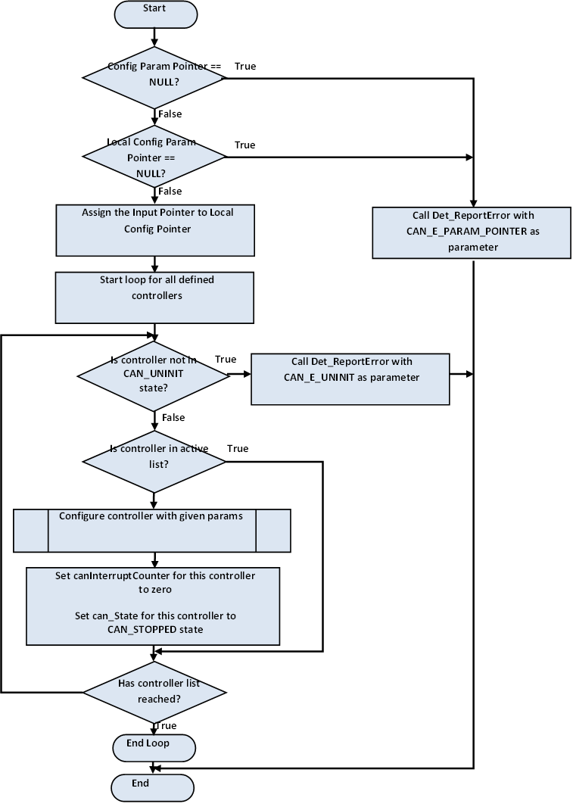   
</p>

***Can_SetControllerMode***
​<p align="center">
  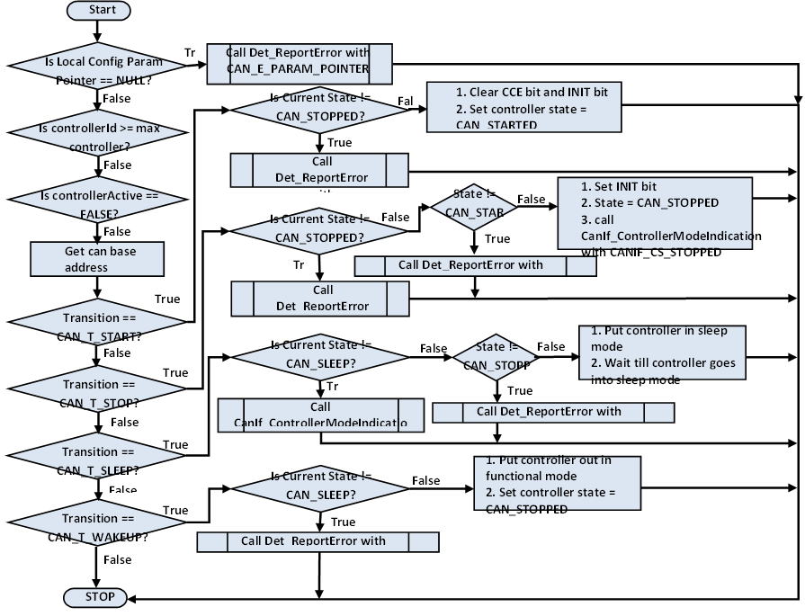   
</p>

***Can_Write***
​<p align="center">
  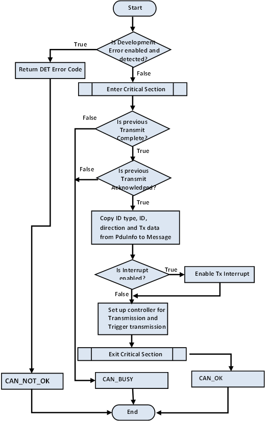   
</p>

***Can_DisableControllerInterrupts***
​<p align="center">
  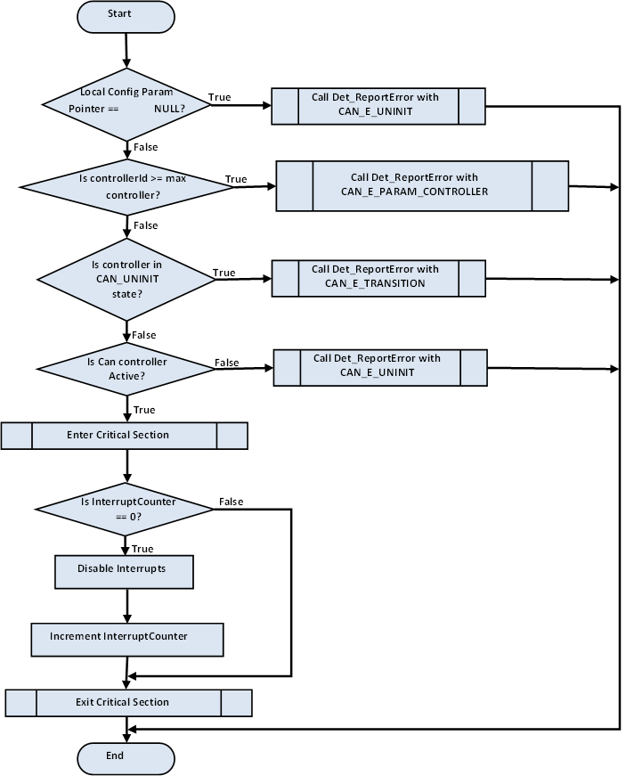   
</p>

***Can_EnableControllerInterrupts***
​<p align="center">
  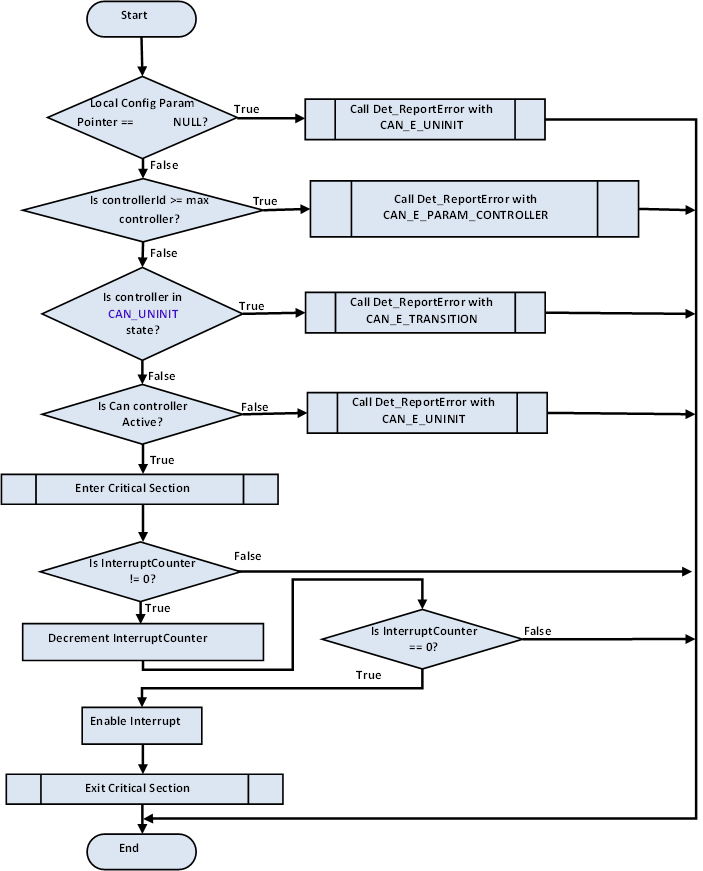   
</p>

***Can_MainFunction_Write***
​<p align="center">
  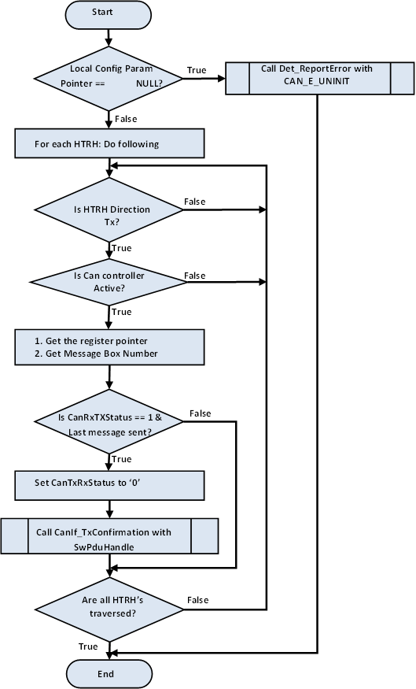   
</p>

***Can_MainFunction_BusOff***

***Can_MainFunction_Read***
​<p align="center">
  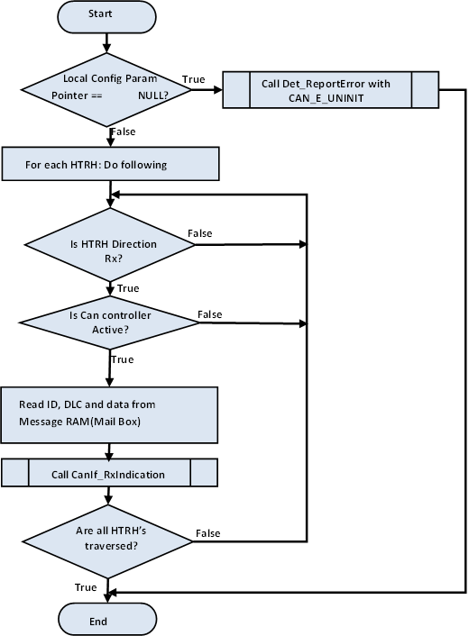   
</p>

***Can_MainFunction_Wakeup***
​<p align="center">
  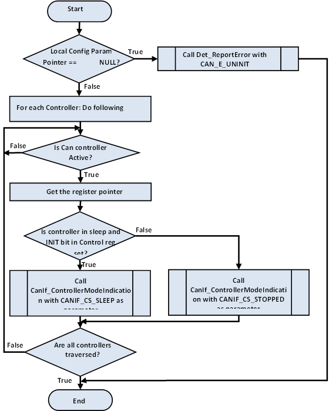   
</p>

***Can_GetVersionInfo***
​<p align="center">
  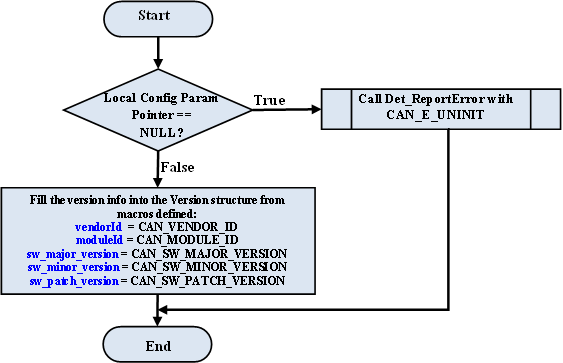   
</p>

***Can_MainFunction_Mode***
​<p align="center">
  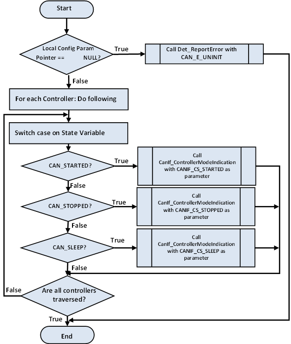   
</p>

***Can_TestLoopBackModeEnable***
​<p align="center">
     
</p>

***Can_TestLoopBackModeDisable***
​<p align="center">
  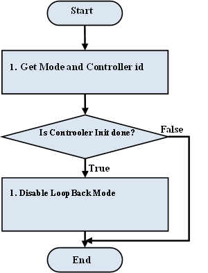   
</p>

***Can_RegisterReadback***
+ As noted from previous implementation, the can configuration registers could potentially be corrupted by other entities (s/w or h/w). One of the recommended detection methods would be to periodically read-back the configuration and confirm configuration is consistent. The service API defined below shall be implemented to enable this detection.

​<p align="center">
  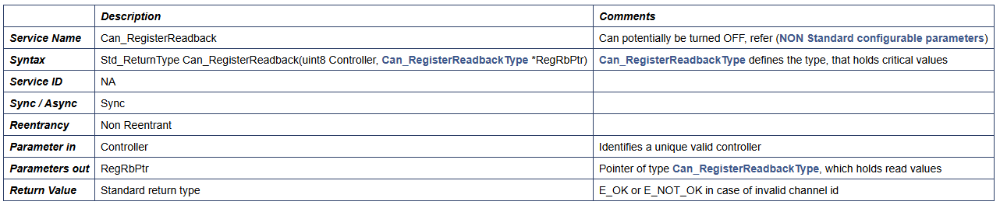   
</p>

+ The critical register listed is a recommendation and implementation shall determine appropriate registers.
+ This service could potentially be turned OFF in the configurator.

​<p align="center">
  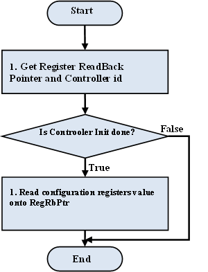   
</p>

***Can_mcanProcessISRRx***
​<p align="center">
  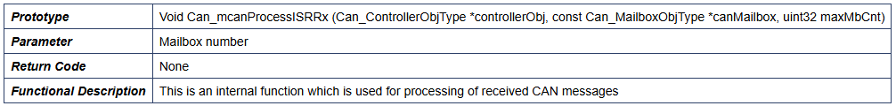   
</p>
​<p align="center">
  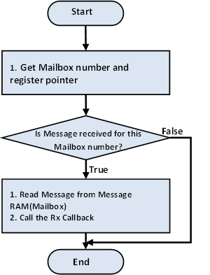   
</p>

***Can_X_IntXISR OR Can_X_IntXISR_Fun***
+ ISR ‘Can_X_IntXISR’ shall be registered to respective CAN Controller Interrupt line as per mapping provided below.
+ Function ‘Can_X_IntXFunc’ is called when ISR ‘Can_X_IntXISR’ for CAN is called. Only the CAN Interrupt is used.
+ Following is the mapping for ISRs to CAN controller interrupt lines
    - Can_0_Int0ISR are associated with Interrupt Line 0 of the MCAN0 Controller respectively.
    - Can_1_Int0ISR are associated with Interrupt Line 0 of the MCAN1 Controller respectively.
+ Only TX and RX Mail box interrupts & Error interrupt will be enabled to begin. If there are 2 controllers, implementation shall have 2 instances of the ISR’s

​<p align="center">
  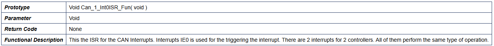   
</p>
​<p align="center">
  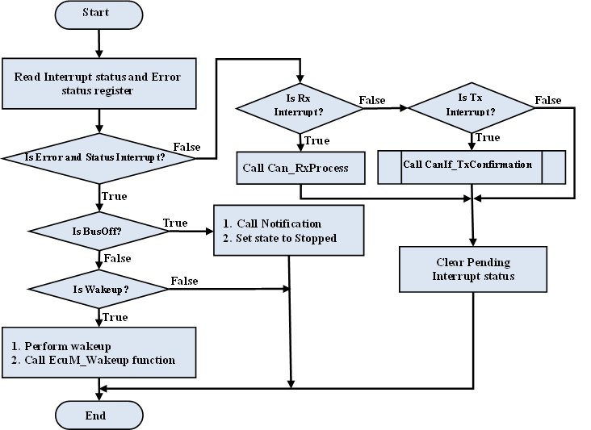   
</p>

***Can_SetBaudrate***
​<p align="center">
  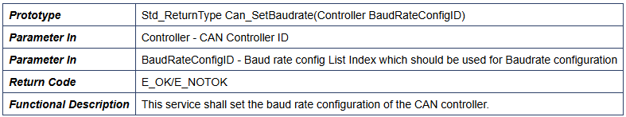   
</p> 

***Can_GetControllerMode***
​<p align="center">
  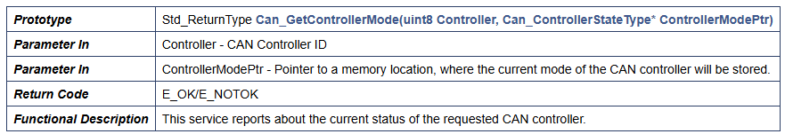   
</p> 

***Can_GetControllerErrorState***
​<p align="center">
  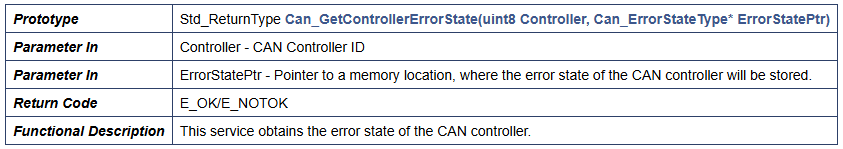   
</p>

***Can_DeInit***
​<p align="center">
  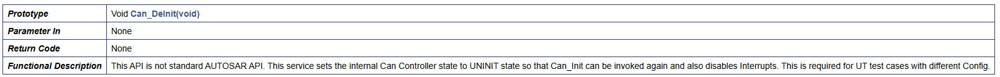   
</p>

***6. Global Variables***
+ This design expects that implementation will require to use following global variables.
​<p align="center">
  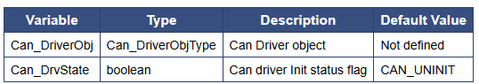   
</p>

***7. Resource Behavior***
+ Code Size : Implementation of this driver shall not exceed 30 kilo lines of code and 4 KB of data section.
+ Stack Size : Worst case stack utilization shall not exceed 2 kilo bytes.

***8. CAN Dma mode***
+ The Can Receive message can be processed either through CPU or via DMA. The method chosen will impact receive throughput.
+ Minimal restrictions on the system and guaranteed “no receive message drop” in the system.
+ DMA Mode DMA Mode – The can controller will generate a DMA events to the system EDMA.CAN message will be copied from CAN mailbox to destination address by DMA
    - ***Advantages:***
        + CPU loading is low and constant irrespective of the number of CAN messages received.
        + Less probability of mailbox overflow as the DMA copy happens without CPU intervention
    - ***Disadvantages***
        + Complexity involved in designing the EDMA parameters.
        + Cache coherency needs to be taken care. This will result in Cache module dependency in driver or in the AUTOSAR stack
        + Need of a common DMA complex driver with resource management as the EDMA is at system level and is common across SoC
+ CPU Mode The Can controller will raise an interrupt. The CPU needs to copy the message and invoke the CanIfRxIndication callback.
    - ***Advantages***
        + Simple implementation
        + No cache coherency is needed and no dependency on cache APIs
    - ***Disadvantages***
        + CPU load is function of rate of CAN messages.
        + High probability of mailbox overflow during high receive message rate as the CPU is involved in reading the FIFO
+ In case of ADAS use case, the CPU loading is low and there is no chance of CAN mailbox overflow in case Thus in all respect (complexity, efficiency), CPU mode is sufficient for the ADAS use case. So it is recommended to employ cpu mode.

***9. MCAN Tx Buffer Mode***
+ Along with dedicated Tx Buffers, MCAN also supports Tx FIFO/Queue. This buffer mode is configurable and can be used in one those configurations. The mode selected will affect the priority in which will messages will go out on bus. Support of any of these modes is necessary in order to support multiplexed transmission.
+ Minimal restrictions on the system and support multiplexed transmission in order to avoid priority inversion.
+ ***FIFO Mode In this mode***, messages are stored into memory in First In First Out(FIFO) manner
    - ***Advantages***
        + Less software overhead as FIFO management is done by MCAN controller
        + Messages are sent in the order in which they are being stored into FIFO
    - ***Disadvantages***
        + Since messages are being sent in the orders which are stored into FIFO, priority inversion can happen if message with higher priority are stored at later location in the FIFO.
        + Messages should be carefully written into FIFO in order to avoid priority inversion.
+ ***QUEUE Mode In this mode***, messages will be stored into first free location in the memory allocated for Queue
    - ***Advantages***
        + Messages are sent in the order of their priority hence priority inversion will not happen.
        + Can be treated as Tx Buffer
    - ***Disadvantages***
        + Messages are written into first free location in Tx Queue, hence leads more software overhead.
+ In case of ADAS use case, the CPU loading is low and priority inversion cannot occur. Thus in all respect (complexity, efficiency), Queue mode is recommended.

***10. Test Criteria***
+ The sections below identify some of the aspects of design that would require emphasis during testing of this design implementation
    - Internal Loopback
        + Internal loopback could be used for enhancements (or development)
        + Configure CAN controller to operate in internal loopback mode and check for transmission and reception of the message
    - Board to Board Loopback
        + Connect two CAN controllers through CAN bus. Send message from first controller and check for reception of the same message on the other controller
    - Multiplexed Transmission
        + Configure message RAM in mixed configuration i.e. to have both buffers as well as FIFO in case of DCAN or Queue in case MCAN. Check if message is getting properly configured as well as check for Multiplexed transmission (priority inversion).
    - Different Baud-Rates
        + Check for transmission and reception at different baud rates.
    - Inter-packet delay
        + Include tests cases where inter-packet delay is 0 (i.e. ST_MIN = 0)

***11. Variance / Deviation from the specification***
+ CanWakeupFunctionalityAPI: Wakeup functionality is not supported, this configuration parameter will NOT enable Can Wakeup Functionality.
+ CanWakeupSupport: Wakeup functionality is not supported, this configuration parameter will NOT enable Can Wakeup Functionality.
+ CanIcomGeneral: ICOM feature is not supported and CanIcomGeneral configuration parameters are not supported.
+ CanSupportTTCANRef: TTCAN feature is not supported and hence CanIfSupportTTCAN parameter is not supported.
+ CanTriggerTransmitEnable: The optional trigger-transmit API's are not supported in this release.
+ CanLPduReceiveCalloutFunction: The optional configuration parameter CanLPduReceiveCalloutFunction is not supported in this release.
+ CAN_CHANGE_BAUDRATE_API: Can_ChangeBaudrate API's cannot be turned OFF via CAN_CHANGE_BAUDRATE_API.
+ CanMainFunctionReadWriteApiPattern: SWS_Can_00442 states that The API name of Can_MainFunction_Read() shall obey the following pattern:
    - Can_MainFunction_Read_0()
    - Can_MainFunction_Read_1() ... and so on, if more than one period (see ECUC_Can_00358) is supported. It's not clear on the expected use. Also, specification say's we can have only one poll function for read and write. Hence this requirement is not implemented.
    - Similarly same w.r.o requirement SWS_Can_00441.
+ TimeoutInCanSetControllerMode: In function Can_SetControllerMode if maximum time CanTimeoutDuration is elapsed, DEM error CAN_E_HARDWARE_ERROR is reported.(Refer SWS_Can_00372 for details).
+ CanSetControllerModeWakeUp: Can_SetControllerMode(CAN_T_WAKEUP) will not wait for a "limited time" and will update the state to STOPPED immediately. (Refer SWS_Can_00268 for details).

***12. Memory Mapping***
​<p align="center">
  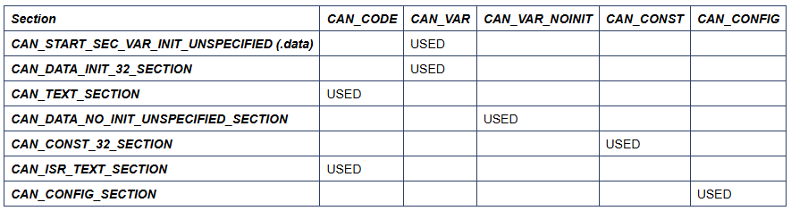   
</p>

***13. Error codes***
​<p align="center">
  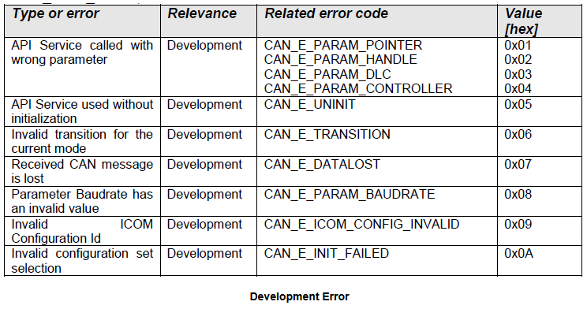   
</p>

***14. Production Code Error Reporting***
+ Production error are reported to DEM via the service DEM_ReportErrorStatus(). In addition to standard errors, this implementation reports "CAN_E_HARDWARE_ERROR" when CAN hardware register read/write fails.

## 📌 Reference

[0] https://www.autosar.org/fileadmin/standards/R4.3.1/CP/AUTOSAR_SWS_CANDriver.pdf

[1] https://www.youtube.com/watch?v=KaFAoG5hK5I

[2] https://autosarthonv.github.io/

[3] https://software-dl.ti.com/jacinto7/esd/processor-sdk-rtos-jacinto7/08_01_00_11/exports/docs/mcusw/mcal_drv/docs/drv_docs/index.html

[4] https://www.youtube.com/watch?v=YeAsBK0K0F0&list=PLE9xJNSB3lTFFjw2Or_ayjf-CSX0VypIE
