# 💚 Introduction DIO MCAL AUTOSAR MODULE 💛

## 👉 Introduction and Summary

### 1️⃣ Introduction

+ Ở repo này mình sẽ nói overview về kiến thức module DIO. Version Autosar trong repo này là 4.3.1 nhé.

### 2️⃣ Summary

Nội dung của bài viết gồm có những phần sau nhé 📢📢📢:
- [I. Introduction and Summary](#👉-introduction-and-summary)
    - [1. Introduction](#1️⃣-introduction)
    - [2. Summary](#2️⃣-summary)
- [II. Contents](#👉-contents)
- [III. Reference](#📌-reference)

## 👉 Contents

### Introduction
+ This document details AUTOSAR BSW DIO module implementation
  - Supported AUTOSAR Release : 4.3.1
  - Supported Configuration Variants : Pre-Compile & Link Time

+ The DIO module provides interfaces to external peripherals by abstracting the input and output pins on the microcontroller device as detailed in the AUTOSAR BSW DIO Driver Specification. Following sections highlight key aspects of this implementation which would be of interest to an integrator.

+ The figure below depicts the AUTOSAR layered architecture as 3 distinct layers,
  - Application
  - Runtime Environment (RTE) and
  - Basic Software (BSW).

+ The BSW is further divided into 4 layers:
  - Services
  - Electronic Control Unit Abstraction
  - MicroController Abstraction (MCAL) and
  - Complex Drivers.

​

     

+ The DIO driver is a part of the microcontroller (peripheral) Driver module which is a part of the Basic Software. The figure below shows the position of the DIO driver in the AUTOSAR Architecture.

​

  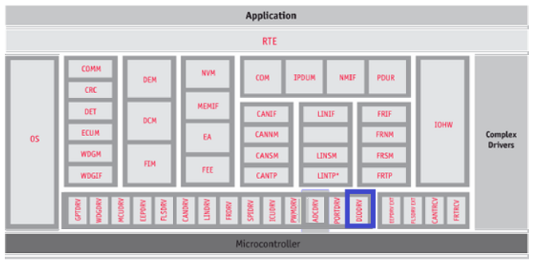   

### Requirements
+ The DIO Driver abstracts the access to the microcontroller’s hardware pins. The DIO Driver implements a standardized interface as specified. 

### Features Supported
+ The DIO SWS driver defines functions allowing read and write access to the internal general purpose I/O channels, ports and channel groups.

### Features Not Supported / NON Compliance
+ [NON Compliance] As the microcontroller currently doesnt support direct read back, requirement pertaining to direct read back is not supported.
+ Supports additional configuration parameters, refer section (Dio_RegisterReadback) & generates global (Global Variables)

### Assumptions
+ Below listed are assumed to valid for this design/implementation, exceptions and other deviations are listed for each explicitly. Care should be taken to ensure these assumptions are addressed by an entity outside Dio driver.
  - This module works on pins and ports which are configured by the PORT driver. Overall configuration and initialization of the port structure which is used in the DIO module.
  - The DIO functions are valid only after the Port Driver has been initialized. If it is not initialized then DIO behavior is undefined. In cases where MCAL Port module is not present, the SBL/GEL files will initialize the pin functionality.
  - The functional clock to the DIO module is expected to be ON before calling any DIO module API.
  - Please Note that an entity outside DIO module will take care to configured required voltage level for DIO.

### Constraints
+ Some of the PINs are reserved and cannot be used by DIO module, please refer device specific manual for details.

### Dependencies
+ Depends on MCAL Port module.
+ The DIO module does not provide APIs for overall configuration and initialization of the port structure which is used in the DIO module. The initialization and configuration will be done by other entities. The DIO module adapts its configuration and usage to the microcontroller and ECU.
+ Many ports and port pins are assigned by the PORT Driver Module to various functionalities for example: SPI, ADC, CAN...

### Design Description
+ The DIO driver provides an interface to the external connections. The top level diagram of DIO module is as show below. (n= varies for each SOC)

​

  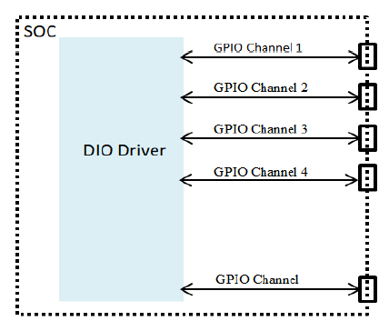   

### DIO Channel, Port And Channel Group
+ A DIO channel represents a single general-purpose digital input/output pin. A DIO Port is a grouping of several DIO channels by hardware (typically controlled by one hardware register). A DIO Channel Group consists of several adjoining DIO channels represented by a logical group. A DIO channel group belongs to one DIO port as illustrated below

​

  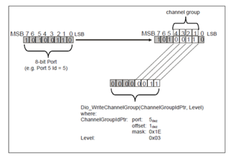   

+ The allocation of DIO instances is dependent on the variant of the device being used. Please refer Device Specific TRM for details.

​

  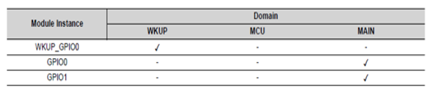   

+ In general, channels/pins can be configured as input or output. Each DIO instance supports 9 banks of 16 DIO pins each. There are in total 3 instances, one in wakeup domain and two in the main domain.

### Input/Output Functionality
+ The DIO peripheral provides the main functionality of input and output. Each pin can be configured independently as input or output with the help of the GPIO direction registers

​

  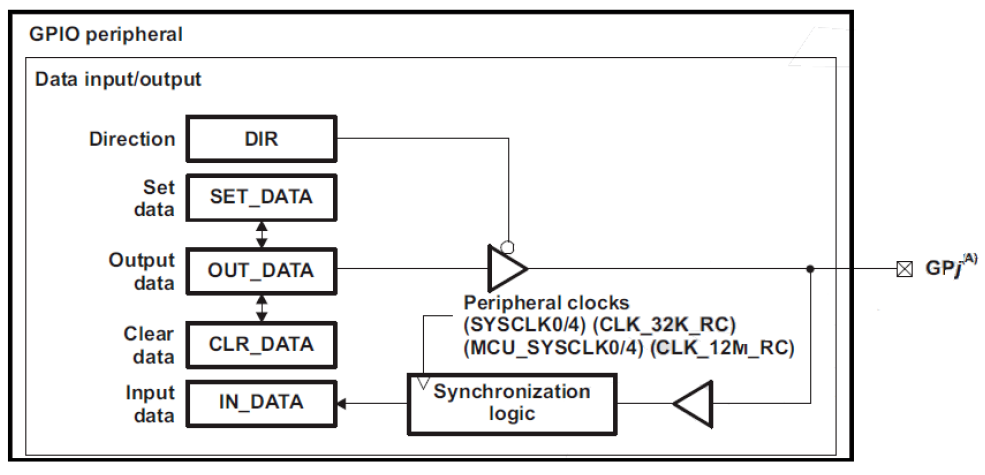   

+ The main services implemented for the input/output pins are the read and write services for channels, ports and channel groups. The following sequence diagrams elaborate the sequence followed for a typical read and write service

​

  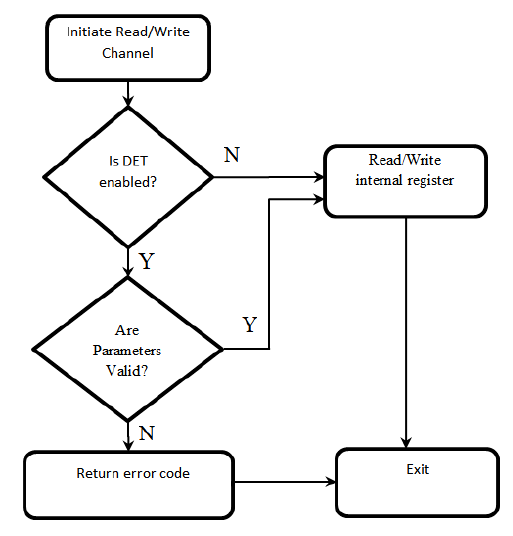   

### Dynamic Behavior
+ Not Applicable

### Resource Behavior
+ Code Size: Implementation of this driver shall not exceed 5 kilo lines of code and 1 KB of data section
+ Stack Size: Worst case stack utilization shall not exceed 2 kilo bytes

### Supporting DIO for AUTOSAR versioned 4.3.1
+ This DIO design is based on the requirements specification for AUTOSAR versioned 4.2.1 and sections below highlight some of the critical changes that would be required between these two versions.
+ Note that this design doesn’t comprehend or account for other versions of AUTOSAR.
***Deleted***
+ The following have been removed in v4.3.1 specification:
  - SWS_Dio_00065 : Heading removed: The Dio module shall detect the following errors and exceptions depending on its build version (development/production mode)
  - DIO176 Sub requirement :API service called with “NULL pointer” parameter in DIO_E_PARAM_CONFIG
  - SWS_Dio_00131 Imported Types: Dem Module and specifically Imported types: Dem_EventIdType, Dem_EventStatusType are removed
  - SWS_Dio_00187,SWS_Dio_00164 :Dio_ConfigType Structure :structure contains all post-build configurable parameters of the DIO driver.
  - Configuration example is removed
  - Definition of the "configuration variants" is removed from from section 10.1.1 in 1
***Added***
+ The v4.3.1 specification has added the following sections:
  - Added section on Runtime errors in 7.6.2 Runtime Errors : There are no runtime errors.
  - SWS_Dio_00175,SWS_Dio_00177,SWS_Dio_00178,SWS_Dio_00188 : Development Errors
  - ECUC_Dio_00154 : Dio Module : Configuration of the Dio (Digital IO) module.
  - Added section for 7.6.3 Transient Faults : There are no transient faults
***Modified***
  - SWS_Dio_00140 : Dem_ReportErrorStatus has been removed from this requirement
  - ECUC_Dio_00145 : DioPortId and ECUC_Dio_00147 DioChannelId, configuration for LINK TIME has been removed
  - Also, note that Directory structure would require an update. (Remove dem.h in included files)

### Directory Structure
+ The below diagram shows the overall files structure for the DIO driver. The Dio.c and Dio.h are the 2 files that contain the DIO driver's APIs.

​

  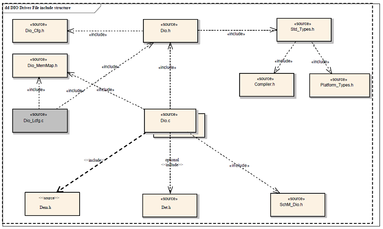   

+ Dio.h : Shall implement the interface provided by the driver
+ Dio.c, Dio_Priv.h : Shall implement the driver functionality
+ Dio_Cfg.h and Dio_Cfg.c: Shall implement the generated configuration for pre-compile variant
+ Dio_Cfg.h and Dio_Lcfg.c: Shall implement the generated configuration for link-time variant
+ DioApp.c: Shall implement the example application that demonstrates the use of the driver

### Configurator
+ The AUTOSAR DIO Driver Specification details mandatory parameters that shall be configurable via the configurator.

### NON Standard configurable parameters
+ The design's specific configurable parameters are as follows:
  - DioRegisterReadbackApi	This shall allow integrators to specify if the read back of critical registers using the API is required or not.
  - DioDeviceVariant	This shall allow integrators to select the device variant for which integration is being performed.This parameter shall be used by driver to impose device specific constraints. The user guide shall detail the device specific constraints.

### Variant Support
+ The driver shall support both VARIANT-LINK-TIME & VARIANT-PRE-COMPILE

### Error Detection
+ The detection of development errors is configurable (ON / OFF) at pre-compile time. The switch DioDevErrorDetect will activate or deactivate the detection of all development errors.

### Development Errors

​

  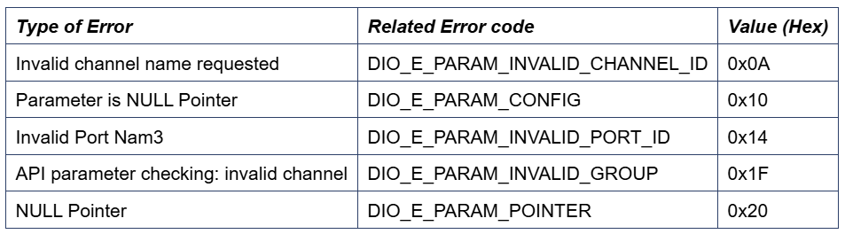   

### Error notification (DET)
+ All detected development errors are reported to Det_ReportError service of the Development Error Tracer (DET).

### MACROS, Data Types & Structures
+ Maximum number of DIO Instances
  - uint8	DIO_HW_UNIT_CNT	Defines the maximum number of Instaces of DIO driver that are configured.
+ Dio_ChannelType: Type definition used to specify the numeric id of the channel
+ Dio_PortType: Type definition used to specify the numeric id of the port
+ Dio_ChannelGroupType: Type definition used to specify the channel group
+ Dio_LevelType: Used to specify the possible levels of a channel
+ Dio_PortLevelType: Used to specify the possible levels of a port
+ Dio_DirectionType: Used to specify the direction of a channel

### APIs
+ Dio_ReadChannel
+ Dio_WriteChannel
+ Dio_ReadPort
+ Dio_WritePort
+ Dio_ReadChannelGroup
+ Dio_WriteChannelGroup
+ Dio_FlipChannel
+ Dio_GetVersionInfo
+ Dio_RegisterReadback
  - As noted from previous implementation, some of the critical configuration registers could potentially be corrupted by other entities (s/w or h/w). One of the recommended detection methods would be to periodically read-back the configuration and confirm configuration is consistent. The service API defined below shall be implemented to enable this detection

​

  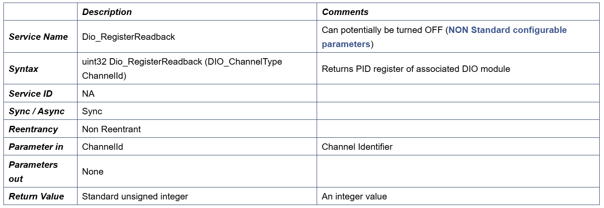   

### Global Variables
+ This design expects that implementation will require to use following global variables.
+ Dio_ConfigValidChannelMask: uint32 array: Auto generated array of enabled ports

### Decision Analysis
***1. Supporting Different SoCs***
+ There are different numbers of pins in different SOCs as well as different instances available in domains such as wakeup and main domain. The Driver can also be hosted on different cores. Multiple approaches are available to support to support this and following are top 2 options.
+ Criteria: Should be scalable (minimal changes to change reserved pins map) and easy to maintain.
+ Available Alternatives
  - Separate Project per SoC For each SoC, a different configurator project is created and reserved pins are hard coded / checked in configuration generation.
    + Advantages:
      - Simple to implement. No overhead in configuration
    + Disadvantages:
      - Not scalable as core could potentially change (that hosts AUTOSAR). Would require different project for a combination of SoC/core
      - Low ease of use, as customers will have to use right version of the configurator project. Potentially, customer can generate wrong configuration.
  - One Project and conditional generation of configuration Multiple SoCs (or core) supported in one project. Add conditional checks while generating / validating pins
    + Advantages
      - Scalability and ease of use
    + Disadvantages
      - Configuration development effort is high
+ Decision: Chosen to use "One Project and conditional generation of configuration" as it scalable and minimizes generation of wrong configuration.

***2. Width of Port***
+ AUTOSAR specification dosen't explicitly specify the width of the PORT, its dependent on the underlying hardware. As per the hardware specification each port is 16 bits wide. However, 2 ports are represented by a single 32 bit register in the hardware. This would require special handling, especially when the ASYNC APIs have to supported.
+ Criteria: Low complexity implementation and scalable
+ Available Alternatives
  - 32 bits per port
    + Advantages:
      - No Exclusive area required to implement SYNC calls
      - Usability (Similar to previous generation of SoC, customers will find it simpler to use)
    + Disadvantages
      - Doesn't reflect internal organization of port (HW). Customer will have to read this design document for complete picture of usage
  - 16 bits per port
    + Advantages
      - Maps directly to hardware organization
    + Disadvantages
      - Would require additional exclusive area to implement SYNC APIs. As the 2 ports map to a single 32 bit register.
+ Decision: Chosen to use "32 bits per port" it minimizes generation use of exclusive areas

### Test Criteria
+ The sections below identify some of the aspects of design that would require emphasis during testing of this design implementation
  - Channel Read/ Write: Test cases shall check for valid pin configurations
  - Channel Group Read/ Write: Test cases shall exercise grouping of pins and test for validity
  - Negative Tests: 
    + Set the direction of channel/port/channel group as INPUT and check for write
    + Check if read/write is possible for invalid configurations

### Configuration
+ The Dio Driver implementation supports multiple configuration variants, the driver expects generated Dio_Cfg.h. The associated dio driver configuration generated files Dio_Cfg.c and Dio_Lcfg.c
+ Dio_ConfigType: This structure contains all post-build configurable parameters of the DIO driver. As post-build configuration is not supported, this structure has not been used in this implementation.

### DIO_WRITE_PORT_EVENT_ID

​

  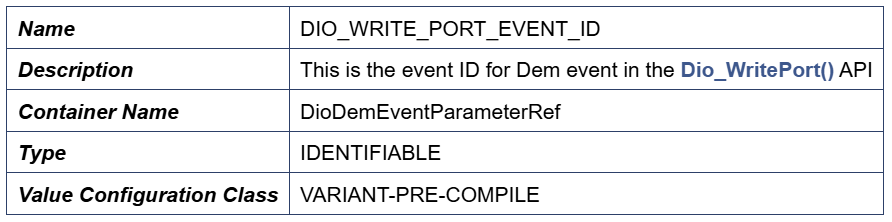   

### DIO_WRITE_CHANNEL_EVENT_ID

​

  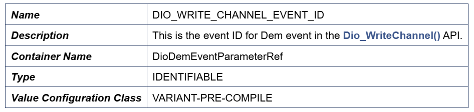   

### Non Standard Service APIs
***Dio_RegisterReadback***
+ To protect HW from un-intended re-configuration (corrupted / fault hardware), some of the critical registers are read periodically and checked. By an entity outside the driver, the values of these registers are not expected to change. This is an optional service API, which can be turned OFF (refer section DioRegisterReadbackApi)

​

  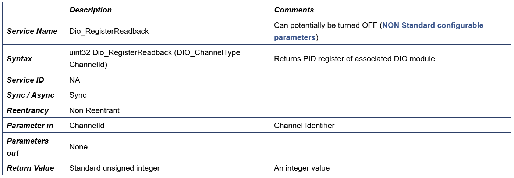   

### Interrupt Configuration
+ The Driver doesn’t register any interrupts handler (ISR), it is expected that consumer of this driver registers the required interrupt handler.

### Dependencies on SW Modules
+ DET: This implementation depends on the DET in order to report development errors and can be turned OFF. Refer section (Development Error Reporting) for detailed error codes.
+ SchM: This implementation requires 1 level of exclusive access to guard critical sections. Invokes SchM_Enter_Dio_DIO_EXCLUSIVE_AREA_0 (), SchM_Exit_Dio_DIO_EXCLUSIVE_AREA_0 () to enter critical section and exit.

### Development Error Reporting
+ Development errors are reported to the DET using the service Det_ReportError(), when enabled. The driver interface (Dio.h File Structure) lists the SID

​

  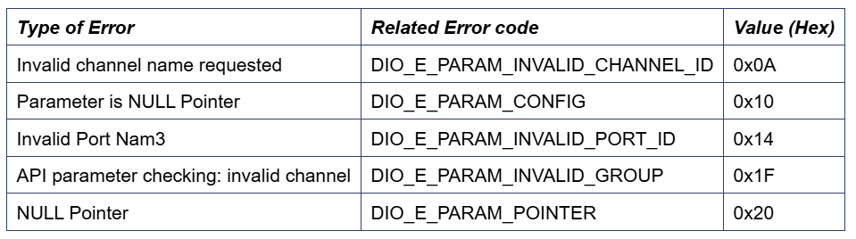   

### Production Code Error Reporting
+ Production error are reported to DEM via the service DEM_ReportErrorStatus(). In addition to standard errors, this implementation reports "DIO_WRITE_CHANNEL_EVENT_ID" and "DIO_WRITE_PORT_EVENT_ID" for DEM events in channel and port writes.

## 📌 Reference

[0] https://www.autosar.org/fileadmin/standards/R4.3.1/CP/AUTOSAR_SWS_DIODriver.pdf

[1] https://www.youtube.com/watch?v=kqpWL7xIPHU&list=PLE9xJNSB3lTG-749702Ja92J7TVCCoXCx&index=54

[2] https://autosarthonv.github.io/

[3] https://software-dl.ti.com/jacinto7/esd/processor-sdk-rtos-jacinto7/08_01_00_11/exports/docs/mcusw/mcal_drv/docs/drv_docs/index.html

[4] https://www.youtube.com/watch?v=YeAsBK0K0F0&list=PLE9xJNSB3lTFFjw2Or_ayjf-CSX0VypIE

[5] https://www.youtube.com/watch?v=dSA5fU7NJ80&list=PLE9xJNSB3lTG-749702Ja92J7TVCCoXCx&index=54
