# 💚 Introduction Eth MCAL AUTOSAR MODULE 💛

## 👉 Introduction and Summary

### 1️⃣ Introduction

+ Ở repo này mình sẽ nói overview về kiến thức module Eth. Version Autosar trong repo này là 4.3.1 nhé.

### 2️⃣ Summary

Nội dung của bài viết gồm có những phần sau nhé 📢📢📢:
- [I. Introduction and Summary](#👉-introduction-and-summary)
    - [1. Introduction](#1️⃣-introduction)
    - [2. Summary](#2️⃣-summary)
- [II. Contents](#👉-contents)
- [III. Reference](#📌-reference)

## 👉 Contents

### Introduction
+ This document details AUTOSAR BSW Eth module implementation
  - Supported AUTOSAR Release : 4.3.1
  - Supported Configuration Variants : Pre-Compile
+ The ETHTRCV module initializes and configures the Ethernet transceiver (PHY) as detailed in the AUTOSAR BSW ETHTRCV Driver Specification.
+ The ETH module is documented in the ETH module user guide.This user guide complements the ETH module user guide and documents the virtual mac mode operation of the ETH module. The ETH module user guide should be read in its entirety before reading this user guide

### Overview
+ The figure below depicts the AUTOSAR layered architecture as 3 distinct layers, Application, Runtime Environment (RTE) and Basic Software (BSW). The BSW is further divided into 4 layers, Services, Electronic Control Unit Abstraction, MicroController Abstraction (MCAL) and Complex Drivers.

​

     

+ MCAL is the lowest abstraction layer of the Basic Software. It contains software modules that interact with the Microcontroller and its internal peripherals directly. The ETH driver is part of the Communication Drivers module which is also part of the Basic Software. The block diagram below shows the position of the Ethernet driver in the AUTOSAR Architecture.

​

  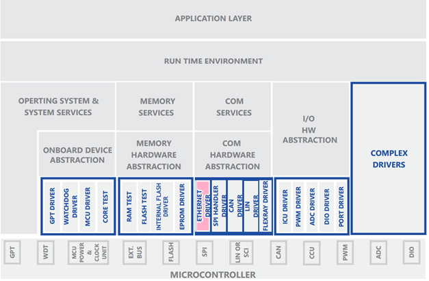   

### Eth Overview
+ As described in the AUTOSAR Ethernet Driver specification, the Ethernet Driver (Eth) is in charge of providing a uniform, hardware independent interface to the upper layer, the Ethernet Interface (EthIf). Thus, the Ethernet Interface may access the underlying bus system in a uniform manner.
+ The driver provides bus specific functionality for controller initialization, configuration, data transmission, data reception, statistics gathering, etc. A single Ethernet Driver module supports only one type of controller hardware, but several controllers of the same type. Figure below shows the lower part of the Ethernet stack

​

  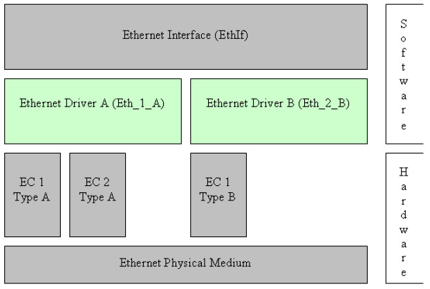   

+ This Ethernet Driver implementation shall support an Ethernet controller based on the peripheral present in the MCU

### Requirements
+ The Eth driver shall implement as per requirements detailed in the Software Product Specification (SPS), Ethernet Driver specification and Basic Software Modules specification . It’s recommended to refer to the Ethernet Driver specification for any clarification.
+ The Eth driver shall follow coding guidelines listed in the BSW General Requirements and Coding Guidelines document 

### Features Supported
+ Below listed are some of the key features that are expected to be supported
  - Ethernet controller initialization
  - Transmission and reception of Ethernet frames
  - Interrupt-based hardware error reporting
  - MDIO
  - Statistics gathering
  - Packet time-stamping (PTP)
  - VLAN tag
  - Hardware-based error detection (collisions, under/over-sized frames, CRC, etc)

### Features Not Supported
- Link-Time and Post-build variants are not supported in this release.
- Transmit frame priority is not supported in this release. The Priority pamareter should be set to 0 when requesting a buffer via Eth_ProvideTxBuffer.
- Receive FIFO is not supported in this release. The FifoIdx parameter should be set to 0 when receiving a buffer via Eth_Receive.
- SWS_Eth_00238 and ECUC_Eth_00036 give different configuration parameter name to enable or disable Eth_GetRxStats. EthGetRxStatsApi name is assumed in this implementation.
- HIS subset of the MISRA C Standard not addressed.
- Global Time APIs are not implemented.
  + Eth_GetCurrentTime
  + Eth_EnableEgressTimeStamp
  + Eth_GetEgressTimeStamp
  + Eth_GetIngressTimeStamp
- The hardware offloaded checksum computation is not supported for either ingress or egress traffic
- Ethernet Switch interface APIs are not called by the driver
- The data flow model of the AUTOSAR Ethernet driver requires that buffers are passed one by one to/from the upper layers. Additionally, there are a number of memory copy operations that need to take place in the lifecycle of packet buffer across the upper layers (i.e. UDP, RTP, etc). This Ethernet driver design aims to being able to scale the driver implementation for higher data throughput

### Dynamic Behavior
+ The driver maintains the following three states: UNINIT, INIT and ACTIVE. Please refer to the sequence diagrams shown in the Specification of Ethernet State Manager, for further details on the interactions and transitions between those states.

### Sequence Diagrams
+ The following sequence diagrams the data flow interactions between the EthIf, Eth and the proposed design. These sequence diagrams extended from the diagrams of the Ethernet Interface specification document

### Data Transmission
+ The sequence diagrams below list control / data flow for transmission in polling and interrupt methods.

***Data Transmission in Polling Mode***

​

  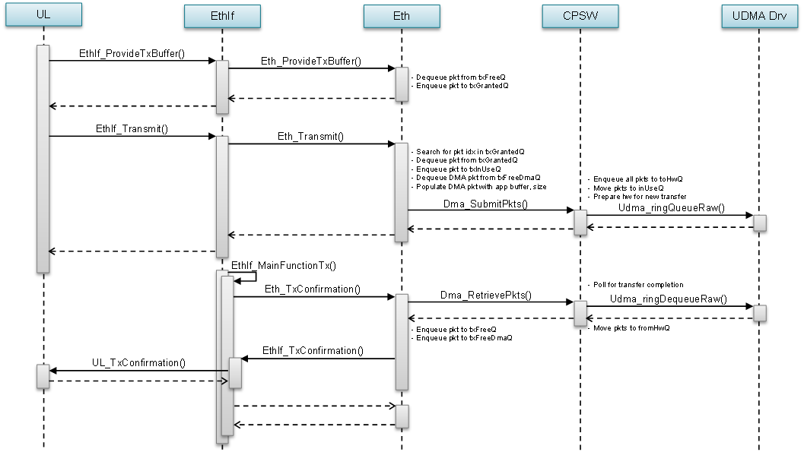   

***Data Transmission in Interrupt Mode***

​

  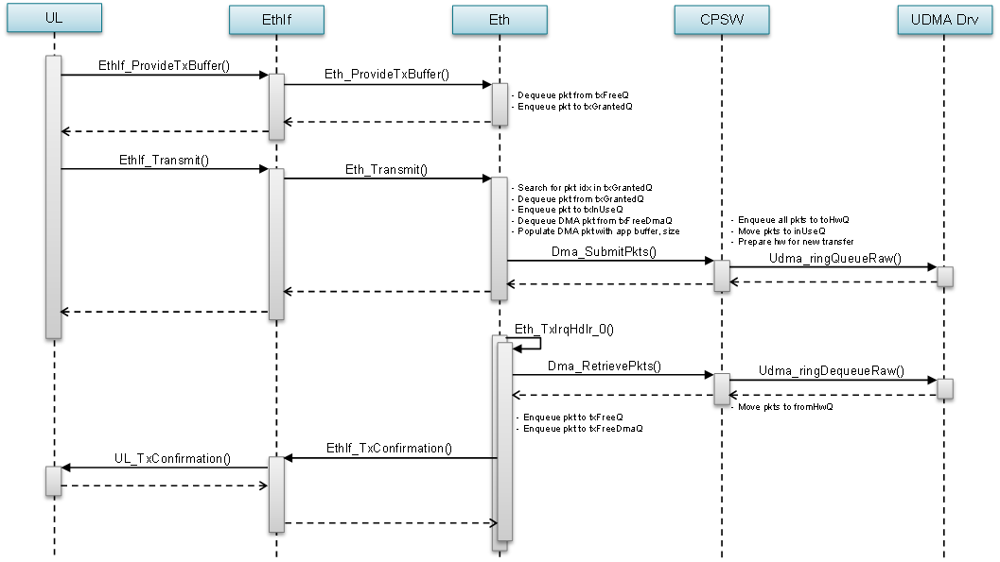   

### Data Reception

***Data Reception in Polling Mode***

​

  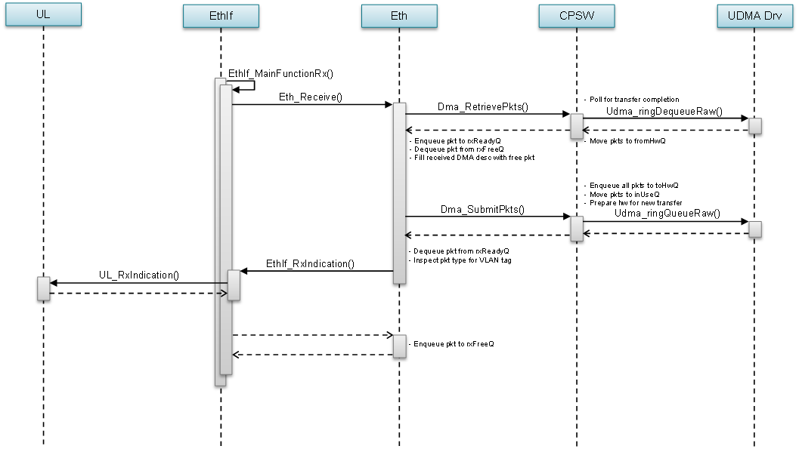   

***Data Reception in Interrupt Mode***

​

  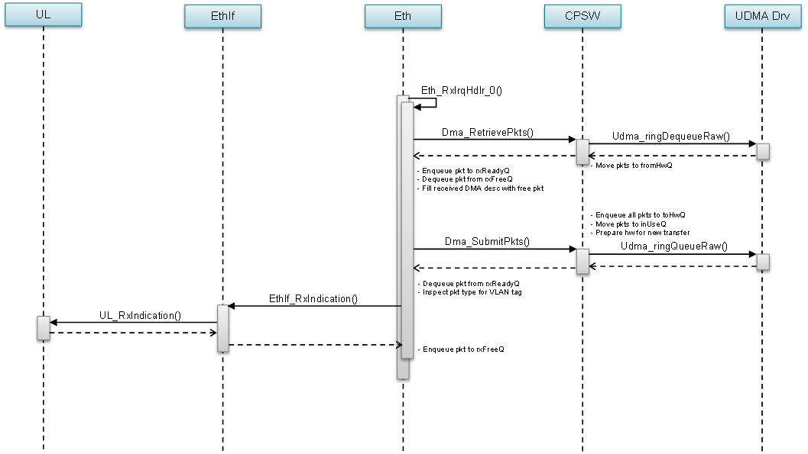   

### Directory Structure
+ The directory structure is as depicted in figures below

​

  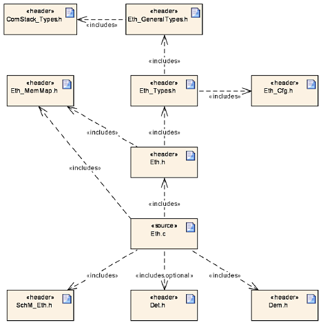   

### Interrupt Service Routines
+ The Ethernet Driver supports two data transfer related interrupts, one for transmission and another for reception. These interrupts are generated when the underlying completion queue rings (CQ Rings) associated with TX and RX get a descriptor from CPSW. For TX, this event signalizes that a previous transmission has completed and its descriptor is free to be reused. For RX, this event signalizes the arrival of new packet.
+ The Eth_RxIrqHdlr_0() interrupt service routine shall clear the interrupt and read the frames of all received buffers. This driver design takes into consideration the ability to receive several frames from the DMA engine. The driver shall call the Ethernet Interface callback function EthIf_RxIndication() on each received frame.
+ The Eth_TxIrqHdlr_0() interrupt service routine shall clear the interrupt and check all filled transmit buffers for successful transmission. The driver shall call the Ethernet Interface callback function EthIf_TxConfirmation() for each transmit frame, if requested.
+ The CPSW module also provides an interrupt for statistics and CPTS related events. These two interrupts shall also have a corresponding service routine.
+ The CPTS interrupt is generated by the hardware when a time sync event is pushed onto the CPTS Event FIFO. The service routine for this interrupt shall clear the interrupt, read the event from the FIFO, decode the event type and process it accordingly.
+ The statistics interrupt is generated when any statistics value is greater than or equal to 0x80000000. The service routine for this interrupt shall clear the interrupt and update the statistics counter(s) accordingly. The intention of this event is to avoid overflow in the 32-bit wide statistics counter values in hardware.

### Configurator
+ The AUTOSAR Eth Driver Specification details mandatory parameters that shall be configurable via the configurator. Please refer section 10 of the Ethernet driver specification
***NON Standard configurable parameters***
+ Following lists this design’s specific configurable parameters
  - EthEnableCacheOps	This shall allows integrators configure the Eth driver to perform cache operations.
  - EthCacheWbOps	Once Eth driver is enabled for cache operations, a pointer to a function that is expected to perform cache write-back operation
  - EthCacheWbInvOps	Once Eth driver is enabled for cache operations, a pointer to a function that is expected to perform cache write-back-and-invalidate operation
  - EthCacheInvalidateOps	Once Eth driver is enabled for cache operations, a pointer to a function that is expected to perform cache invalidate operation
  - EthDmaTxChIntrNum	Allows integrators to specify the UDMA transmit interrupt number
  - EthDmaRxChIntrNum	Allows integrators to specify the UDMA receive interrupt number
  EthMdioClkFreq	Allows integrators to specify the MDIO clock frequency. Device TRM details the frequency based on the PLL configurations
  - EthMdioBusFreq	Allows integrators to specify the MDIO BUS frequency (MDCLK). Device TRM details the frequency based on the PLL configurations
  - EthConnType	Allows integrators to specify the MII connection type
  - EthEnableLoopBack	Allows integrators to enable or disable loopback mode of operation. Expected to be used for debug
  - EthUseDefaultMacAddr	Allows integrators to use MAC address that is present in ROM
  - EthDefaultOSCounterId	This shall allow integrators to specify the OS counter instance to be used in OS API GetCounterValue () The driver shall implement timed-wait for all waits (e.g. waiting for reset to complete). This timed wait shall use OS API GetCounterValue ()
  - EthTimeoutDuration	Allow integrators to configure the time duration for which Eth-Busy should wait. Mainly needed for PHY register accesses

### Debug Information
+ The ETH driver shall provide driver status for debugging. The states ETH_STATE_UNINIT and ETH_STATE_INIT can be probed.

### Error Classification
+ Errors are classified in two categories, development error and runtime / production error.
+ Requirements Covered	SWS_Eth_00008, SWS_Eth_00120

### Development Errors
+ Development errors are reported to the DET using the service Det_ReportError() if development error detection and reporting are enabled. The reported ETH module ID is 088
+ The following table presents the service IDs and the related services:
  - 0x01	Eth_Init
  - 0x03	Eth_SetControllerMode
  - 0x04	Eth_GetControllerMode
  - 0x05	Eth_WriteMii
  - 0x06	Eth_ReadMii
  - 0x08	Eth_GetPhysAddr
  - 0x09	Eth_ProvideTxBuffer
  - 0xA	  Eth_Transmit
  - 0x0B	Eth_Receive
  - 0x0C	Eth_TxConfirmation
  - 0xD	  Eth_GetVersionInfo
  - 0x12	Eth_UpdatePhysAddrFilter
  - 0x13	Eth_SetPhysAddr
  - 0x14	Eth_GetCounterValues
  - 0x15	Eth_GetRxStats
  - 0x16	Eth_GetCurrentTime
  - 0x17	Eth_EnableEgressTimeStamp
  - 0x18	Eth_GetEgressTimeStamp
  - 0x19	Eth_GetIngressTimeStamp
  - 0x1C	Eth_GetTxStats
  - 0x1D	Eth_GetTxErrorCounterValue
  - 0x20	Eth_MainFunction

### Error Detection
+ The detection of development errors is configurable (ON / OFF) at pre-compile time. The switch EthDevErrorDetect will activate or deactivate the detection of all development errors.

### Error notification (DET)
+ All detected development errors are reported to Det_ReportError service of the Development Error Tracer (DET).

### Runtime Errors
+ The Eth driver shall be capable of reporting the following production errors using the Dem_ReportErrorStatus() interface from the Diagnostics Event Manager (DEM), as specified by the AUTOSAR Ethernet Driver specification.

​

  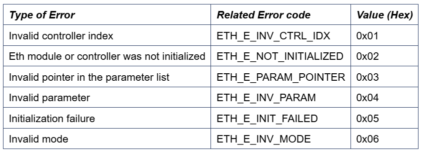   

***Extended Production error***
+ The CPSW module is capable of recording and reporting statistics related to different types of traffic events. A subset of those statistics shall be mapped to the error types required in the AUTOSAR Ethernet driver specification as follows:
  - ETH_E_ACCESS. Mapped to CPSW’s port 0 enable state and UDMA error condition.
  - ETH_E_RX_FRAMES_LOST. Mapped to CPSW’s “RX Bottom of FIFO Drop” which reports the total number of frames received on a port that overran the port’s RX FIFO and were dropped.
  - ETH_E_CRC. Mapped to CPSW’s “RX CRC Errors” which reports the total number of frames received on a port that experienced a CRC error.
  - ETH_E_UNDERSIZEFRAME. Mapped to CPSW’s “Undersize (Short) RX Frames” which reports the total number of undersized frames received on a port.
  - ETH_E_OVERSIZEFRAME. Mapped to CPSW’s “Oversize RX Frames” which reports the total number of oversized frames received on a port.
  - ETH_E_ALIGNMENT. Mapped to CPSW’s “RX Align/Code Errors” which reports the total number of frames received on a port that experienced an alignment or code error.
  - ETH_E_SINGLECOLLISION. Mapped to CPSW’s “Single Collision TX Frames” which reports the total number of frames transmitted on a port that experienced exactly one collision.
  - ETH_E_MULTIPLECOLLISION. Mapped to CPSW’s “Multiple Collision TX Frames” which reports the total number of frames transmitted on a port that experienced multiple (2 to 15) collisions.
  - ETH_E_LATECOLLISION. Mapped to CPSW’s “Late Collisions” which reports the total number of frames on a port with an abandoned transfer due to a late collision (512-bit times into the transmission).

### Resource Behavior
+ Code Size : Implementation of this driver shall not exceed 30 kilo lines of code and 1 KB of data section.
+ Stack Size : Worst case stack utilization shall not exceed 4 kilo bytes.

### API
+ Eth_Init
  - Requirements Covered	SWS_Eth_00027, SWS_Eth_00028, SWS_Eth_00029, SWS_Eth_00031, SWS_Eth_00034, SWS_Eth_00039
+ Eth_SetControllerMode
  - Requirements Covered	SWS_Eth_00041, SWS_Eth_00042, SWS_Eth_00043, SWS_Eth_00044, SWS_Eth_00045, SWS_Eth_00168
+ Eth_GetControllerMode
  - SWS_Eth_00046, SWS_Eth_00047, SWS_Eth_00048, SWS_Eth_00049, SWS_Eth_00050, SWS_Eth_00051
+ Eth_GetPhysAddr
  - Requirements Covered	SWS_Eth_00052, SWS_Eth_00053, SWS_Eth_00054, SWS_Eth_00055, SWS_Eth_00056, SWS_Eth_00057
+ Eth_SetPhysAddr
  - Requirements Covered	SWS_Eth_00139, SWS_Eth_00140, SWS_Eth_00141, SWS_Eth_00142, SWS_Eth_00143, SWS_Eth_00151
+ Eth_UpdatePhysAddrFilter
  - Requirements Covered	SWS_Eth_00144, SWS_Eth_00146, SWS_Eth_00147, SWS_Eth_00150, SWS_Eth_00152, SWS_Eth_00164, SWS_Eth_00165, SWS_Eth_00166, SWS_Eth_00167, SWS_Eth_00245, SWS_Eth_00246
+ Eth_WriteMii
  - Requirements Covered	SWS_Eth_00058, SWS_Eth_00059, SWS_Eth_00060, SWS_Eth_00061, SWS_Eth_00062, SWS_Eth_00063, SWS_Eth_00241
+ Eth_ReadMii
  - Requirements Covered	SWS_Eth_00064, SWS_Eth_00065, SWS_Eth_00066, SWS_Eth_00067, SWS_Eth_00068, SWS_Eth_00069, SWS_Eth_00070, SWS_Eth_00242
+ Eth_GetCounterValues
  - Requirements Covered	SWS_Eth_00226, SWS_Eth_00227, SWS_Eth_00228, SWS_Eth_00229, SWS_Eth_00230, SWS_Eth_00231, SWS_Eth_00232
+ Eth_GetRxStats
  - Requirements Covered	SWS_Eth_00233, SWS_Eth_00234, SWS_Eth_00235, SWS_Eth_00236, SWS_Eth_00237, SWS_Eth_00238
+ Eth_GetTxStats
  - Requirements Covered	SWS_Eth_00248, SWS_Eth_00249, SWS_Eth_00250, SWS_Eth_00251
+ Eth_GetTxErrorCounterValues
  - Requirements Covered	SWS_Eth_91006, SWS_Eth_00252, SWS_Eth_00253, SWS_Eth_00254, SWS_Eth_00255
+ Eth_GetCurrentTime
  - Requirements Covered	SWS_Eth_00181, SWS_Eth_00182, SWS_Eth_00183, SWS_Eth_00184, SWS_Eth_00185, SWS_Eth_00210
+ Eth_EnableEgressTimeStamp
  - Requirements Covered	SWS_Eth_00186, SWS_Eth_00187, SWS_Eth_00188, SWS_Eth_00189, SWS_Eth_00211
+ Eth_GetEgressTimeStamp
  - Requirements Covered	SWS_Eth_00190, SWS_Eth_00191, SWS_Eth_00192, SWS_Eth_00193, SWS_Eth_00194, SWS_Eth_00212
+ Eth_GetIngressTimeStamp
  - Requirements Covered	SWS_Eth_00195, SWS_Eth_00196, SWS_Eth_00197, SWS_Eth_00198, SWS_Eth_00199, SWS_Eth_00213
+ Eth_ProvideTxBuffer
  - Requirements Covered	SWS_Eth_00077, SWS_Eth_00078, SWS_Eth_00079, SWS_Eth_00080, SWS_Eth_00081, SWS_Eth_00082, SWS_Eth_00083, SWS_Eth_00084, SWS_Eth_00085, SWS_Eth_00086, SWS_Eth_00137
+ Eth_Transmit
  - Requirements Covered	SWS_Eth_00087, SWS_Eth_00088, SWS_Eth_00089, SWS_Eth_00090, SWS_Eth_00091, SWS_Eth_00092, SWS_Eth_00093, SWS_Eth_00094, SWS_Eth_00129, SWS_Eth_00138
+ Eth_Receive
  - Requirements Covered	SWS_Eth_00095, SWS_Eth_00096, SWS_Eth_00097, SWS_Eth_00098, SWS_Eth_00099, SWS_Eth_00132, SWS_Eth_00153
+ Eth_TxConfirmation
  - Requirements Covered	SWS_Eth_00100, SWS_Eth_00101, SWS_Eth_00102, SWS_Eth_00103, SWS_Eth_00104, SWS_Eth_00105, SWS_Eth_00134
+ Eth_GetVersionInfo
  - Requirements Covered	SWS_Eth_00106, SWS_Eth_00136
+ Eth_MainFunction
  - Requirements Covered	SWS_Eth_00169, SWS_Eth_00171, SWS_Eth_00172, SWS_Eth_00240
+ Ethernet Interface Callbacks
  - The following Ethernet Interface (EthIf) callbacks are called upon transmission or reception events.
    + EthIf_TxConfirmation is called by the driver when notification has been enabled in Eth_Transmit().
    + EthIf_RxIndication is called by the driver upon successful reception.
  - Requirements Covered	SWS_Eth_00243, SWS_Eth_00256, SWS_Eth_00244
+ Ethernet Switch Callbacks
  - The following Ethernet Switch (EthSwt) callbacks are to be called to inform the Ethernet Switch driver about special treatment required for switch management purposes.
    + EthSwt_EthRxProcessFrame()
    + EthSwt_EthRxFinishedIndication()
    + EthSwt_EthTxPrepareFrame()
    + EthSwt_EthTxAdaptBufferLength()
    + EthSwt_EthTxProcessFrame()
    + EthSwt_EthTxFinishedIndication()

### Types
+ The following types are required as per AUTOSAR Ethernet Driver specification, 8.2 of the Ethernet Driver specification
  - Eth_ConfigType. Implementation specific structure of the post build configuration.
  - Eth_ReturnType. Ethernet Driver specific return type.
  - Eth_ModeType. Defines the controller modes.
  - Eth_StateType. Status supervision used for Development Error Detection.
  - Eth_FrameType. The Ethernet frame type used in the Ethernet frame header.
  - Eth_DataType. The Ethernet data type used for data transmission. Its definition depends on the used CPU.
  - Eth_RxStatusType. Used as out parameter in Eth_Receive(). It indicates whether a frame has been received and if so, whether more frames are available or frames got lost.
  - Eth_FilterActionType. An enumeration that describes the action to be taken for the MAC address given in the *PhysAddrPtr.
  - Eth_TimeStampQualType. Depending on the HW, quality information regarding the evaluated time stamp might be supported. If not supported, the value shall be always Valid. For Uncertain and Invalid values, the upper layer discards the time stamp.
  - Eth_TimeStampType. Used for expressing the time stamps including relative and absolute calendar time.
  - Eth_TimeIntDiffType. Used to express time differences in a usual way.
  - Eth_RateRatioType. Used to express frequency ratios.
  - Eth_MacVlanType. Interpretation of this value is not specified by driver specification.
  - Eth_TxStatsType. Statistic counter for diagnostics.
  - Eth_RxStatsType. Statistic counter for diagnostics.
  - Eth_TxErrorCounterValuesType. Statistic counters for diagnostics.
+ Requirements Covered	SWS_Eth_00156, SWS_Eth_00158, SWS_Eth_00159, SWS_Eth_00160, SWS_Eth_00161, SWS_Eth_00162, SWS_Eth_00163, SWS_Eth_00175, SWS_Eth_00177, SWS_Eth_00178, SWS_Eth_00179, SWS_Eth_00180, SWS_Eth_91001, SWS_Eth_91002, SWS_Eth_91003, SWS_Eth_91004

### Global Variables
+ This design expects that implementation will require to use following global variables.

​

  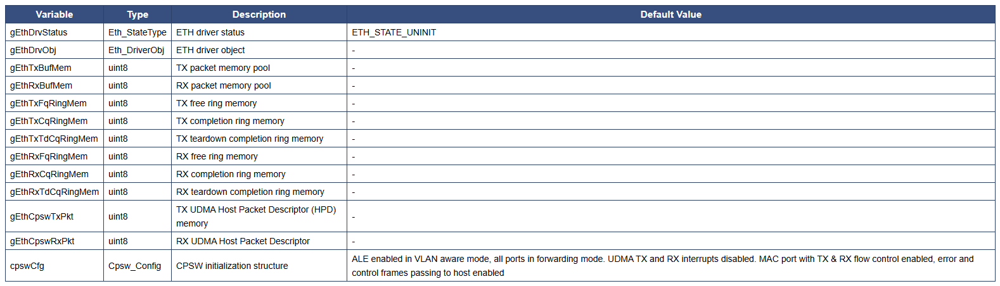   

### Decision Analysis
***1. Packet Submission & Retrieval: Single or Queue***
+ Traffic throughput can be limited by the underlying mechanism used to pass packets to the Ethernet hardware (CPSW). Unfortunately, the transfer related APIs of the AUTOSAR Ethernet Driver impose a significant constraint on the maximum throughput by processing packets one by one. However, the driver implementation can be done in a way that facilitates future throughput related improvements and customizations.
+ Criteria: The ability to achieve higher throughput without significant driver complexity increase.
+ Single Packet A single packet is passed to the transmission or reception helper functions of the driver
  - Advantages
    + Simpler driver implementation, no queue operations need to be implemented
    + Meets the AUTOSAR Ethernet driver requirements
  - Disadvantages
    + The maximum throughput is limited by having to process one packet at a time
    + Not straightforward way to increase throughput without major driver changes
+ Queue of Packets A linked-list based queue of packets is passed to the transmission or reception helper functions of the driver. The helper functions take care of creating packet descriptors for each packet in the queue.
  - Advantages
    + Prepares the driver for higher throughput use-cases
    + Prepares the driver for reduced CPU load in higher throughput use-cases, which is achieved by reducing the overhead per packet by processing them all in a single shot
  - Disadvantages
    + Upper layers can’t take advantage of this approach unless the mechanism to pass packets to the driver is customized
    + Increases driver complexity
+ Decision: The capability of scaling the driver for higher Ethernet throughput is a strong argument in favor of the alternative 2 (Queue of Packets). No major overhead is foreseen by using a queue instead of an array of packets. While the driver complexity increases, it’s not significant enough to affect the decision.

***2. Buffers Per Packet***
+ The number of data buffers in one Ethernet packet is often a configurable parameter in driver implementations. At this point, the AUTOSAR specification doesn’t require that the driver implementation supports multiple buffers per packet.
+ Criteria: Buffers per packet configurability without significant driver complexity increase.
+ One buffer per packet No configurability allowed. The driver would create only Host Packet Descriptors
  - Advantages
    + Simpler driver implementation, only one type of descriptor needs to be implemented
    + Meets the AUTOSAR Ethernet driver requirements
  - Disadvantages
    + Less configurability of the packet buffers
+ Configurable number of buffers per packet The driver would create Host Packet Descriptors for the first buffer in the packet and Host Buffer Descriptor for the rest.
  - Advantages
    + More configurability of the packet buffers
  - Disadvantages
    + Upper layers can’t take advantage of this approach unless the mechanism to pass packets to the driver is customized
    + Increases driver complexity
+ Decision: Adding the support for flexible number of buffers per packet in the Ethernet driver is localized changes. Consequently it makes more sense to add this feature when the Ethernet specification mandates it. Recommended to implement option 1 (one buffer per packet).

### Test Criteria
+ The sections below identify some of the aspects of design that would require emphasis during testing of this design implementation
  - Loopback Test: CPSW internal loopback test (transmit to receive). Generally speaking, the loopback tests are easier and faster to run because they don’t involve any additional test setup. It’s recommended that loopback tests are performed before any other type of testing as it can help identify problems more quickly
  - Transmit: Basic and Stress Tests
    + Transmission of 100 packets from the DUT
      - Packets shall be received in a PC machine (i.e. running Wireshark or similar application)
      - Manual inspection shall be done to ensure packet content is correct (i.e. it matches an expected pattern)
    + Transmission of 500k packets from the DUT
      - Packets shall be received in a PC
      - Received packet count must match
    + Transmission of packets with injected errors
      - The test application shall print TX error messages from CPSW statistics
  - Reception: Basic and Stress Tests
    + Reception of N packets on the DUT
      - Packets shall be sent from a PC machine (i.e. running packeETH or similar application)
      - The test application shall inspect packet content to ensure content is correct (i.e. it matches an expected pattern)
    + Reception of 500k packets from the DUT
      - Packets shall be received in a PC
      - Received packet count must match
    + Reception of packets with injected errors
      - The test application shall print RX error messages from CPSW statistics
  - Polling and Interrupt Mode Test
    + Basic transmission and reception tests with the Eth driver in interrupt mode
    + Basic transmission and reception tests with the Eth driver in polling mode
  - Global Time Support Tests
    + Reception of PTP packets
      - PTP packets sent from PC
      - The test application shall inspected all incoming packets and identify the time sync events related
      - The test application shall print the time stamp of the identified packets

### Functional Description
+ This ETH driver implementation supports the Gigabit Ethernet Switch (CPSW) peripheral present in the J7xx devices. The CPSW peripheral has an Ethernet port (port 1) which supports RGMII and RMII interfaces, and a host port (port 0) which supports the internal Communications Port Programming Interface (CPPI). The ETH driver uses the UDMA driver APIs to setup data transfers to/from the CPPI port.
+ The ETH driver implements single UDMA channel for data transmission and single channel (flow) for data reception. Only the CPSW default thread ID is enabled and configured according to the UDMA receive channel's default flow. Interrupts can be enabled for DMA transmit and receive completion events.
+ The DMA transfers are based on descriptors called Host Mode Packet Descriptors (HMPD). The descriptors are given to and retrieved from the UDMA via Ring Accelerators. There are three rings used per data direction in this implementation:
  - Transmit
    + Free Queue Ring - Descriptors with the address and length of the buffers to be transmitted are queued into this ring. In normal conditions, only CPSW will dequeue descriptors from this queue.
    + Completion Queue Ring - Descriptors that correspond to Ethernet frames which have already been consumed by the CPSW are placed in this queue. CPSW is the producer and host is the consumer of this ring.
    + Tear-down Completion Queue Ring - This ring is used only when the UDMA channel is torn down
  - Receive
    + Free Queue Ring - Descriptors with the address and length of free buffers to be filled with incoming Ethernet frames are queued into this ring. In normal conditions, only the CPSW will dequeue descriptors from this queue.
    + Completion Queue Ring - Descriptors that correspond to buffers filled with new data from incoming Ethernet frames are placed in this queue. CPSW is the producer and host is the consumer of this ring.
    + Tear-down Completion Queue Ring - This ring is used only when the UDMA channel is torn down.
+ The depth of each ring as well as its associated memory is configurable. The ring memories can be any memory in the system, but it's recommended that they are placed in a fast memory (i.e. OCMRAM or MSMC3). The depth of these rings is determined by the number of TX and RX buffers set in the driver configuration (EthTxBufTotal and EthRxBufTotal).
+ Similarly, the HMPDs can be placed in any memory of the system, but it's recommended that they are placed in OCMRAM or MSMC3 as well.
+ The Management Data I/O interface (MDIO) of the CPSW peripheral is used by the ETH driver to implement the MII register read and write APIs which are ultimately used by the ETHTRCV driver to configure the Ethernet transceiver (PHY). The ETH driver handles the MDIO interrupt which indicates the completion event of the Ethernet transceiver register accesses.
+ The Address Lookup Engine (ALE) of the CPSW peripheral is used by the ETH driver to implement the receive filter API. The ALE provides 64 entries that can be used to set filter rules.
+ The Statistics submodule of the CPSW peripheral is used by the ETH driver to implement the statistics and drop count APIs.

### Ethernet interrupt to ISR mapping
+ The following table lists the mapping between Ethernet interrupts and the corresponding interrupt service routines.

​

  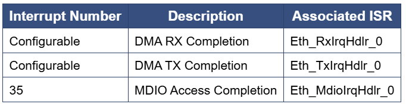   

+ The DMA interrupt numbers can be set via the Ethernet driver configuration parameters dmaTxChIntrNum and dmaRxChIntrNum.

### Variance / Deviation from the specification
***Ethernet Global Time APIs***
+ This driver implementation doesn't support the Global Time APIs:
  - Eth_GetCurrentTime()
  - Eth_EnableEgressTimeStamp()
  - Eth_GetEgressTimeStamp()
  - Eth_GetIngressTimeStamp()
+ QoS feature of Transmit/Receive APIs
  - The current implementation doesn't support QoS feature in transmission and reception:
    + Transmit frame priority is not supported in this release. The Priority pamareter should be set to 0 when requesting a buffer via Eth_ProvideTxBuffer().
    + Receive FIFO is not supported in this release. The FifoIdx parameter should be set to 0 when receiving a buffer via Eth_Receive().

### Ethernet Switch Interface
+ The driver doesn't call Ethernet Switch Interface APIs.

### Ethernet Transceiver Wake-Up
+ The wake-up related APIs are not implemented in this release:
  - EthTrcv_SetTransceiverWakeupMode()
  - EthTrcv_GetTransceiverWakeupMode()
  - EthTrcv_CheckWakeup()
+ The wake-up related functionality of other non wake-up specific APIs (i.e. EthTrcv_TransceiverInit(), EthTrcv_SetTransceiverMode(), etc) are not implemented in this release either.

### Ethernet Transceiver Manual/Auto-Negotiation Mode
+ The current EthTrcv driver implementation only supports auto-negotiation mode. The following APIs are impacted and partial functionality of the API is implemented:
  - EthTrcv_TransceiverInit()
  - EthTrcv_SetTransceiverMode()

### Ethernet Transceiver ECUC
+ The following EthTrcv ECUC APIs are not implemented in this release:
  - EthTrcvPhysLayerType
  - EthTrcvConnNeg
  - EthTrcvMainFunctionPeriod

### Development Error Reporting
+ Development errors are reported to the DET using the service Det_ReportError(), when enabled.
### Error codes
+ Production error are reported to DET via Det_ReportError(). Only the error codes in the Ethernet and Ethernet Transceiver driver specifications are reported which are listed below. There are no implementation specific error codes being reported.
### Ethernet driver error codes

​

  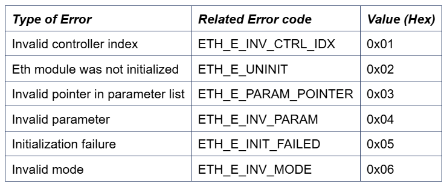   

### Ethernet Transceiver driver error codes

​

  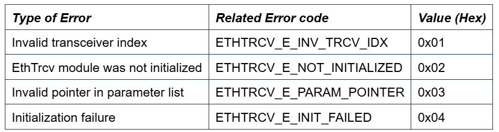   

### Production Code Error Reporting
+ Production error are reported to DEM via the service DEM_ReportErrorStatus(). There are no implementation specific error codes being reported. Only the error codes in the Ethernet and Ethernet Transceiver driver specifications are reported which are listed below.

​

  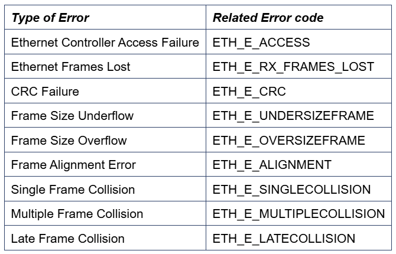   

### The following table summarizes the different tests implemented

​

  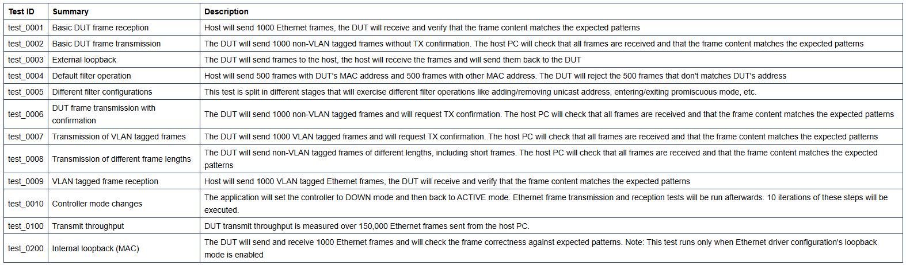   

### Data Path Setup sequence of Autosar Ethernet Driver in Virtual MAC mode

​

  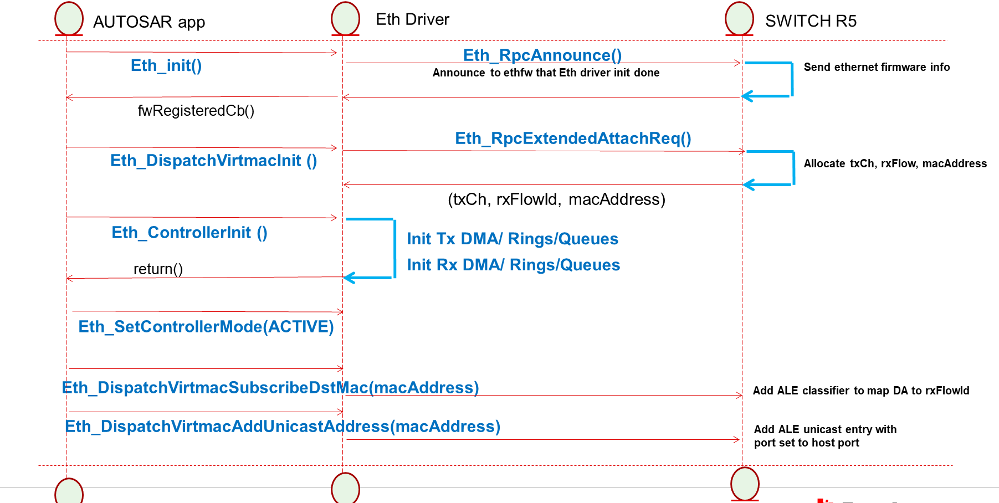   

### Functional Description
+ The ETH driver in virtual MAC mode does not control any of the CPSW submodules like MAC/MDIO/ALE/STATS unlike the standard ETH driver.
+ The ETH driver in virtual MAC mode supports transmission and reception of packets like the ETH driver in non-virtual MAC mode. The ETH driver uses the UDMA driver APIs to setup data transfers to/from the host port.
+ The ETH driver implements single UDMA channel for data transmission and single rx flow for data reception. Interrupts can be enabled for DMA transmit and receive completion events.
+ The DMA transfers are based on descriptors called Host Mode Packet Descriptors (HMPD). The descriptors are given to and retrieved from the UDMA via Ring Accelerators. There are three rings used per data direction in this implementation:
  - Transmit
    + Free Queue Ring - Descriptors with the address and length of the buffers to be transmitted are queued into this ring. In normal conditions, only CPSW will dequeue descriptors from this queue.
    + Completion Queue Ring - Descriptors that correspond to Ethernet frames which have already been consumed by the CPSW are placed in this queue. CPSW is the producer and host is the consumer of this ring.
    + Tear-down Completion Queue Ring - This ring is used only when the UDMA channel is torn down.
  - Receive
    + Free Queue Ring - Descriptors with the address and length of free buffers to be filled with incoming Ethernet frames are queued into this ring. In normal conditions, only the CPSW will dequeue descriptors from this queue.
    + Completion Queue Ring - Descriptors that correspond to buffers filled with new data from incoming Ethernet frames are placed in this queue. CPSW is the producer and host is the consumer of this ring.
    + Tear-down Completion Queue Ring is not used in virtual MAC mode for Rx. This is because there is a single UDMA Rx channel with upto 64 flows The single Udma Rx channel open/close is managed by the Ethernet Firmware.
+ The depth of each ring as well as its associated memory is configurable. The ring memories can be any memory in the system, but it's recommended that they are placed in a fast memory (i.e. OCMRAM or MSMC3). The depth of these rings is determined by the number of TX and RX buffers set in the driver configuration (EthTxBufTotal and EthRxBufTotal).

### Ethernet APIs Not Supported
+ APIs not support by the Eth Drvier in non-virtual MAC mode mentioned in Eth Driver user guide are not supported in virtual MAC mode as well. Additionally the following APIs are not supported in virtual MAC mode
  - Eth_GetEtherStats(): Statistics module cannot be accessed by the Eth Driver operating in virtual MAC mode. In the current release getting the statistics from Ethernet Firmware core via RPC msgs is not supported.
  - Eth_GetDropCount(): Statistics module cannot be accessed by the Eth Driver working in virtual MAC mode. In the current release getting the statistics from Ethernet Firmware core via RPC msgs is not supported.
  - Eth_ReadMii(): In Virtual MAC mode the PHY is not managed by the Eth Transceiver driver. Hence the MII access APIs are also not supported by the Ethernet Driver.
  - Eth_WriteMii(): In Virtual MAC mode the PHY is not managed by the Eth Transceiver driver. Hence the MII access APIs are also not supported by the Ethernet Driver.
  - Eth_UpdatePhysAddrFilter(): The ALE module which requires configuration to update the address filter cannot be accessed by the Eth Driver operating in virtual MAC mode. The driver supports RPC APIs to add/remove unicast/multicast/vlan in the switch by means of Eth_DispatchVirtmacXXX APIs. Refer the Ethernet driver API guide for details.
+ The reason for having a new set of Eth_DispatchVirtmacXXX instead of invoking the RPC APIs inside the existing Eth_UpdatePhysAddrFilter API is as follows:
  - As the RPC APIs are asynchronous dispatch APIs it is not possible to abstract their calls from the Eth Driver Client by invoking the APIs within an existing API, such as Eth_UpdatePhysAddrFilter(). It would require blocking in the API until response from Ethernet Firmware is received. Blocking would abstract the Ethernet Client from virtual MAC / native MAC mode operation but would pose problems with error handling, hence a new set of APIs which must be explicitly invoked by the Ethernet Driver Client have been implemented.

## 📌 Reference

[0] https://www.autosar.org/fileadmin/user_upload/standards/classic/4-3/AUTOSAR_SWS_EthernetDriver.pdf

[1] https://www.youtube.com/watch?v=kqpWL7xIPHU&list=PLE9xJNSB3lTG-749702Ja92J7TVCCoXCx&index=54

[2] https://autosarthonv.github.io/

[3] https://software-dl.ti.com/jacinto7/esd/processor-sdk-rtos-jacinto7/08_01_00_11/exports/docs/mcusw/mcal_drv/docs/drv_docs/index.html

[4] https://www.youtube.com/watch?v=YeAsBK0K0F0&list=PLE9xJNSB3lTFFjw2Or_ayjf-CSX0VypIE

[5] https://www.youtube.com/watch?v=dSA5fU7NJ80&list=PLE9xJNSB3lTG-749702Ja92J7TVCCoXCx&index=54
