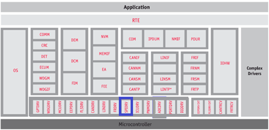
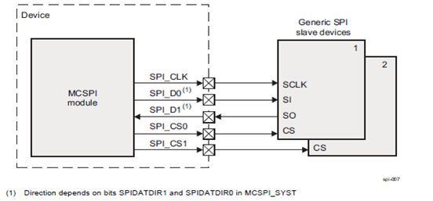
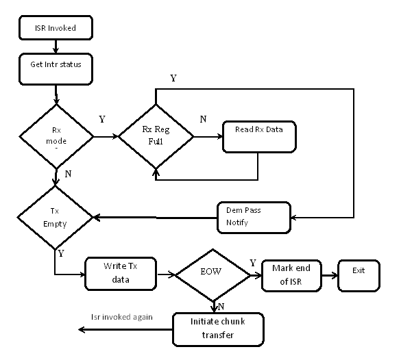
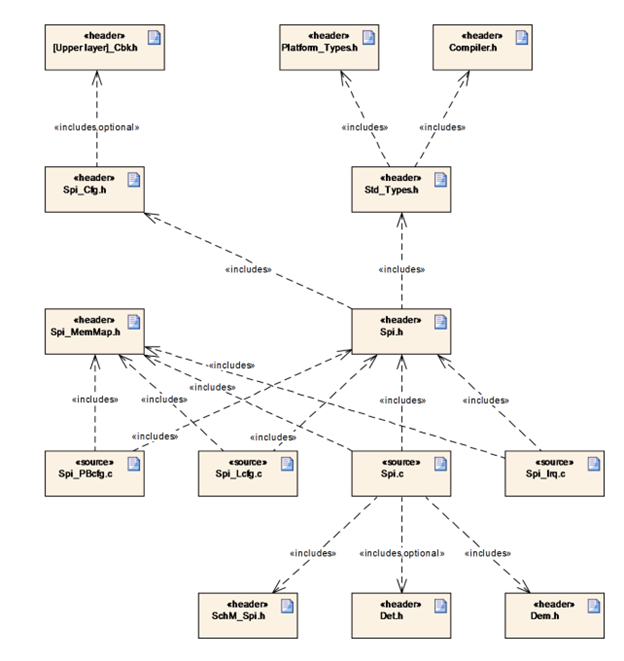
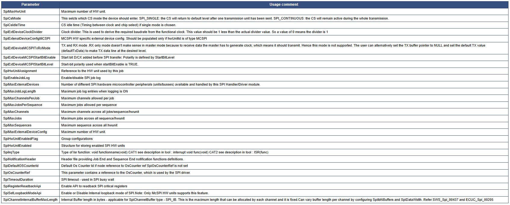
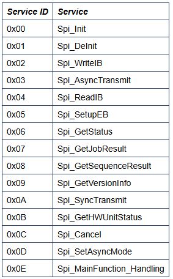
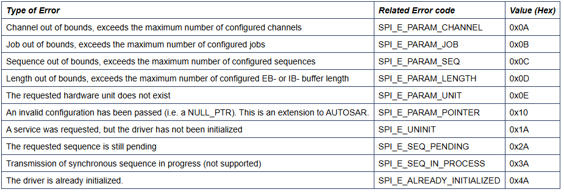
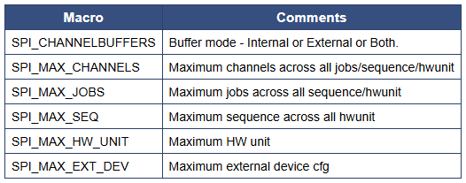
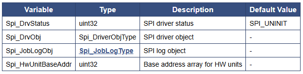

# 💚 Introduction Spi MCAL AUTOSAR MODULE 💛

## 👉 Introduction and Summary

### 1️⃣ Introduction

+ Ở repo này mình sẽ nói overview về kiến thức module Spi. Version Autosar trong repo này là 4.3.1 nhé.

### 2️⃣ Summary

Nội dung của bài viết gồm có những phần sau nhé 📢📢📢:
- [I. Introduction and Summary](#👉-introduction-and-summary)
    - [1. Introduction](#1️⃣-introduction)
    - [2. Summary](#2️⃣-summary)
- [II. Contents](#👉-contents)
- [III. Reference](#📌-reference)

## 👉 Contents

### Introduction
+ This document details AUTOSAR BSW Eth module implementation
  - Supported AUTOSAR Release : 4.3.1
  - Supported Configuration Variants : Pre-Compile & Link Time & Post Build

### Overview
+ The figure below depicts the AUTOSAR layered architecture as 3 distinct layers, Application, Runtime Environment (RTE) and Basic Software (BSW). The BSW is further divided into 4 layers, Services, Electronic Control Unit Abstraction, MicroController Abstraction (MCAL) and Complex Drivers.

​

     

+ MCAL is the lowest abstraction layer of the Basic Software. It contains internal drivers that are software modules that interact with the Microcontroller and its internal peripherals directly.SPI driver is part of the communication Drivers module which is part of the Basic Software. SPI driver diagram below shows the position of the SPI driver in the AUTOSAR Architecture.The Spi driver provides services for basic communication with external components. These components can be used by an application. The main tasks of the Spi are:
  - Handle the Spi hardware units onboard.
  - Handle data transmission to the components connected via Spi.
  - Take care of the settings required by external components (baud rate etc.)

​

     

### Spi Overview

​

     

+ The MCSPI modules include the following main features:
  - Serial clock with programmable frequency, polarity, and phase for each channel.
  - Wide selection of SPI word lengths, ranging from 4 to 32 bits.
  - SPI configuration per channel. This means, clock definition, polarity enabling and word width can be configured individually.
  - Built-in FIFO available for a single channel.
  - Support for the following interrupts and status, with masking: Interrupt for FIFO threshold levels. Rx empty, TX empty etc

### Features Supported
+ Configure Spi with
  - External devices
  - Channels
  - Jobs
  - Sequences
+ Initialization and de-initialization of MCSPI hardware units and callback functions.
+ Configure error detection (DEM and DET).
+ Configure implementation features like
  - Spi scalability level(s).
  - Spi channel buffers
  - Spi Interrupts
  - Spi frame transfers with 8 or 16bit clock frames
+ Select simple or extended API
+ Interruptible Sequences.
+ All four modes of SPI transfer (mode 0 to mode 3).
+ Configurable start bit enable, chip select idle time delay. Chip select maps to single channel, not leveraging the multi- channel feature which IP provides.
+ Internal clock divider.
+ Concurrent transfer of MCSPI devices.
+ Enhanced (Synchronous/Asynchronous) SPI Handler/Driver for MCSPI channels.
+ Concurrent synchronous, asynchronous transfer

### Features Not Supported
+ Supports only MSB based transfer modes(LSB is not supported).
+ Data width more than 32 bits.
+ In async mode of transfer only interrupt/polling based mode is supported. DMA based transfer mode is not supported.
+ Supports additional configuration parameters, refer section generates global (Global Variables)
+ Some SPI instances of device variants TDA4x does not support master mode and are not pinned out externally.

### Constraints
+ A job could belong to several sequences but can't be active at the same time i.e. a job queued in a sequence cannot be queued via another sequence. This is a design limitation to reduce driver complexity.
+ A channel could belong to several sequences or jobs but can't be active at the same time i.e. a channel in a job in a sequence cannot be part of another active job or sequence. This is a design limitation to reduce driver complexity.
+ Non-Interruptible sequence applies only within a HW unit. If a sequence is started, another high priority job belonging to another sequence cannot interrupt the job belonging to the same hardware unit. But the job can be scheduled ahead of another pending job of the started sequence if it belongs to another HW queue. This is illustrated in below example

### Dependencies to other modules
+ SPI peripherals may depend on the system clock, prescaler(s) and PLL. Thus, changes of the system clock (e.g. PLL on , PLL off) may also affect the clock settings of the SPI hardware.
+ The SPI Handler/Driver module does not take care of setting the registers which configure the clock, prescaler(s) and PLL in its init function. This has to be done by the MCU module.
+ Depending on microcontrollers, the SPI peripheral could share registers with other peripherals. In this typical case, the SPI Handler/Driver has a re-lationship with MCU module for initialising and de-initialising those registers.
+ If Chip Selects are done using microcontroller pins the SPI Handler/Driver has a relationship with PORT module. In this case, this specifica-tion assumes that these microcontroller pins are directly accessed by the SPI Han-dler/Driver module without using APIs of DIO module. Anyhow, the SPI depends on ECU hardware design and for that reason it may depend on other modules.

### Scalability Levels in SPI Driver:
+ LEVEL 0, Simple Synchronous SPI Handler/Driver: the communication is based on synchronous handling with a FIFO policy to handle multiple accesses. Buffer usage is configurable to optimize and/or to take advantage of HW capabilities. A simple synchronous transmission means that the function calling the transmission service is blocked during the ongoing transmission until the transmission is finished.
+ LEVEL 1, Basic Asynchronous SPI Handler/Driver: the communication is based on asynchronous behavior and with a Priority policy to handle multiple accesses. Buffer usage is configurable as for “Simple Asynchronous” level. An asynchronous transmission means that the user calling the transmission service is not blocked when the transmission is on-going. Furthermore, the user can be notified at the end of transmission.
+ LEVEL 2, Enhanced (Synchronous/Asynchronous) SPI Handler/Driver: the communication is based on asynchronous behavior or synchronous handling, using either interrupts or polling mechanism selectable during execution time and with a Priority policy to handle multiple accesses. Buffer usage is configurable as for other levels

### Priority Handling and Job Queuing Operations
+ Priority mechanism is implemented using a pure software function as hardware priority mechanism is not supported by the SPI module. Priority is supported at job level in a sequence. As per the AUTOSAR SPI HandlerDriver SWS jobs are scheduled in order of priority. The priority of jobs determines their scheduling even across sequences as long as a sequence is marked as interruptible.The internal implementation of job priority based scheduling is based on priority queue implemented as a doubly linked list. All jobs are queued into a work queue per hardware unit. The hardware services the next job in the work queue by de-queuing from this work queue. The work queue implementation ensures the highest priority job is de-queued always.

### Interrupt Service Routines
+ For each of the configured hardware units (MCSPI), one interrupt service routine has to be mapped. The Integrator has to map the interrupt service routines to the interrupt sources of the respective HW unit interrupt. The supported ISRs are part of the Spi_Irq.h file. Spi_Irq.h contains ISR for each of MCSPI hardware units. These should be used for the registration.
+ Handling MCSPI FIFO Interrupt: MCSPI Hardware Behavior: The hardware doesn't generate TX empty interrupt for the last chunk of data write when the write is not equal to the FIFO depth. This means that the EOW (End of Word) interrupt cannot be used for data transfer (TX) completion.
+ To handle scenario when the actual transfer size is not a multiple of FIFO size the following steps shall be performed.
  - The transfer request needs to be split into two
    + one with multiple of FIFO trigger level
    + another with just with the reminder words
  - For the last chunk transfer, the FIFO level is reconfigured to be equal to the chunk size in the ISR context. This will generate the EOW interrupt
+ From timing point of view, the only change with this two stage transfer is that, there will be a slightly different delay in between these two transfers compared to the full un-interrupted transfer. This is due to the ISR time and also we are waiting for the first transfer to fully complete (FIFO is fully drained). This delay is similar to the delay between channels in a job. So there is no real impact on performance.

​

     

### Dynamic Behavior
+ The SPI driver at any time will be in one of the following states. The state transition will depend on the APIs invoked by the application
  - SPI_UNINIT: The SPI Handler/Driver is not initialized or not usable. This is the state before starting driver initialization or after the driver is de-initialized.
  - SPI_IDLE: The SPI Handler/Driver is not currently transmitting any Job. This is the state before the transmission is started or after the transmission is completed.
  - SPI_BUSY: This is the state after a transmission has started i.e. transmission for the sequence is ongoing.

### Directory Structure
- The below diagram shows the overall files structure for the SPI driver. . The Spi.c and Spi.h are the 2 files that contain the SPI driver’s APIs.

​

     

### The design's specific configurable parameters are as follows:

​

     

### Variant Support
+ The driver shall support both VARIANT-LINK-TIME , VARIANT-PRE-COMPILE & VARIANT-POST-BUILD.

### Development Error Reporting
+ By default, development errors are reported to the DET using the service Det_ReportError(), if development error detection and reporting are enabled (i.e. checkboxes Development Mode and Development Error Reporting are checked). The reported module SPI ID is 83. The reported service IDs identify the services which are described earlier. The following table presents the service IDs and the related services:

​

     

### Parameter Checking
+ AUTOSAR requires that API functions check the validity of their parameters. The checks in table are internal parameter checks of the API functions. These checks are for development error reporting and can be enabled or disabled. ECUC parameters error checks are handled as per ECUC Parameter checking in configurator . The deviations should be documented in user guide.

​

     

### Error Handling : Receive FIFO/Buffer overflow
+ The MCSPI module supports Rx overflow interrupt generation. SPI driver uses this feature for reporting RX FIFO overflow error. This is detected when it is enabled in hardware and receiver register or FIFO becomes filled.
+ MCSPI module support uses of FIFO for receive and transmit operations. The FIFO is shared between Rx and TX. If FIFO is enabled receive overrun interrupt indicates FIFO full for receive. SPI driver reports this to application and stops processing any further transfers.

### MACROS, Data Types & Structures
+ The sections below lists some of key data structures that shall be implemented and used in driver implementation

​

     

+ Spi_StatusType: This type defines a range of specific status for SPI Handler/Driver
+ Spi_JobResultType: Enumeration This type defines a range of specific Jobs status for SPI Handler/Driver
+ Spi_SeqResultType: Enumeration This type defines a range of specific Sequences status for SPI Handler/Driver
+ Spi_DataBufferType: Used to specify the type of application data buffer elements
+ Spi_NumberOfDataType: Used to specify Type for defining the number of data elements of the type Spi_DataBufferType to send and / or receive by Channel
+ Spi_ChannelType: Used to specify the identification (ID) for a Channel.
+ Spi_JobType: Used to specify the identification (ID) for a Job
+ Spi_SequenceType: Used to specify the identification (ID) for a sequence of jobs
+ Spi_HWUnitType: Used to specify the identification (ID) for a SPI Hardware microcontroller peripheral (unit)
+ Spi_AsyncModeType: Used to specify the asynchronous mechanism mode for SPI busses handled asynchronously in LEVEL 2

### Global Variables
+ This design expects that implementation will require to use following global variables.

​

     

### Test Criteria
+ The sections below identify some of the aspects of design that would require emphasis during testing of this design implementation
  - Validating ECUC Parameter: Configuration for each test case shall be generated by EB Tresos command line.
+ Performance Testing
  - While measuring time taken to send data, care should be taken to use a timer (and not rely on CPU ticks & conversion). Time shall be measured between invoke of transmit API and return of this function call for both Asynctransmit and Synctransmit cases.
+ Loopback Test
  - The loopback transmit test for all SPI instances
+ Transmit Test with different configurations
  - Multichannel transmit test with different channel parameter configurations
  - Multijob transmit test with different job parameter configurations
  - Multisequence transmit test with Non interruptible sequence configuration
  - Multisequence transmit test with Interruptible sequence configuration
  - Transmit test with different device configurations like modes, polarity and phase.
  - Asynchronous and Synchronous mode of transmission test
  - Asynchronous transmission test with interrupt and polling mode
  - Transmit test with IB/EB channel buffering modes
+ Transmit test with different baud rates
  - Transmit test with different clock bit rates obtained for data transfer by programming the clock divider

## 📌 Reference

[0] https://www.autosar.org/fileadmin/user_upload/standards/classic/4-3/AUTOSAR_SWS_SpiDriver.pdf

[1] https://youtu.be/G-Y27cojQb8?si=WphEMRTopmP83CDc

[2] https://autosarthonv.github.io/

[3] https://software-dl.ti.com/jacinto7/esd/processor-sdk-rtos-jacinto7/08_01_00_11/exports/docs/mcusw/mcal_drv/docs/drv_docs/index.html

[4] https://www.youtube.com/watch?v=YeAsBK0K0F0&list=PLE9xJNSB3lTFFjw2Or_ayjf-CSX0VypIE

