# 💚 Introduction Gpt MCAL AUTOSAR MODULE 💛

## 👉 Introduction and Summary

### 1️⃣ Introduction

+ Ở repo này mình sẽ nói overview về kiến thức module Gpt. Version Autosar trong repo này là 4.3.1 nhé.

### 2️⃣ Summary

Nội dung của bài viết gồm có những phần sau nhé 📢📢📢:
- [I. Introduction and Summary](#👉-introduction-and-summary)
    - [1. Introduction](#1️⃣-introduction)
    - [2. Summary](#2️⃣-summary)
- [II. Contents](#👉-contents)
- [III. Reference](#📌-reference)

## 👉 Contents

### Introduction
+ This document details AUTOSAR BSW Gpt module implementation
  - Supported AUTOSAR Release : 4.3.1
  - Supported Configuration Variants : Pre-Compile & Post Build

### Overview
+ The figure below depicts the AUTOSAR layered architecture as 3 distinct layers, Application, Runtime Environment (RTE) and Basic Software (BSW). The BSW is further divided into 4 layers, Services, Electronic Control Unit Abstraction, MicroController Abstraction (MCAL) and Complex Drivers.

​

     

+ MCAL is the lowest abstraction layer of the Basic Software. It contains software modules that interact with the Microcontroller and its internal peripherals directly. Gpt driver is part of the Microcontroller Drivers (block, show above). Below shows the position of the Gpt driver in the AUTOSAR Architecture.

​

  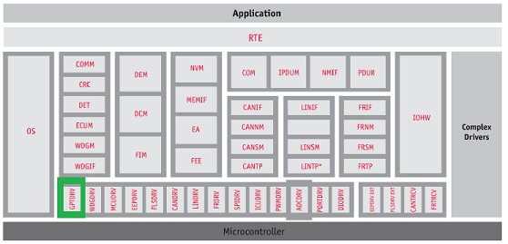   

### Spi Overview
+ The GPT module initializes, configures and controls the internal Timer(s) hardware to realize GPT driver as detailed in AUTOSAR BSW GPT Driver Specification. Following section highlights key aspects of this implementation, which would of interest to an integrator.
+ Gpt primarily used to generate different time bases that other modules of AUTOSAR could depend on. Devices includes multiple timers, below listed are some of the key features provided.
  - Free running 32 bit up counter
  - Auto reload mode (can be used for continuous counter operation)
  - Support dynamic Start / Stop counter operation
  - Programmable clock dividers (2n, where n = [0-8])
  - 2 timers modules could be operated in cascaded mode to provide 64bit counter
  - Programmable interrupt generation on overflow, compare and capture
  - Programmable clock source
+ Supports 3 basic functional modes Timer mode, Capture mode & Compare mode

### Features Supported
+ Below listed are some of the key features that are expected to be supported
  - Starting and stopping of hardware timers
  - Getting the timer values
  - Setting one shot mode or continuous mode
  - Controlling time triggered interrupt notifications
  - Controlling time triggered wakeup interrupts
  - The requirement id’s listed below shall be supported

### Features Not Supported
- [NON Compliance] Gpt PreDef Timers is not supported
- [NON Compliance] GptClockReference doesn’t refer to McuClockReferencePoint.
- Supports additional configuration parameters

### Assumptions
+ Below listed are assumed to valid for this design/implementation, exceptions and other deviations are listed for each explicitly. Care should be taken to ensure these assumptions are addressed.
  - The functional clock to the GPT module is expected to be on before calling any GPT module API.
  - The GPT driver as such doesn’t perform any PRCM programming to get the functional clock.
  - The clock-source selection for GPT is not performed by the GPT driver, other entities such as SBL, MCAL module MCU shall perform the same.
  - The GTC hardware present in the SOC shall not be supported as GPT module.

### Constraints
+ Some of the critical constraints of this design are listed below
  - Is cases where MCU module is not employed (supported) to configure the clock source for GPT module. The GPT module configurator shall refer to MCU clock source as listed in specification.

### Fundamental Operation
+ As detailed in the TRM, the timer module generates an interrupt when the counter reaches its maximum value (i.e. 0xFFFFFFFF, for a 32 bit counter). The basic idea is use “Auto Reload” mode of the timer and initial count that could be set (TCRR register). Consider an example where timer is configured to expire after reaching a count of 0x0E000000

​

  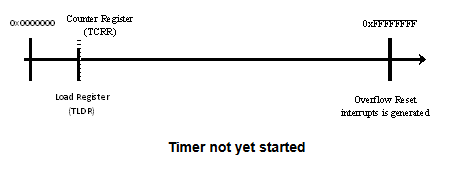   

+ Following sequence of steps shall be performed, before the timer could be started
  - The initial count of the counter is set to 0xF1FFFFFF (i.e. 0xFFFFFFFF - 0x0E000000)
  - The reload register (TLDR) is set with 0xF1FFFFFF as depicted above

​

  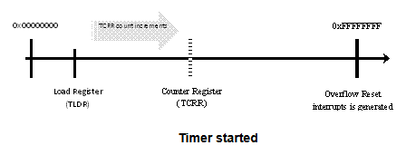   

  - Timer is programmed as configured (one shot or continuous mode)
  - The timer is started and the counter (register TCRR), starts counting on every pulse
    + As depicted in above figure, TCRR has moved w.r.t to TLDR

​

  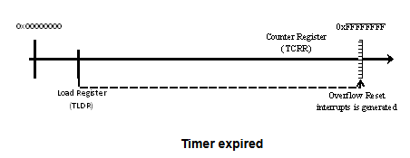   

  - When the timer expires, the TCRR is loaded with value present in TLDR as show above
  - An interrupt can be triggered at this point
  - The timer would default to as show in figure "Timer not yet started", in continuous mode. Also note that no explicit start would be required
  - In One Shot mode, timer is halted. i.e. TCRR stop counting the count of 0xFFFFFFFF is retained by TCRR

### Dynamic Behavior
+ States: As detailed in section 7.1 of autosar spec, a timer would be in one of the following states. Initialized, running, stopped, expired. A variable shall be maintained on per channel basis to track and maintain the state. The diagram below shows transitions of states and it’s associated service API’s.

​

  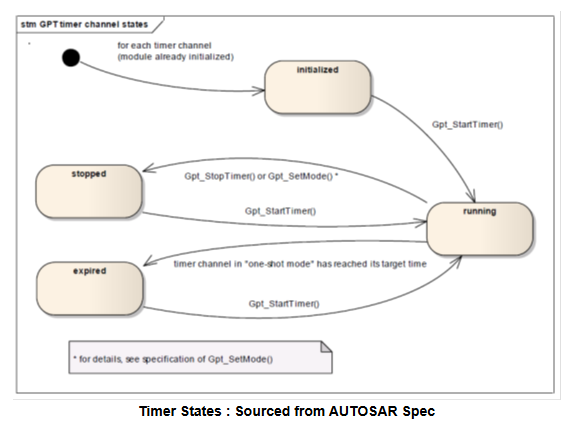   

### Modes of Timer
***Continuous Mode***

​

  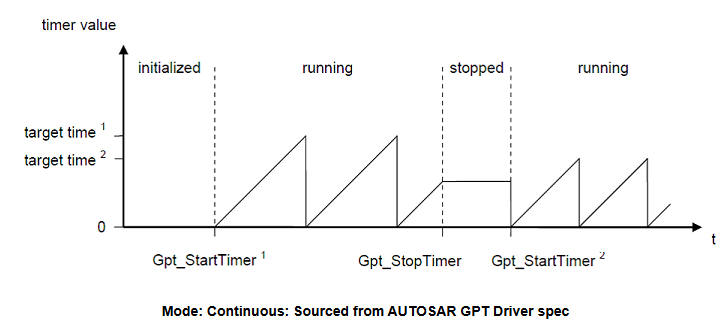   

​

  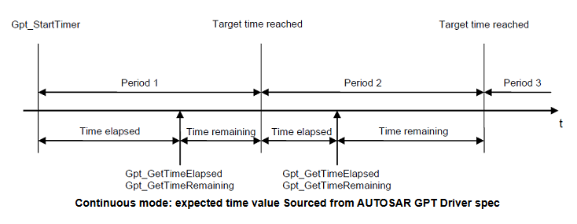   

***One Shot Mode***

​

  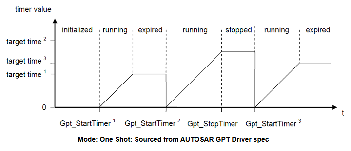   

### Determination of time elapsed
+ The elapsed time could be computed under following conditions “Table 5: Summary: Return values and DET errors of Gpt_GetTimeElapsed”
  - In continuous mode
    + Can be obtained by subtracting Timer Reload Register value (TLDR) from current counter value (TCRR)
  - In One Shot mode
    + Timer is counting
      - Same as “In Continuous mode”
    + Timer expired
      - Can be obtained by subtracting Timer Reload Register value from max value (i.e. 0xFFFFFFFF for 32 bit counter)

### Determination of time remaining
+ The elapsed time could be computed under following conditions, section 1.5 specifically “Table 6: Summary: Return values and DET errors of Gpt_GetTimeRemaining”
  - In continuous mode
    + Can be obtained by subtracting current counter value (TCRR) from max value (i.e. 0xFFFFFFFF for 32 bit counter)
  - In One Shot mode
    + Timer is counting
      - Same as “In Continuous mode”
    + Timer expired
      - Value is always 0

### Directory Structure
​

  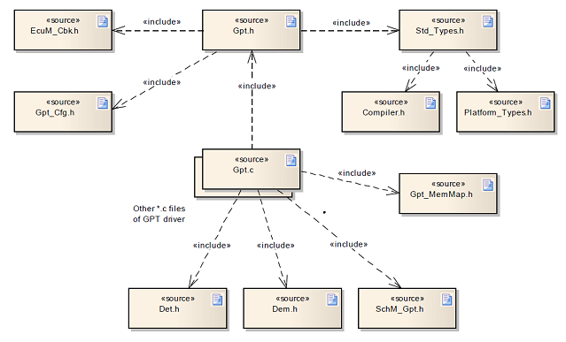   

### NON Standard configurable parameters
​

  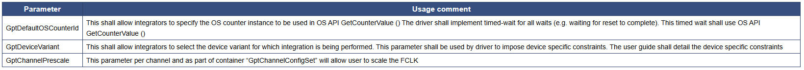   

### Development Errors
​

  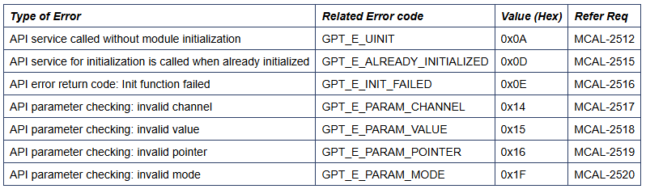   

### Runtime Errors
+ API service is called when timer channel is still busy	GPT_E_BUSY	0x0B

### MACROS, Data Types & Structures
+ Gpt_ValueType, Gpt_ModeType, Gpt_PredefTimerType, Gpt_NotifyType, Gpt_ChannelMode
+ Gpt_RegisterReadbackType
​

  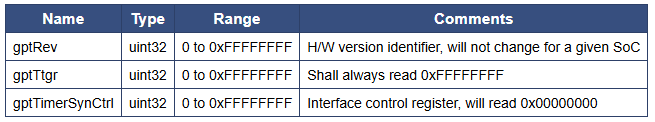   

+ Gpt_ChannelConfigType
​

  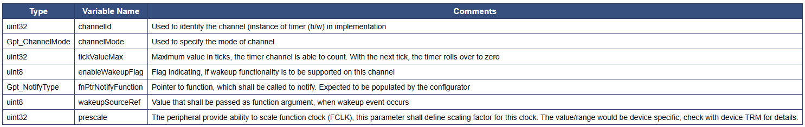   

+ Gpt_ConfigType
  - Used to define all channels specific parameters, shall be supplied to Gpt_Init () function. Values of these are expected to be populated by configurator.

### API
+ Gpt_Init, Gpt_DeInit, Gpt_GetTimeElapsed, Gpt_GetTimeRemaining, Gpt_StartTimer, Gpt_StopTimer, Gpt_EnableNotification, Gpt_DisableNotification, Gpt_SetMode, Gpt_DisableWakeup, Gpt_EnableWakeup, Gpt_CheckWakeup, Gpt_GetVersionInfo, 
+ Gpt_RegisterReadback: As noted from previous implementation, the timer configuration registers could potentially be corrupted by other entities (s/w or h/w). One of the recommended detection methods would be to periodically read-back the configuration and confirm configuration is consistent. The service API defined below shall be implemented to enable this detection.
​

  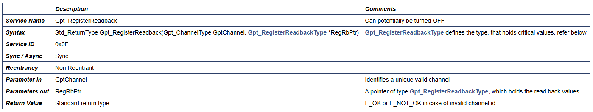   

### Notify ISR
+ On elapse of configured count, the timer peripheral generates an interrupt. The implementation shall provide an ISR with prototype as “void Gpt_<ChannelNum>Isr (void)” The control flow shall be as depicted in flow chart figure below. Since, the function prototype dosen’t take any arguments to uniquely identify the timer channel that caused this interrupt, a separate ISR shall be implemented for each configured / enabled channel.

​

  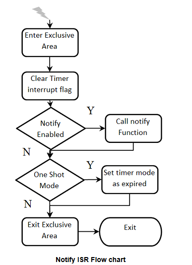   

### Wakeup ISR
+ On elapse of configured count the timer peripheral generates an interrupt. The implementation shall provide an ISR with prototype as “void Gpt_<ChannelNum>Isr (void)” The control flow shall be as depicted in flow chart above, with following exceptions
  - Check for notify & call notify shall not be implemented, instead EcuM_CheckWakeup () shall be called with configured wakeup source
  - Check for mode and its associated action for true condition shall not be implemented

### Global Variables
+ This design expects that implementation will require to use following global variables.

​

  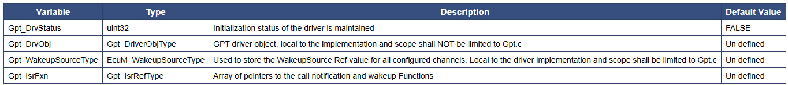   

### Decision Analysis
+ Use of DM Timer Auto-Reload mode for GPT continuous mode: The timer hardware doesn’t support continuous mode if configured timer count is less than max count of timer (0xFFFFFFFF in 32 bit timer). To implement GPT continuous mode we have to use timer interrupt to trigger timer start or tweak timer configuration during timer start to work in Continuous mode.
+ Criteria: Implementation of GPT ‘Continuous’ mode, without timing constraints (or programming registers in ISR)
+ Use GPT count completion interrupt to restart timer. For implementing continuous mode with this count provided to start timer function will be programmed as to match value for interrupt generation and timer will start counting from zero. Once it reaches count value it will generate match interrupt. Same will be used for notification and wake up event. Here driver will check if timer is configured in continuous mode and if yes it will trigger timer enable again.
  - Advantages: Simple to implement. No overhead configuration.
  - Disadvantages
    + Latency between timer interrupt generation and timer restart. This will be major issue as it will vary with Processor speed. Also will not be constant between two timer count completion cycles
    + Dependency on ISR for timer restart
+ Use of Timer auto reload mode Device timer HW supports auto-reload mode when timer overflow (max count possible for timer HW reached) occurs. In this case timer HW restarts timer with value loaded in Counter register (CR). To use this feature for GPT continuous mode we need to calculate count value with reference to max count. For example if count value is 0x10 then counter register should be programmed with (0xFFFF_FFFF – 0x10) value. This will ensure timer restarts after counting till overflow.
  - Advantages
    + No dependency on ISR for timer restart. This will be taken care by hardware.
    + Independent of processor speed.
  - Disadvantages: Complex software implementation as software has to make sure correct value is written and also keep track of count value given by application for timer elapsed and time remaining functions.
+ Decision: To avoid dependency on processor and interrupt service routine, recommended to use timer hardware auto-reload feature. Software will make sure to return correct values for time elapsed and time remaining functions.

### Test Criteria
+ The sections below identify some of the aspects of design that would require emphasis during testing of this design implementation
  + State Transitions
    - Test cases shall exercise all state transitions as detailed in section (States)
    - Ensure non supported API’s in a given state, returns valid error code
  + Wake functionality
    - Test cases shall ensure, wake up functionality is exercised on one channel at least
  + Mode
    - Test cases shall ensure, a timer shall be operable in all supported modes (but not concurrently, for a single channel)
  + Concurrency
    - Test cases shall ensure, multiple channels can be operated concurrently
  + Timeout
    - Test cases exercising Gpt_Start API, as perform equivalence class test on Gpt_ValueType Gpt_Start (). As a large Gpt_ValueType increase test cycle time
    - Large Gpt_ValueType shall be performed only for “Full Test Cycle”
  + Elapsed / Remaining time
    - Test cases shall ensure API (when available) GptTimeElapsedApi () is invoked on elapsed timer (one shot mode) and value shall not change
    - Test cases shall ensure API (when available) GptTimeRemainingApi () is invoked on elapsed timer (one shot mode) and value shall not change

## 📌 Reference

[0] https://www.autosar.org/fileadmin/user_upload/standards/classic/4-3/AUTOSAR_SWS_GptDriver.pdf

[1] https://youtu.be/G-Y27cojQb8?si=WphEMRTopmP83CDc

[2] https://autosarthonv.github.io/

[3] https://software-dl.ti.com/jacinto7/esd/processor-sdk-rtos-jacinto7/08_01_00_11/exports/docs/mcusw/mcal_drv/docs/drv_docs/index.html

[4] https://www.youtube.com/watch?v=YeAsBK0K0F0&list=PLE9xJNSB3lTFFjw2Or_ayjf-CSX0VypIE

