# 💚 Introduction Wdg MCAL AUTOSAR MODULE 💛

## 👉 Introduction and Summary

### 1️⃣ Introduction

+ Ở repo này mình sẽ nói overview về kiến thức module Wdg. Version Autosar trong repo này là 4.3.1 nhé.

### 2️⃣ Summary

Nội dung của bài viết gồm có những phần sau nhé 📢📢📢:
- [I. Introduction and Summary](#👉-introduction-and-summary)
    - [1. Introduction](#1️⃣-introduction)
    - [2. Summary](#2️⃣-summary)
- [II. Contents](#👉-contents)
- [III. Reference](#📌-reference)

## 👉 Contents

### Introduction
+ This document details AUTOSAR BSW Wdg module implementation
  - Supported AUTOSAR Release : 4.3.1
  - Supported Configuration Variants : Pre-Compile, Link Time and Post-build

### Overview
+ The figure below depicts the AUTOSAR layered architecture as 3 distinct layers, Application, Runtime Environment (RTE) and Basic Software (BSW). The BSW is further divided into 4 layers, Services, Electronic Control Unit Abstraction, MicroController Abstraction (MCAL) and Complex Drivers.

​

     

+ MCAL is the lowest abstraction layer of the Basic Software. It contains software modules that interact with the Microcontroller and its internal peripherals directly. Wdg driver is part of the Microcontroller Drivers (block, shown above). Below shows the position of the Wdg driver in the AUTOSAR Architecture.

​

  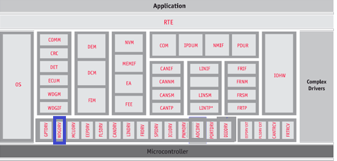   

### Wdg Overview
+ The WDG module initializes, and configures WDG hardware(RTI) to meet requirements as detailed in AUTOSAR BSW WDG Driver Specification. Following section highlights key aspects of this implementation, which would be of interest to an integrator.

+ RTI(Real Time Interrupt) module supports three functional modes Counter mode, Capture mode & Windowed watchdog timer mode. Only Windowed watchdog timer mode is used to meet AUTOSAR WDG requirements.

+ The digital windowed watchdog generates an interrupt after a programmable period, if trigger is not serviced in the allowed time frame. TDA4x class of devices supports windowed watchdog timer where key can be only written in the configured window programmed through software. The watchdog opens a configurable time window in which it must be serviced. Any attempt to service the watchdog outside this time window, or a failure to service the watchdog in this time window, will cause the watchdog to generate a NMI interrupt.

### Features Supported
+ Below listed are some of the key features that are supported
  - Initialization and configuration of WDG (configure window size, timeout value etc.)
  - Setting default mode(FAST/SLOW)
  - Service trigger via Wdg_Trigger API if called within the allowed time window.
  - Supports all instances of RTI present in MCU domain.
  - Supports additional configuration parameters, refer section (Implementation specific parameters (computed)) & (Wdg_RegisterReadback)

### Features Not Supported
+ [NON Compliance] Wdg_SetMode API is not supported. Due to hardware limitations, Mode and Timeout can’t be modified if watchdog is already running i.e only during initialization Mode and Timeout can be set.
+ OFF-Mode is not supported.
+ External Wdg driver : This driver is an internal, belongs to the Microcontroller Abstraction Layer whereas external watchdog driver belongs to the Onboard Device Abstraction Layer. So requirements w.r.o external watchdog are not implemented.
+ Standard AUTOSAR WDG specification 1, categorizes few BSW General Requirements as non-requirements

### Assumptions
+ Below listed are assumed to be valid for this design/implementation, exceptions and other deviations are listed for each explicitly. Care should be taken to ensure these assumptions are addressed.
  - The functional clock to the WDG module is expected to be enabled before calling any WDG module API.
  - The WDG driver as such doesn’t perform any PRCM programming to get the functional clock.
  - The clock-source selection for WDG is not performed by the WDG driver, other entities such as SBL, MCAL module MCU shall perform the same.
  - Assumed that only one of the RTI instance is initiated per core at which driver is running.

### Constraints
+ Some of the critical constraints of this design are listed below
  - In case where MCU module is not employed (supported) to configure the clock source for WDG module

### Fundamental Operation
+ The Digital Watchdog Timer(DWT) generates reset after a programmable period, if not serviced within that period. In DWT, time-out boundary is configurable.In DWWD, along with configurable time-out boundary, the start time boundary is also configurable. The DWWD can generate Reset or Interrupt, if not serviced within window(Open Window) defined by start time and time-out boundary. Also the DWWD can generate Reset or Interrupt if serviced outside Open Window (i.e within Closed Window). Generation of Reset or Interrupt depends on the DWWD Reaction configuration.

### WDG Configuration Sequence

​

  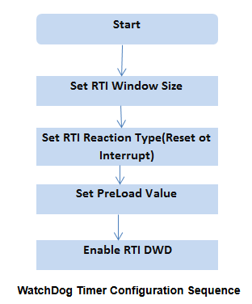   

### Dynamic Behavior
***States***
+ As detailed in specification, Driver will be in one of the following states.
  - WDG_UNINIT : Default state indicating a non-initialized module.
  - WDG_IDLE : Indicating initialization is successful.
  - WDG_BUSY : Indicating module is busy(during execution).

​

  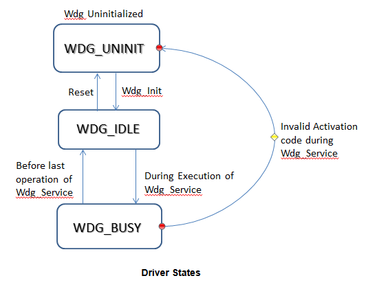   

### Directory Structure

​

  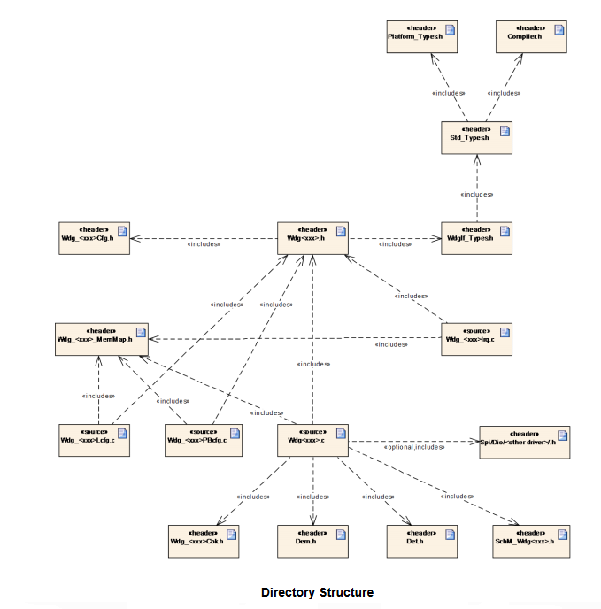   

### NON Standard configurable parameters
+ Following lists this design’s specific configurable parameters

​

  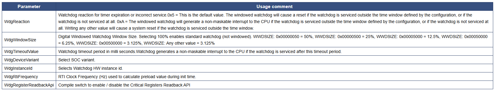   

### Development Errors

​

  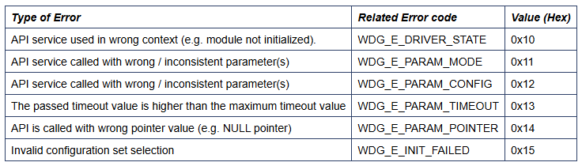   

### Runtime Errors

​

  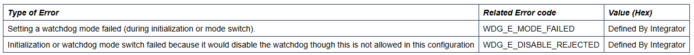   

### Error notification (DEM)
+ All detected run time errors shall be reported via Dem_ReportErrorStatus() service of the Diagnostic Event Manager (DEM).

​

  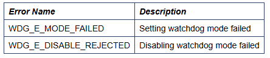   

### Wdg_ModeInfoType
+ Used to define watchdog hardware specific parameters per instance and the values of these are expected to be populated by configurator.

​

  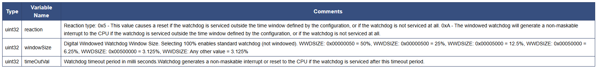   

### Wdg_ConfigType

​

  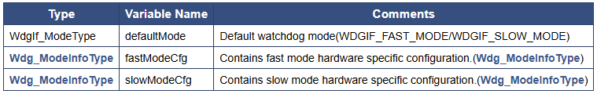   

### Wdg_ConfigType_PC

​

  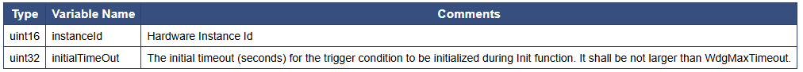   

### Wdg_RegisterReadbackType

​

  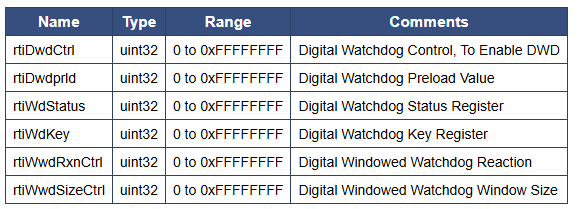   

### API
+ Wdg_Init, Wdg_SetTriggerCondition, Wdg_GetVersionInfo, Wdg_Trigger

### Global Variables

​

  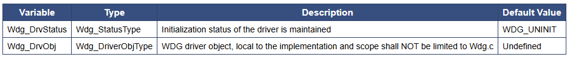   

### Test Criteria
+ Timeout
  - Test cases shall ensure watchdog generates ESM interrupts and thereby reset occurs for the configured timeout value.
  - Also test with different set of timeout values(Equivalence partition test).
+ State Transitions
  - Test cases shall exercise all state transitions as detailed in section (States)
+ Modes
  - Test cases shall ensure watchdog support both fast/slow modes
+ Trigger Condition
  - Test cases shall ensure driver test with different set of trigger condition timeout values(Equivalence partition test).
+ Window Sizes
  - Test cases shall ensure watchdog operation test with all window sizes that hardware supports.
+ Window Violation Test
  - Test cases shall ensure watchdog start time violation test.
+ Test for all instances
  - Test cases shall ensure watchdog operation for all the RTI instances supported
+ Test for different clock sources
  - Test cases shall ensure watchdog operation for all the RTI clock sources supported.

## 📌 Reference

[0] https://www.autosar.org/fileadmin/user_upload/standards/classic/4-3/AUTOSAR_SWS_GptDriver.pdf

[1] https://youtu.be/G-Y27cojQb8?si=WphEMRTopmP83CDc

[2] https://autosarthonv.github.io/

[3] https://software-dl.ti.com/jacinto7/esd/processor-sdk-rtos-jacinto7/08_01_00_11/exports/docs/mcusw/mcal_drv/docs/drv_docs/index.html

[4] https://www.youtube.com/watch?v=YeAsBK0K0F0&list=PLE9xJNSB3lTFFjw2Or_ayjf-CSX0VypIE

