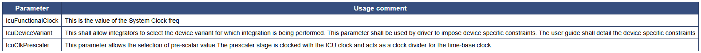
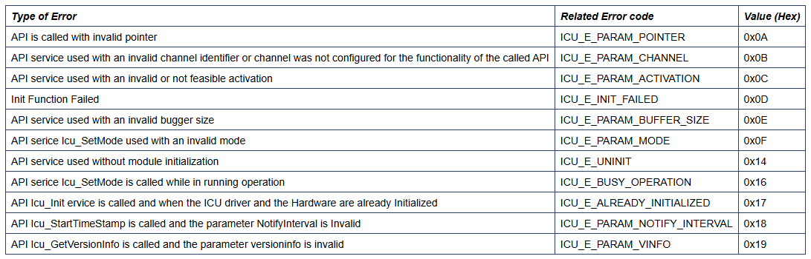
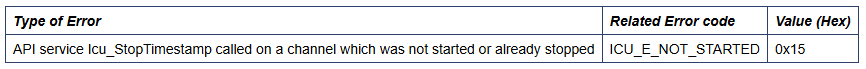
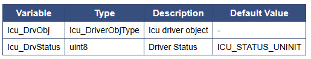

# 💚 Introduction Icu MCAL AUTOSAR MODULE 💛

## 👉 Introduction and Summary

### 1️⃣ Introduction

+ Ở repo này mình sẽ nói overview về kiến thức module Icu. Version Autosar trong repo này là 4.3.1 nhé.

### 2️⃣ Summary

Nội dung của bài viết gồm có những phần sau nhé 📢📢📢:
- [I. Introduction and Summary](#👉-introduction-and-summary)
    - [1. Introduction](#1️⃣-introduction)
    - [2. Summary](#2️⃣-summary)
- [II. Contents](#👉-contents)
- [III. Reference](#📌-reference)

## 👉 Contents

### Introduction
+ This document details AUTOSAR BSW Icu module implementation
  - Supported AUTOSAR Release : 4.3.1
  - Supported Configuration Variants : Pre-Compile & Post-Build

### Overview
+ The figure below depicts the AUTOSAR layered architecture as 3 distinct layers, Application, Runtime Environment (RTE) and Basic Software (BSW). The BSW is further divided into 4 layers, Services, Electronic Control Unit Abstraction, MicroController Abstraction (MCAL) and Complex Drivers.

​

     

+ MCAL is the lowest abstraction layer of the Basic Software. It contains internal drivers that are software modules that interact with the Microcontroller and its internal peripherals directly. ICU driver will use ECAP (Enhanced Capture) hardware IP for demodulation of a PWM signal, counting pulses, measuring of frequency and duty cycle and generating simple interrupts.

### Icu Overview
+ The ICU module initializes, configures and controls the internal hardware to realize ICU driver as detailed in AUTOSAR BSW ICU Driver Specification. The ICU functionality is realized through the ECAP IP available on the device. Following section highlights key aspects of this implementation, which would be of interest to an integrator.
+ The Icu driver uses ECAP module to capture events. The Icu driver provides the following features:
  - Signal Measurements - High time, Low time, Period time, Duty cycle
  - Edge Detection - Provide notification for each edge detected
  - Edge Counting - Measure edge counts
  - Edge Timestamping - Measure the absolute time when edges occur
+ The hardware ECAP module includes the following features:
  - 32-bit time base Counter
  - 4x32 event time-stamp capture Registers
  - Interrupt capability for capture events
  - Absolute time-stamp capture
  - Difference (Delta) mode time-stamp capture
  - All above resources dedicated to a single input pin
+ Please note that this is just for reference purpose, for other details please refer to technical reference manual. Note that not all feature available in ECAP hardware IP are currently supported by ICU driver.

### Features Supported
+ Capture Functionality using the ECAP module.
+ Edge polarity (activation) setting.
+ Enabling of Development Error Detection and Runtime Error Detection.

### Features Not Supported
+ Hardware does not support wakeup capability. Hence, the below features are not supported.
  - Controlling Wakeup interrupts.
  - Icu_SetMode()
  - Icu_DisableWakeup()
  - Icu_EnableWakeup()
  - Icu_CheckWakeup()

### Assumptions
+ Below listed points are assumed to be valid for this design/implementation, exceptions and other deviations are listed for each explicitly. Care should be taken to ensure these assumptions are addressed.
  - The functional clock to the Icu module is expected to be ON before calling any Icu service APIs. The Icu driver doesn’t perform any programming to enable the module functional clock. The default functional clock is 125Mhz.
  - Interrupt configuration for Icu interrupt registration should be done by application. Refer to example application for reference.
  - The Icu module depends on the system clock, prescalers and PLL.

### Fundamental Operation
+ ECAP Edge Polarity Select and Qualifier Four Independent edge polarity selection multiplexers are used, one for each capture event. Each edge(capture event) will have the polarity set according to the activation edge selected.
+ ECAP Interrupt Control An interrupt can be generated on capture events 1 through 4. In ICU driver module, interrupt will be generated for every single capture event - so all 4 capture events are triggered for edge counting, edge detection, timestamp calculation and signal measurements.

### Interrupt Service Routines
+ An interrupt can be generated on capture events 1 through 4. In ICU driver module, interrupt will be generated for every single capture event - so all 4 capture events are triggered for edge counting, edge detection, timestamp calculation and signal measurements.
+ When a capture event occurs and capture register reads value, an interrupt flag will be raised for that event. The ISR in ICU module will recognize the the capture event and perform required steps based on the measurement mode (Please refer to 1) selected in configurator. For example, if Timestamp measurement mode is selected, the timestamp specific ISR will be called, required values will be stored in module, and interrupts will be cleared from there.

### Dynamic Behavior
+ The ICU Module can have two states: IC_STATUS_UINIT (before the module had been initialized with Icu_Init) and ICU_STATUS_INIT (after module has been initialized).
+ The ICU State (logical input state of ICU Channel) can be ICU_ACTIVE or ICU_IDLE. ICU_ACTIVE - Input state of an ICU Channel, and activation edge has been detected. ICU_IDLE - Input state of an ICU Channel, no activation edge had been detected since last call of Icu_GetInputState() or Icu_Init().

### NON Standard configurable parameters

​

     

### Development Error Reporting
+ The detection of development errors is configurable (ON / OFF) at pre-compile time. The switch ICU_DEV_ERROR_DETECT will activate or deactivate the detection of all development errors
+ By default, development errors are reported to the DET using the service Det_ReportError(), if development error detection and reporting are enabled (i.e. checkboxes Development Mode and Development Error Reporting are checked).

​

     

### Runtime Errors

​

     

### Debugging support
+ Icu driver makes driver status available for debugging. The input channel status can be probed using the Icu_GetInputState() API.

### Max Number Channels
+ int32	ICU_MAX_NUM_CHANNELS	Defines the maximum number of instances available in ICU module. This is specific to SoC being used (3 for J721E and J7200).

### Data Types
+ Icu_ModeType Used to allow enabling/disabling of all interrupts which are not required for the ECU wakeup. This will only be set to ICU_MODE_NORMAL as wakeup capability is not supported by hardware.
+ Icu_ChannelType Numeric identifier of an ICU Channel.
+ Icu_InputStateType Input state of an ICU channel
+ Icu_ConfigType This type contains initialization data
+ Icu_ActivationType Definition of the type of activation of an ICU channel
+ Icu_ValueType: Width of the buffer for timestamp ticks and measured elapsed timeticks. This will be 32-bit to match the hardware timer
+ Icu_DutyCycleType: Type which shall contain the values, needed for calculating duty cycle.
+ Icu_IndexType: Icu Index time to abstract the reutn value of service Icu_GetTimestampIndex() 
+ Icu_EdgeNumberType: Type to abstract the return value of the service Icu_GetEdgeNumbers().
+ Icu_MeasurementModeType: Definition of the measurement mode type
+ Icu_SignalMeasurementPropertyType: Definition of the measurement property type
+ Icu_TimestampBufferType: Definition of the timestamp measurement property type

### API
+ Icu_Init, Icu_Deinit, Icu_SetActivationCondition, Icu_DisableNotification, Icu_EnableNotification, Icu_GetInputState, Icu_StartTimestamp, Icu_StopTimestamp, Icu_GetTimestampIndex, Icu_ResetEdgeCount, Icu_EnableEdgeCount, Icu_EnableEdgeDetection, Icu_DisableEdgeDetection, Icu_DisableEdgeCount, Icu_GetEdgeNumbers, Icu_StartSignalMeasurement, Icu_StopSignalMeasurement, Icu_GetTimeElapsed, Icu_GetDutyCycleValues, Icu_GetVersionInfo

### Global Variables
+ This design expects that implementation will require to use following global variables.

​

     

### Decision Analysis
***Signal Measurements API Design flow***
+ Criteria: Signal Measurements API could be implemented using either interrupt based or non-interrupt based functionality.
+ The most efficient(least time delay) method shall be chosen. Also, the method which complies best with AUTOSAR specification will be analyzed.
1. Use Interrupt based functionality
  - Advantages
    + A notification can be generated when the signal measurement information has been successfully captured.
    + Application need not take care to ensure that information has been captured before calling the data gathering API.
  - Disadvantages
    + Some subsequent edges can be lost while processing the ISR.
    + The AUTOSAR specification does not mention ISR/notification handling for Signal Measurements functionality. If implemented through Interrupt functionality, it would be a deviation from AUTOSAR specificiation.
2. Use non-Interrupt based functionality.
  - Advantages
    + Easier implementation and simpler integration.
    + Runtime will be more efficient as ISR processing will be eliminated.
    + Code size will be reduced as the application will take care of the timing assumptions.
    + User given the flexibility to handle the delay as they wish in the application. This can be done using several means, one being added time delay.
    + This implementation complies best with AUTOSAR provided requirements.
  - Disadvantages
    + Application needs to take care to add some delay after call of Icu_StartSignalMeasurement() API to ensure that there is sufficient time for the module to capture all required data.
+ Decision: Option 2 is selected as it gives best runtime performance. Most importantly, it complies best with AUTOSAR specified functionality

***Interrupt on Capture Registers***
+ ECAP module has the ability to generate interrupts at each or only at a particular capture event. There can be total of 4 capture event interrupts (one for each capture register, CAP1 - CAP4).
+ Criteria: The design the best complies with AUTOSAR specification shall be chosen.
1. Generate interrupts at every 4th capture event (after all capture registers have been filled)
  + Advantages
    - Reduced time in handling interrupts as the frequency will be reduced.
  + Disadvantages
    - Interrupts will be generated only after every 4th event. Driver will have limitation to stick to multiples of 4 for edge counting, edge detection and timestamp operations.
    - Driver will be deviating from AUTOSAR specification if implemented using this method.
2. Generate interrupts at every single capture event
  + Advantages
    - Easier implementation and simpler integration.
    - This method will meet all AUTOSAR specification requirements as there will be no limitation for how many edges are captured, etc.
  + Disadvantages
    - Interrupt handling will take more time as every capture event will have to be handled.
+ Decision: Option 2 is chosen as it will ensure that there are no deviation from AUTOSAR specification.

### Test Criteria
+ ICU Signal Measurements : Duty Cycle, High Time, Low Time, Period Time
  - Test cases shall check the input signal wave and the signal measurements calculated by the ICU module match. The input signals can be tested using the MCAL EPWM module input.

## 📌 Reference

[0] https://www.autosar.org/fileadmin/user_upload/standards/classic/4-3/AUTOSAR_SWS_ICUDriver.pdf

[1] https://youtu.be/G-Y27cojQb8?si=WphEMRTopmP83CDc

[2] https://autosarthonv.github.io/

[3] https://software-dl.ti.com/jacinto7/esd/processor-sdk-rtos-jacinto7/08_01_00_11/exports/docs/mcusw/mcal_drv/docs/drv_docs/index.html

[4] https://www.youtube.com/watch?v=YeAsBK0K0F0&list=PLE9xJNSB3lTFFjw2Or_ayjf-CSX0VypIE

