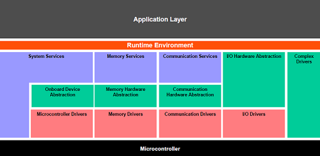
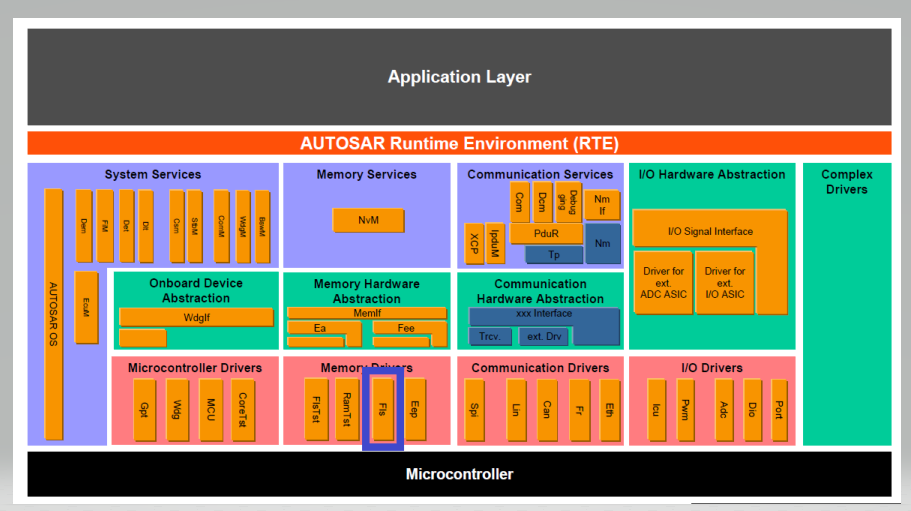
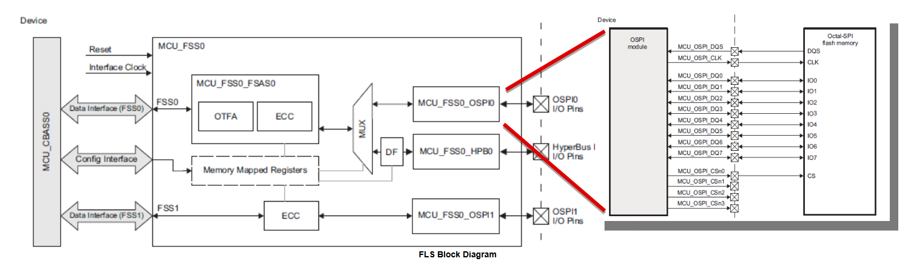
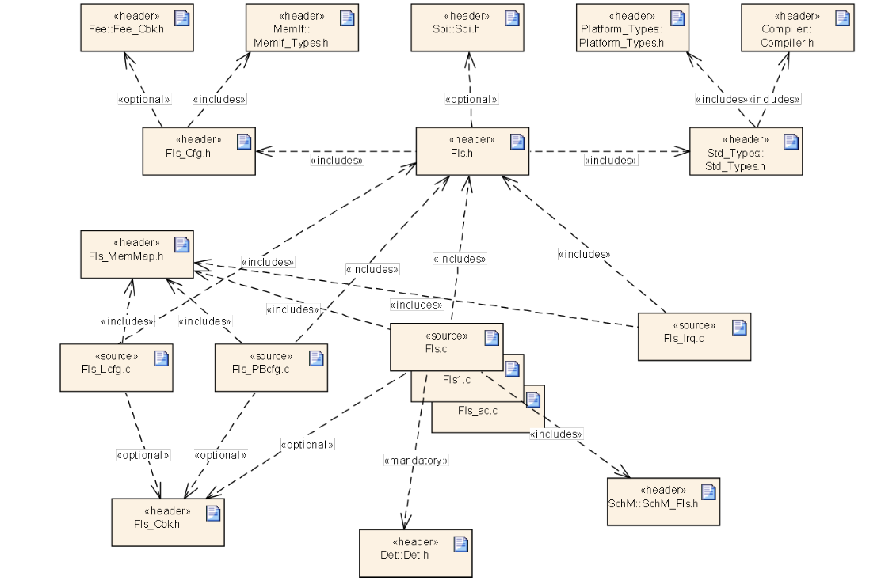
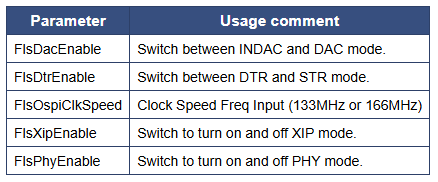
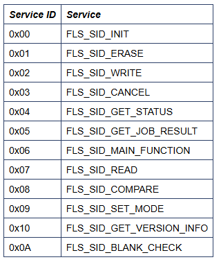
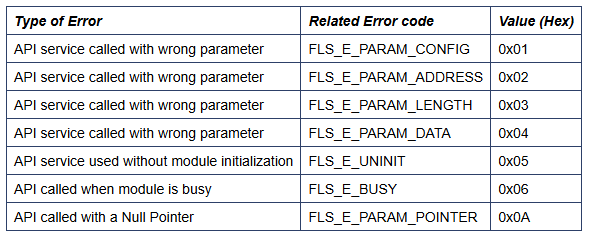
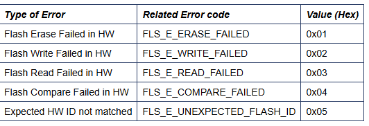
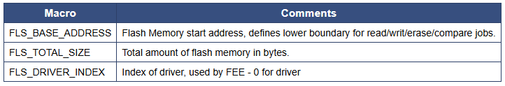
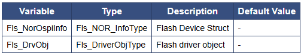

# 💚 Introduction Fls MCAL AUTOSAR MODULE 💛

## 👉 Introduction and Summary

### 1️⃣ Introduction

+ Ở repo này mình sẽ nói overview về kiến thức module Fls. Version Autosar trong repo này là 4.3.1 nhé.

### 2️⃣ Summary

Nội dung của bài viết gồm có những phần sau nhé 📢📢📢:
- [I. Introduction and Summary](#👉-introduction-and-summary)
    - [1. Introduction](#1️⃣-introduction)
    - [2. Summary](#2️⃣-summary)
- [II. Contents](#👉-contents)
- [III. Reference](#📌-reference)

## 👉 Contents

### Introduction
+ This document details AUTOSAR BSW Fls module implementation
  - Supported AUTOSAR Release : 4.3.1
  - Supported Configuration Variants : Pre-Compile & Post-Build

### Overview
+ The figure below depicts the AUTOSAR layered architecture as 3 distinct layers, Application, Runtime Environment (RTE) and Basic Software (BSW). The BSW is further divided into 4 layers, Services, Electronic Control Unit Abstraction, MicroController Abstraction (MCAL) and Complex Drivers.

​

     

+ MCAL is the lowest abstraction layer of the Basic Software. It contains internal drivers that are software modules that interact with the Microcontroller and its internal peripherals directly. ICU driver will use ECAP (Enhanced Capture) hardware IP for demodulation of a PWM signal, counting pulses, measuring of frequency and duty cycle and generating simple interrupts.

### Fls Overview
+ MCAL is the lowest abstraction layer of the Basic Software. It contains internal drivers that are software modules that interact with the Microcontroller and its internal peripherals directly. Flash Driver is part of the Memory Drivers module, which is part of the Basic Software. The Flash Driver provides services for reading, writing, erasing flash memory and Execute-in-Place (XIP) mode for external Flash Device. The driver supports MT35XU512ABA1G12 and S28HS512T OSPI Flash Devices. The main tasks of the FLS driver are:
  + Perform storage mode applications:
    - Read from flash.
    - Write to flash.
    - Erase Flash.
    - Compare and Blank Check flash memory location.
  + Execute application using XIP Mode (only XIP read supported).

​

     

+ This Flash driver uses OSPI module to transfer data between the system and flash device. Below diagram shows the integration between the two hardware IPs that are used by the Flash Driver: FSS and OSPI. J721-EVM has one Flash device support - MT35XU512ABA1G12, and J7200-EVM has s28HS512T. Please note that this is for just reference purpose, for other details please refer to technical reference manual.

​

     

+ The Flash Driver module includes the following main features:
  - Storage Mode support to Write, Read, Erase for flash memory.
  - Direct Access Mode (DAC) for Memory Mapped Flash accesses.
  - Indirect Access Mode (INDAC) to make use of internal SRAM for data transfers.
  - Poll Mode implementation for DAC and INDAC mode, and Interrupt Mode implementation for INDAC mode.
  - Serial clock with programmable frequency.
  - Single (STR/SDR) and Double Transfer Rate protocol (DTR/DDR) support.
  - Execute-in-Place (XIP) Read support.
  - PHY Module integration for optimized performance.

### Features Supported
+ Configuration of Flash Device: External flash device - MT35XU512ABA1G12
+ Initialization of OSPI Module.
+ Enabling of Development Error Detection (DET).
+ Configuration of implementation features like:
  - Fls DDR vs SDR
  - Fls DAC vs INDAC
  - Fls OSPI Clk Speed
  - Fls XIP Enable
+ Asynchronous Write, Read, Erase, BlankCheck, and Compare APIs
+ Interrupt based implementation with INDAC using non-blocking/callback design.

### Features Not Supported
+ API features not supported
  - BlankCheck and Compare API functionality not available in Interrupt mode.
  - Timeout Supervision not supported.
  - Erase and Write Verification not supported.
  - Only one instance of Fls module supported at one time.
  - Cancel API not supported.
+ HW features not supported
  - Supports only XIP Read mode.
  - Implementation compliant with only MCU1_0 and MCU2_1.

### Assumptions
+ Below listed points are assumed to be valid for this design/implementation, exceptions and other deviations are listed for each explicitly. Care should be taken to ensure these assumptions are addressed.
  - The functional clock to the Fls module is expected to be ON before calling any Fls service APIs. The Fls driver doesn’t perform any programming to enable the module functional clock.
  - Interrupt configuration for Fls interrupt registration should be done by application. Refer to example application for reference.
  - Flash base addresses, register offsets and SOC specific defines are defined by CSL header files.

### Fundamental Operation
+ Fls module uses OSPI interface to transfer data between the system and the flash device. To be able to write to the flash, the flash has to be erased first. The erase operation internally programs 0xFF to all memory cells.
+ DAC Mode: Direct Access Mode allows data interface accesses directly trigger read or write to flash memory. It is memory-mapped, and can be used to both access and directly execute code from external flash.
+ INDAC Mode: Indirect Access Mode used the internal OSPI SRAM to make data transfers. Indirect trigger access address does not have any relationship with flash address. It should take the SRAM as source (instead of Flash memory).
+ STIG: Software Triggered Instruction Generator - While DAC and INDAC are used for data transfer, STIG is used to access the volatile and non-volatile configuration registers, status registers, and for erase functions.
+ This Flash Driver Module Write, Read, Erase, BlankCheck and Compare APIs are asynchronous such that control will return to the application after the job from one of the APIs has been accepted. A "job" describes the action that will perform actual transactions to the hardware. The driver's Fls_MainFunction () API will do the job processing internally, after the APIs have been called and the job has been accepted. During job processing, the module will perform the programming of the flash device, and will make data transfers between system and flash device.
+ External Flash Device Hardware:
  - Flash is composed of Sectors and Pages. Sectors are subdivided into Pages.
  - Writes happen in complete page blocks, erases happen in complete sectors.
  - Write Enable command sent before a write or erase operation.
  - Read ID command sent to detect the connected flash device.
  - MT35XU512ABA1G12 NOR Flash Device
    + Micron Tech, 64MB density
    + Sector Size: 4k Bytes
    + Page Size: 256 Bytes
  - S28HS512T NOR Flash Device:
    + Cypress, 64MB density
    + Sector Size: 256K Bytes
    + Page Size: 256 Bytes

### Resource Behavior
+ There are no hard requirements for resource allocation for Flash driver. Average Stack Size of FLS Driver is around 5 kilo bytes.
+ In terms of CPU load, there is not target defined for Flash Driver. We will measure and report this analysis post development.

### Interrupt Service Routines
+ For the Flash module instance, one interrupt service routine has been mapped. Note that Interrupt mode is only available when operating in INDAC mode. BlankCheck and Compare API are not functional with interrupt mode. The supported ISR is part of the Fls_Irq.h and Fls_Irq.c files.
+ Handling Flash OSPI FIFO Interrupt: OSPI Hardware Behavior: The hardware uses SRAM Watermark levels to trigger interrupts. There are two interrupts generated for every write/read call from SRAM to/from Flash memory. One interrupt notifies driver that the SRAM FIFO fill level is below a watermark level, which allows more data to be transferred into the SRAM. Another interrupt occurs when the transfer from SRAM into Flash memory, or to system memory, completes. Both these interrupts trigger the same ISR, and are handled accordingly within the ISR.

### Dynamic Behavior
+ The Flash driver at any time will be in one of the following states. The state transition will depend on the APIs invoked by the application
  - MEMIF_UNINIT: The Flash Driver is not initialized. This is the state before starting driver initialization.
  - MEMIF_IDLE: The Flash Driver is not currently transferring any Job. This is the state before the transfer is started or after the transfer is completed.
  - MEMIF_BUSY: This is the state after a transfer has started i.e. Job execution is on going.

### Directory Structure
+ The diagram below shows the overall files structure for the Flash driver. The Fls.c and Fls.h are the 2 files that contain the Flash driver’s APIs.

​

     

### NON Standard configurable parameters

​

     

### Error Classification
+ Errors are classified in two categories, development error and Transient Faults.
+ The reported service IDs identify the services which are described earlier. The following table presents the service IDs and the related services:

​

     

### Development Errors
+ AUTOSAR requires that API functions check the validity of their parameters and module status. The checks in table are internal parameter checks of the API functions. These checks are for development error reporting and can be enabled or disabled.

### Development Error Reporting
+ The detection of development errors is configurable (ON / OFF) at pre-compile time. The switch FLS_DEV_ERROR_DETECT will activate or deactivate the detection of all development errors.
+ By default, development errors are reported to the DET using the service Det_ReportError(), if development error detection and reporting are enabled (i.e. checkboxes Development Mode and Development Error Reporting are checked).

​

     

### Transient Faults
+ Transient errors are reported to the DET using the service Det_reportDetTransientFault(). The driver interface (Fls.h File Structure) lists the SID.
​

     

### Debugging support
+ Flash driver makes driver status available for debugging. The states MEMIF_UNINIT, MEMIF_IDLE, MEMIF_BUSY can be probed. Driver status variable is defined by the status element in the Fls_DrvObj.

### MACROS
+ The sections below lists some of key data structures that shall be implemented and used in driver implementation.

​

     

+ Fls_ConfigType: This type of the external data structure contains the initialization data for the Flash Driver
+ Fls_SectorType: This structure contain information about the Flash Device in use

### API
+ Fls_Init, Fls_Erase, Fls_Write, Fls_GetStatus, Fls_GetJobResult, Fls_Read, Fls_Compare, Fls_GetVersionInfo, Fls_BlankCheck, Fls_MainFunction

### Global Variables
+ This design expects that implementation will require to use following global variables.
​

     

### Decision Analysis
***Data Transfer Mode***
+ The OSPI hardware module provides a couple ways to transfer data: DAC mode and INDAC mode.
+ Criteria: CPU must have minimal restrictions while the flash driver is processing. Polling vs Interrupt mode should be allowed in the implementation.
+ DAC Mode
  - Direct Access Controller (or DAC) refers to the operation where data interface accesses directly trigger a read or write to Flash memory. It is memory mapped and can be used to both access and directly execute code from external Flash memory. Access that use DAC do not use the embedded SRAM within the OSPI module.
  - Advantages
    + Flash memory is memory mapped, so Execute-in-place is supported.
    + Integration with the PHY Module gives optimized performance.
  - Disadvantages
    + Needs a data interface access to trigger for any number of bytes transfer.
    + Only supports poll mode implementation as it does not use SRAM (which is used to trigger interrupts otherwise).
    + Design implementation is blocking, since in poll mode, control stays within the driver until all the data has been transfered.
+ INDAC Mode
  - Indirect Access Controller (INDAC) uses the internal SRAM of the OSPI module. Data transfers then happen between the SRAM and Flash memory or SRAM and system memory, so no memory mapping is needed. The aim of the indirect mode of operation is to transfer significant numbers of bytes to/from Flash memory. Indirect operations are controlled and triggered by software via specific read/write transfer registers.
  - Advantages
    + Bulk transfers take place between system and flash memory in the most efficient manner. Fewest possible write cycles carried out inside flash device to maximize life of device.
    + INDAC supports poll and interrupt based implementation. The embedded SRAM used by INDAC provides interrupt mechanism. Interrupts are triggered when SRAM levels fall below a watermark, and also when a write/read operation finishes from within the SRAM.
    + Design implementation is non-blocking and allows the control to return to the application (CPU) while the data is still transferring in hardware.
  - Disadvantages
    + Execute-in-place not supported.
    + When using interrupt based INDAC mode, the FlsMaxWriteNormalMode has to be set to the page size of the flash device.
    + PHY module is not integrated.
+ Decision: In case of a execute-in-place/memory mapped use case, DAC Poll mode should be used. Since DAC mode enables the PHY Module, it gives higher performance results for read operations. For better performance for write operations, INDAC Interrupt mode should be used.

***Selecting Flash device information structure***
+ The Flash device information should be available to the Flash Driver. Information such as Flash device sector size, number of sectors, page size, etc. is needed.
+ Criteria: Avoid user input errors.
+ Use device specific, local structure
  - Only one Flash device is connected to the J7EVM, and this driver implementation only supported one device.
  - Advantages
    + Simpler design.
    + The values of flash device are constant and are stored in local, internal structure. This information should not be changed by user.
  - Disadvantages
    + Does not follow Autosar Spec.
+ Use spec specific structure
  - Autosar Spec provide a specific structure that would come as input from user as a configuration parameter.
  - Advantages: This would follow the Autosar Spec requirement.
  - Disadvantages: Increased chance of user input error, and complexity, as only one Flash device is connected and supported for J7EVM.
+ Decision: Option 1 is selected. The configuration parameter for FlsSector is not editable by the user, to avoid any error. Option 2 is useful when there are various flash devices connect, with varied size details. Since this Flash device contains sectors with all same sizes, Option 1 makes a simpler and more efficient design.

### Test Criteria
+ Validating ECUC parameters: Validating ECUC Parameter: Configuration for each test case shall be generated by EB Tresos command line.
+ Performance Testing: While testing the Write, Read, Erase, BlankCheck and Compare APIs, care should be taken to check the return value to see if job is finished before sending the next job. This can be checked using the Fee_Cbk callback functions: Fls_JobEndNotification and Fls_JobErrorNotification.
+ Test Verification: To verify that the flash memory is correctly programmed, BlankCheck API should be used after performing Erase operation and Compare API should be used after a Write operation to ensure data integrity.

### Driver Adaption for QSPI and new FLASH device
+ Current FLS driver uses OSPI protocol and supports the two NOR Flash devices for J721E and J7200 (MT35XU512ABA1G12 S28HS512T).
+ If variation to the supported features are needed, user will need to take care to modify the driver to accommodate changes.
1. Configuring QSPI
  - Files that contain OSPI protocol configuration are: Fls_Ospi.c, Fls_Ospi.h. Similar files will need to be added for QSPI protocol configuration. These files should contain the QSPI APIs used for transferring data and configuring QSPI controller. Please refer to TRM for details on how to program QSPI.
  - The interface files (Fls_Spi_Intf.c, Fls_Spi_Intf.h) will need to be modified to call QSPI specific APIs instead of the OSPI specific ones (which is current configuration).
  - Lastly, the board config files (Fls_Brd_Nor_xspi.c) will need slight modification to ensure that Flash Device is configured correction when using QSPI mode.
2. Integrating new Flash Device
  - Each flash device will need to have its own header file which defines device specific commands. If a new Flash device is integrated, such a header file will need to be created and included by the driver files. Examples of such header files are Fls_NOR_m35xu512.h and Fls_NOR_s28hs512t.h.
  - Next, the board configuration files (Fls_Brd_Nor_Ospi.c, etc.) will need to be modified to work with the new flash device. The APIs in the board configuration files are used to set the flash device settings. They should be carefully modified to ensure that correct commands are being written on the flash device. This can be done based on the flash device specification.
  -  Note: Writing incorrect commands can break the flash device and make is obsolete. Proper care should be taken to ensure integration had been done correctly.
  - Note: The PHY tuning algorithm described in above section is specific to currently supported flash devices. Please note that the algorithm is not expected to work with other flash devices.  

## 📌 Reference

[0] https://www.autosar.org/fileadmin/user_upload/standards/classic/4-3/AUTOSAR_SWS_ICUDriver.pdf

[1] https://youtu.be/G-Y27cojQb8?si=WphEMRTopmP83CDc

[2] https://autosarthonv.github.io/

[3] https://software-dl.ti.com/jacinto7/esd/processor-sdk-rtos-jacinto7/08_01_00_11/exports/docs/mcusw/mcal_drv/docs/drv_docs/index.html

[4] https://www.youtube.com/watch?v=YeAsBK0K0F0&list=PLE9xJNSB3lTFFjw2Or_ayjf-CSX0VypIE

