# 💚 Introduction Adc MCAL AUTOSAR MODULE 💛

## 👉 Introduction and Summary

### 1️⃣ Introduction

+ Ở repo này mình sẽ nói overview về kiến thức module Adc. Version Autosar trong repo này là 4.3.1 nhé.

### 2️⃣ Summary

Nội dung của bài viết gồm có những phần sau nhé 📢📢📢:
- [I. Introduction and Summary](#👉-introduction-and-summary)
    - [1. Introduction](#1️⃣-introduction)
    - [2. Summary](#2️⃣-summary)
- [II. Contents](#👉-contents)
- [III. Reference](#📌-reference)

## 👉 Contents

### Introduction
+ This document details AUTOSAR BSW Adc module implementation
  - Supported AUTOSAR Release : 4.3.1
  - Supported Configuration Variants : Pre-Compile & Post-Build

### Overview
+ The figure below depicts the AUTOSAR layered architecture as 3 distinct layers, Application, Runtime Environment (RTE) and Basic Software (BSW). The BSW is further divided into 4 layers, Services, Electronic Control Unit Abstraction, MicroController Abstraction (MCAL) and Complex Drivers.

​

     

+ MCAL is the lowest abstraction layer of the Basic Software. It contains software modules that interact with the Microcontroller and its internal peripherals directly. Adc driver is part of the I/O Drivers (block, shown above). Below shows the position of the Adc driver in the AUTOSAR Architecture.

​

  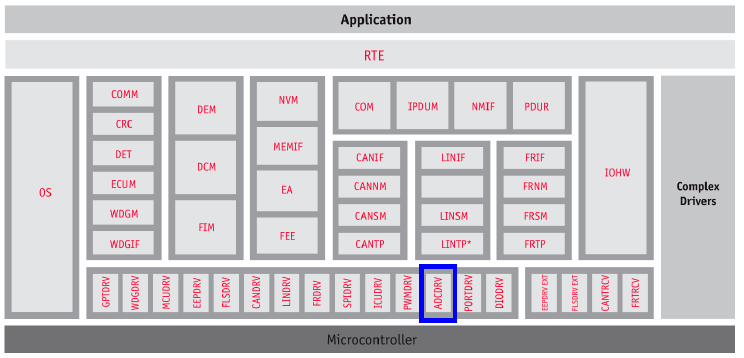   

### Adc Overview
+ The analog-to-digital converter (ADC) module is a successive-approximation-register (SAR) general purpose analog-to-digital converter. TDA4x class of devices includes 2 instances of ADC. Below listed are some of the key features provided.
  - 4 MSPS rate at 60 MHz sample clock can be operated with either single-ended or differential input.
  - Separate positive and negative ADC reference in case the maximum analog input level is smaller than the analog supply.
  - Built-in functional safety self-tests
  - Programmable Finite State Machine (FSM) sequencer that supports the following steps:
    + Software register bit for start of conversion
    + Optional start of conversion (SOC), hardware synchronized to external hardware event
    + Single conversion (one-shot)
    + Continuous conversions
    + Sequence through all input channels based on a mask
    + Programmable open delay before sampling each input
    + Programmable sampling delay for each input
    + Programmable averaging of input samples - 16, 8, 4, 2, or 1
    + Store data in either of two FIFO – 256-word 16-bit RAM
    + Support for servicing FIFOs via DMA or CPU
    + Programmable DMA request event (for each FIFO)
    + Dynamically enable or disable channel inputs during operation
    + Software register bit for end of conversion
  - Support for the following interrupts and status, with masking
    + Interrupt after a sequence of conversions (all non-masked input channels)
    + Interrupt for FIFO threshold levels
    + Interrupt if sampled data is out of a programmable range
    + Interrupt for FIFO overflow and underflow conditions
    + Status bit to indicate if ADC is busy converting

### Features Supported
+ Below listed are some of the key features that are expected to be supported
  - Initialization and de-initialization of internal analog-to-digital conversion unit
  - Grouping of ADC channels to so called ADC channel groups
  - Starting and stopping conversions of software triggered channel groups
  - Streaming functionality (storage of multiple results)
  - Accessing conversion results in two different ways: by value using Adc_ReadGroup() API and by reference using   - Adc_GetStreamLastPointer() API
  - Getting information about the status of a group
  - Queuing of conversion requests
  - Priority levels and abort/restart and suspend/resume of channel groups
  - The following combinations of modes are supported by the ADC driver
    + One-shot, Software Trigger, Single Access Mode
    + Continuous, Software Trigger, Circular Single Access Mode
    + Continuous, Software Trigger, Linear Single Access Mode (similar to one-shot mode)
    + Continuous, Software Trigger, Circular Streaming Access Mode
    + Continuous, Software Trigger, Linear Streaming Access Mode
  - Supports additional configuration parameters

### Features Not Supported
  - Enabling and disabling hardware trigger of hardware triggered channel groups
  - Management of hardware low-power states and the corresponding API
  - All limit checking requirements
  - The following combinations of modes are not supported by the ADC driver
    + All hardware trigger modes
    + One-shot, Software Trigger, Stream Access (Circular) Mode.
    + Optional ADC module specific clock prescale factor as hardware doesn’t support.

### Fundamental Operation
+ ADC is an 8 channel general purpose SAR ADC controller which supports 12 bit conversion samples from an analog front end converter (AFE).

​

  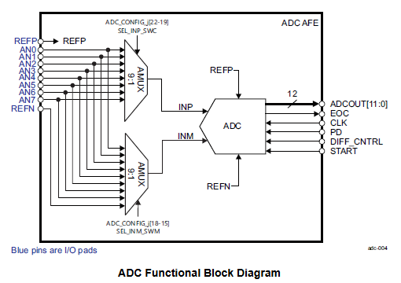   

+ Before enabling the module, the user must first program the step configuration registers in order to configure a channel input to be sampled. There are 16 programmable step configuration registers which are used by the sequencer to control which switches to turn on or off (inputs to the AFE), which channel to sample, and which mode to use (HW triggered or SW enabled, one-shot or continuous, averaging, where to save the FIFO data, etc). The user can program the delay between driving the inputs to the AFE and the time to send the start of conversion signal. This delay is called open delay( and can also be programmed to zero). The user also has control of the sampling time (width of the start of conversion signal) to the AFE which is called the sample delay. Each channel input is configured independently via the Step Delay register.
+ The ADC sequencer is completely controlled by software and behaves accordingly to how the ADC_CONFIG_j registers are programmed. A step is the general term for sampling a input. It is defined by the programmer who decides which input values to send to the AFE as well as how and when to sample a input. If a step is configured as software (SW) controlled when the ADC is first enabled, the sequencer will then wait for a ADC_STEPENABLE register bit to turn on. After a step is enabled, the sequencer will start with the lowest step (1) and continue until step (16). If a step is not enabled, then sequencer will skip to the next step. If all steps are disabled, then the sequencer will remain in the IDLE state. An ENDOFSEQUENCE interrupt is generated after the last active step is completed before going back to the IDLE state. The ENDOFSEQUENCE interrupt does not mean data is in the FIFO.We should use FIFO interrupts.

​

  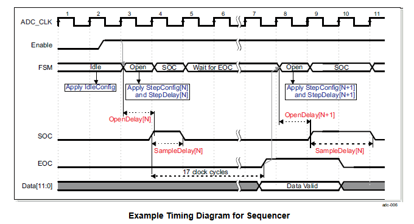   

+ Using the minimum delay values, the ADC can sample at 18 ADC clocks per sample. Once the ADC is enabled and assuming at least one step is active, the FSM will transition from the IDLE state and apply the first active ADC_CONFIG_j and ADC_DELAY_j register settings. It is possible for the OpenDelay value to be 0, and the FSM will immediately skip to the SampleDelay state. The AFE will begin sampling of the analog voltage on high level of the SOC signal. Voltage sampling duration is 4 clock cycles long. After the AFE is finished converting the input data (13 more cycles later), the end of conversion (EOC) signal is sent and the FSM will then apply the next active step. This process is repeated and continued (from step 1 to step 16) until the last active step is completed

### Different Input Values
+ ADC can be operated with either single-ended or differential input values.

### Single-ended input
+ Single-ended inputs are generally sufficient for most applications. In single-ended applications, all signals are referenced to a common ground at the ADC.

### Differential input
+ An ADC with fully-differential inputs digitizes the differential analog input voltage (REFP – REFN) over a span of full scale voltage. Fully-differential inputs offer wider dynamic range and better SNR performance over single-ended.

### Dynamic Behavior
***States***
+ As detailed in section 7.1, driver group status will be in one of the following states. ADC_IDLE, ADC_BUSY, ADC_COMPLETED, ADC_STREAM_COMPLETED. A variable shall be maintained per adc channel group to track and maintain the state. The diagram below shows transitions of states and it’s associated service API’s.

​

  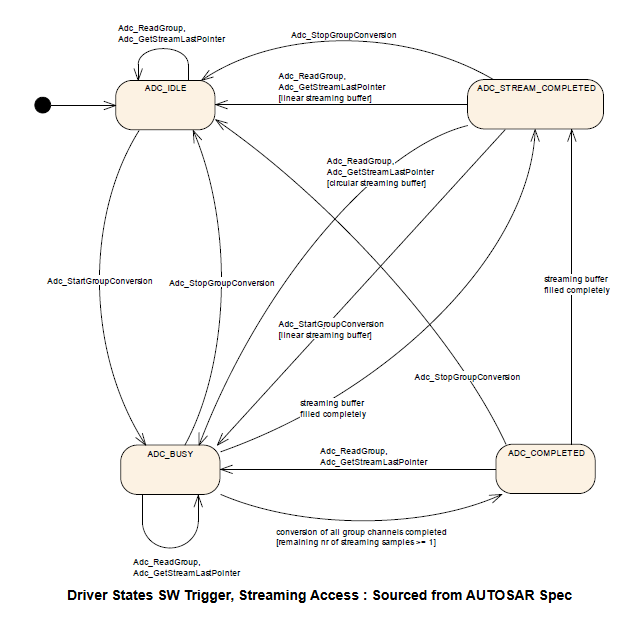   

### One Shot Mode
+ The ADC module shall support the conversion mode One-shot Conversion for all ADC Channel groups. One-shot conversion means that exactly one conversion is executed for each channel configured for the group being converted.

### Continuous Mode
+ The ADC module shall support the conversion mode Continuous Conversion for all ADC Channel groups with trigger source software. Continuous Conversion means that after the conversion has been completed, the conversion of the whole group is repeated. The conversions of the individual ADC channels within the group as well as the repetition of the whole group don’t need any additional trigger events to be executed. Converting the individual channels within the group can be done sequentially or in parallel depending on hardware and/or software capabilities.

### Software API Call
+ The ADC module shall support the start condition Software API Call for all conversion modes. The trigger source Software API Call means that the conversion of an ADC Channel group is started/stopped with a service provided by the ADC module.

### Hardware Event
+ The ADC module shall support the start condition Hardware Event for groups configured in One-Shot conversion mode. The trigger source Hardware Event means that the conversion of an ADC Channel group can be started by a hardware event, e.g. an expired timer or an edge detected on an input line.

### Adc_GetStreamLastPointer
+ The ADC module shall support result access using the API function Adc_GetStreamLastPointer. Calling Adc_GetStreamLastPointer informs the user about the position of the group conversion results of the latest conversion round in the result buffer and about the number of valid conversion results in the result buffer. The result buffer is an external buffer provided from the application.

### Adc_ReadGroup
+ The ADC module shall support result access using the API function Adc_ReadGroup. Calling Adc_ReadGroup copies the group conversion results of the latest conversion round to an application buffer which start address is specified as API parameter of Adc_ReadGroup.

### Priority Handling and Queuing Operations
+ Priority mechanism is implemented using a pure software function as hardware priority mechanism is not supported by the ADC module. This means only ADC_PRIORITY_NONE and ADC_PRIORITY_HW_SW options are supported ADC_PRIORITY_HW is not supported.
+ Priority mechanism can be statically enabled or disabled using the configuration macro ADC_PRIORITY_IMPLEMENTATION which can be changed during configuration step. When priority mechanism is enabled and when a high priority group is started when a lower priority group is in progress for the same ADC unit, the driver stops the current group and schedules the high priority group. Once the high priority group conversion is completed (either implicitly or explicitly) the driver will re-schedule the lower priority group. While restarting the group, the driver always starts from channel 0 of the group i.e. irrespective of whether the group parameter ‘groupReplacement’ is ADC_GROUP_REPL_ABORT_RESTART or ADC_GROUP_REPL_SUSPEND_RESUME the driver always does restart operation. Resume operation is not supported.
+ This driver also supports queuing mechanism to queue multiple requests to the driver for the same ADC unit. Queuing mechanism can be statically enabled or disabled using the configuration macro ADC_ENABLE_QUEUING which can be changed during the configuration step. When priority mechanism is enabled and when queue is enabled, the driver processes the requests on a first come first serve basis.When queuing is disabled, the driver will raise a development error. When any group is started when the hardware unit is busy converting another group,it queues that group and returns without any operation.

### Interrupt Service Routines
+ For each of the configured hardware units, one interrupt service routine has to be mapped. The Integrator has to map the interrupt service routines to the interrupt sources of the respective ADC unit interrupt. The supported ISR’s are part of the Adc_Irq.h file.

​

  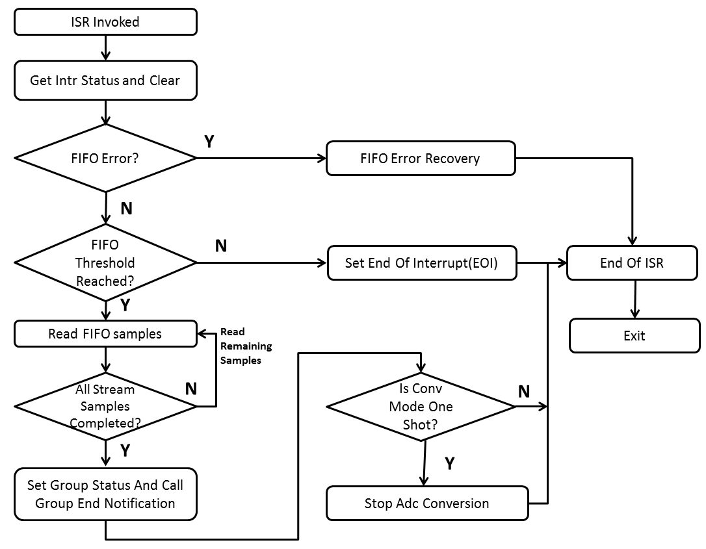   

### Conversion Mode Example
+ Refer specifically section 7.2 of the specification for more details
+ The following examples specify the order of channel conversion depending on group and conversion type:
  - Example 1: Channel group containing channels [CH0, CH1, CH2, CH3, and CH4] is configured in Continuous conversion mode. After finishing each scan, the notification (if enabled) is called. Then a new scan is started automatically.
  - Example 2: Channel group containing channels [CH0, CH1, CH2, CH3, and CH4] is configured in One-Shot conversion mode. After finishing the scan the notification (if enabled) is called.
  - Example 3: Channel group containing channel [CH3] is configured in Continuous conversion mode. After finishing each scan the notification (if enabled) is called. Then a new scan is started automatically.
  - Example 4: Channel group containing channel [CH4] is configured in One-Shot conversion mode. After finishing the scan the notification (if enabled) is called.

​

  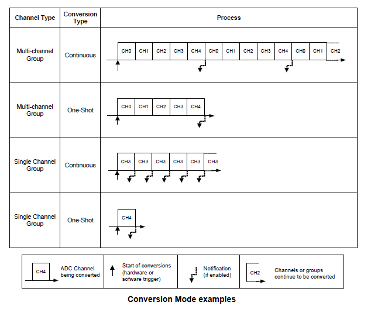   

### Directory Structure

​

  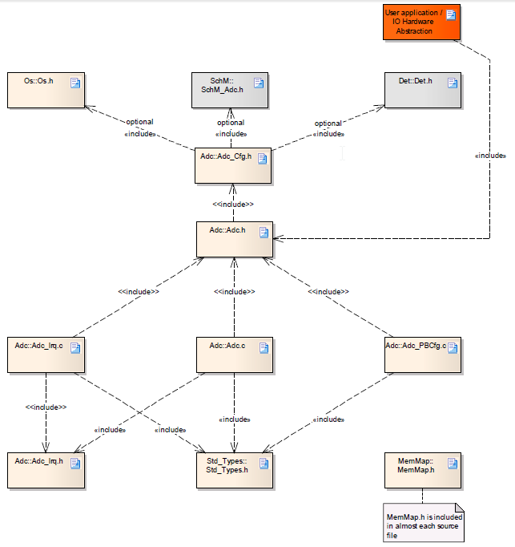   

### NON Standard configurable parameters

​

  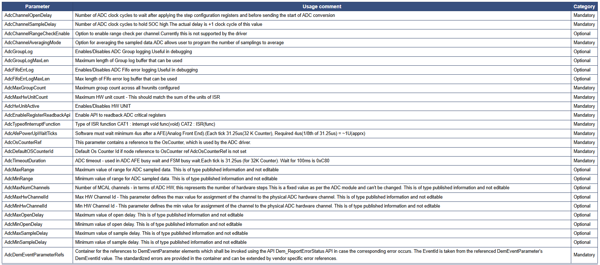   

### Development Errors

​

  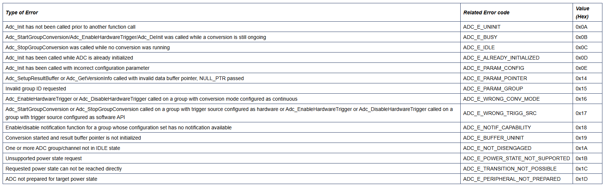   

### Runtime Errors
+ Reference to the DemEventParameter which shall be issued when the error Timeout on blocking API call occurs	ADC_E_HARDWARE_ERROR	Defined By Integrator

### MACROS, Data Types & Structures
+ uint32	ADC_MAX_GROUP	Maximum group across all hwunit.
+ uint32	ADC_MAX_HW_UNIT	Sum of all active hw units configured.
+ uint32	ADC_NUM_CHANNEL	Number of MCAL channels - in terms of ADC HW, this represents the number of hardware steps.
+ Adc_ConfigType: Data structure containing the set of configuration parameters required for initializing the ADC Driver and ADC HW Unit(s)
+ Adc_ChannelType: Numeric ID of an ADC channel
+ Adc_GroupType: Numeric ID of an ADC channel group
+ Adc_ValueGroupType: Type for reading the converted values of a channel group (raw, without further scaling, alignment according precompile switch ADC_RESULT_ALIGNMENT)
+ Adc_PrescaleType: Type of clock prescaler factor
+ Adc_ConversionTimeType: Type of conversion time, i.e. the time during which the sampled analogue value is converted into digital representation.
+ Adc_SamplingTimeType: Type of sampling time, i.e. the time during which the value is sampled, (in clock-cycles)
+ Adc_ResolutionType: Type of channel resolution in number of bits.
+ Adc_StatusType: Current status of the conversion of the requested ADC Channel group
+ Adc_TriggerSourceType: Type for configuring the trigger source for an ADC Channel group
+ Adc_GroupConvModeType: Type for configuring the conversion mode of an ADC Channel group
+ Adc_GroupPriorityType: Priority level of the channel. Lowest priority is 0
+ Adc_GroupDefType: Type for assignment of channels to a channel group (this is not an API type)
+ Adc_StreamNumSampleType: Type for configuring the number of group conversions in streaming access mode (in single access mode, parameter is 1)
+ Adc_StreamBufferModeType: Type for configuring the streaming access mode buffer type
+ Adc_GroupAccessModeType: Type for configuring the access mode to group conversion results.
+ Adc_HwTriggerSignalType: Type for configuring on which edge of the hardware trigger signal the driver should react, i.e. start the conversion (only if supported by the ADC hardware)
+ Adc_HwTriggerTimerType: Type for the reload value of the ADC module embedded timer (only if supported by the ADC hardware)
+ Adc_PriorityImplementationType: Type for configuring the prioritization mechanism. 
+ Adc_GroupReplacementType: Replacement mechanism, which is used on ADC group level, if a group conversion is interrupted by a group which has a higher priority
+ Adc_ChannelRangeSelectType: In case of active limit checking: defines which conversion values are taken into account related to the boardes defineed with AdcChannelLowLimit and AdcChannelHighLimit
+ Adc_ResultAlignmentType: Type for alignment of ADC raw results in ADC result buffer (left/right alignment). 
+ Adc_PowerStateType: Power state currently active or set as target power state
+ Adc_PowerStateRequestResultType: Result of the requests related to power state transitions
+ Adc_RegisterReadbackType

​

  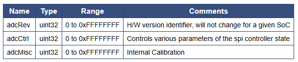   

+ Adc_ChannelConfigType: Structure containing parameters for ADC MCAL channel configuration. In terms of ADC hardware, this represents the step configuration. There are ADC_NUM_CHANNEL steps in the ADC hardware and each step could be mapped to an actual hardware input channel.

​

  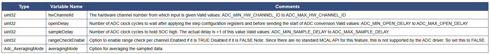   

+ Adc_GroupConfigType

​

  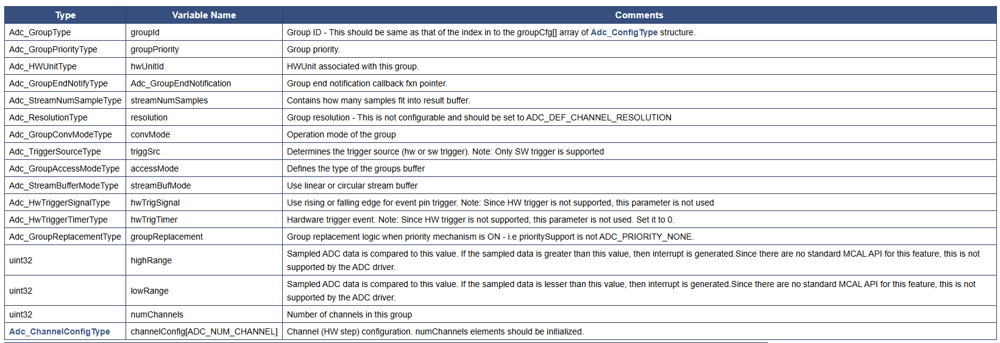   

+ Adc_HwUnitConfigType: ADC Hardware unit configuration structure.
+ Adc_ConfigType: Used to define all channels specific parameters, shall be supplied to Adc_Init () function. Values of these are expected to be populated by configurator.

​

  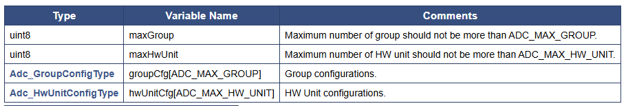   

### API
+ Adc_Init, Adc_SetupResultBuffer, Adc_DeInit, Adc_StartGroupConversion, Adc_StopGroupConversion, Adc_ReadGroup, Adc_EnableGroupNotification, Adc_DisableGroupNotification, Adc_GetGroupStatus, Adc_GetStreamLastPointer, Adc_GetVersionInfo
+ Adc_RegisterReadback: As noted from previous implementation, the adc configuration registers could be potentially corrupted by other entities (s/w or h/w). One of the recommended detection methods would be to periodically read-back the configuration and confirm configuration is consistent. The service API defined below shall be implemented to enable this detection. Constraint: Should be called only after module initialization

### Global Variables
+ This design expects that implementation will require to use following global variables.

​

  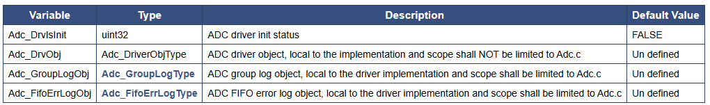   

### Test Criteria
+ Differential Input Test
    - Test cases shall perform test to check differential input values.
+ State Transitions
    - Test cases shall exercise all state transitions as detailed in section (States)
    - Ensure non supported API’s in a given state, returns valid error code
+ Mode
    - Test cases shall ensure, adc operable in all supported modes
+ Performance
  - Test cases shall ensure, adc performance measurement CPU utilization for a given configuration.
+ Stream Access
  - Test cases shall ensure, adc operable in all stream access mode types
+ Concurrency
  - Test cases shall ensure, multiple adc instances can be operated concurrently
+ ADC Input Values
  - Test cases perform equivalence class test on different input range values.
+ Group Logging
  - Test cases shall ensure, adc operable with group/FIFO error logging on.

## 📌 Reference

[0] https://www.autosar.org/fileadmin/user_upload/standards/classic/4-3/AUTOSAR_SWS_ICUDriver.pdf

[1] https://youtu.be/G-Y27cojQb8?si=WphEMRTopmP83CDc

[2] https://autosarthonv.github.io/

[3] https://software-dl.ti.com/jacinto7/esd/processor-sdk-rtos-jacinto7/08_01_00_11/exports/docs/mcusw/mcal_drv/docs/drv_docs/index.html

[4] https://www.youtube.com/watch?v=YeAsBK0K0F0&list=PLE9xJNSB3lTFFjw2Or_ayjf-CSX0VypIE

